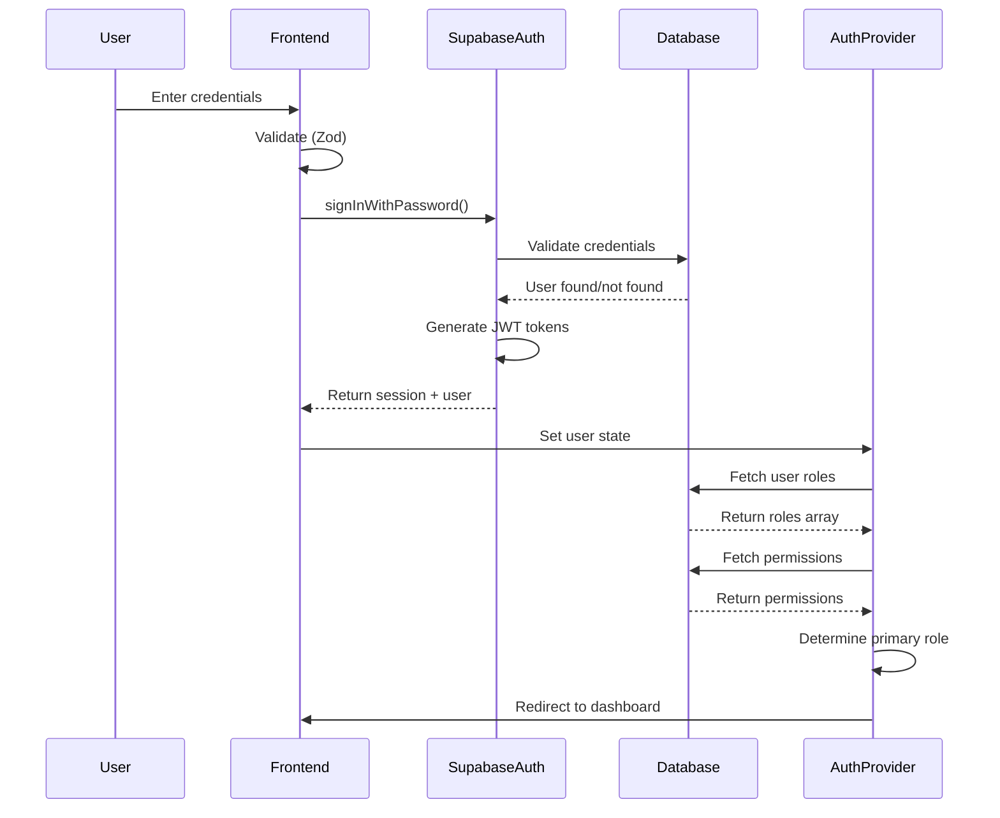
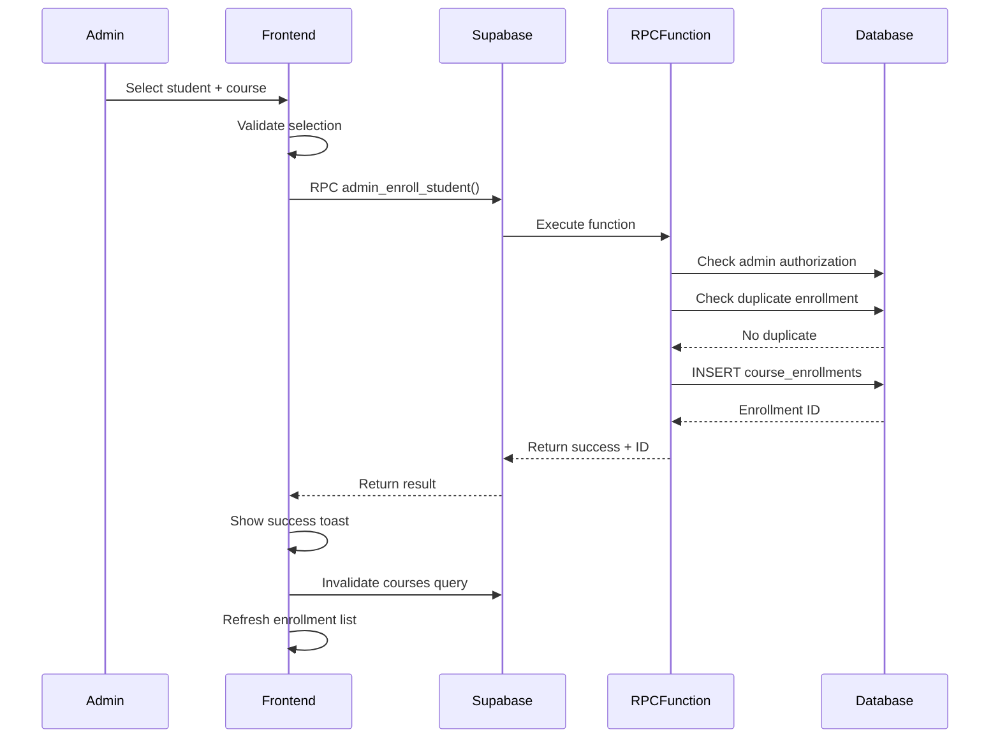
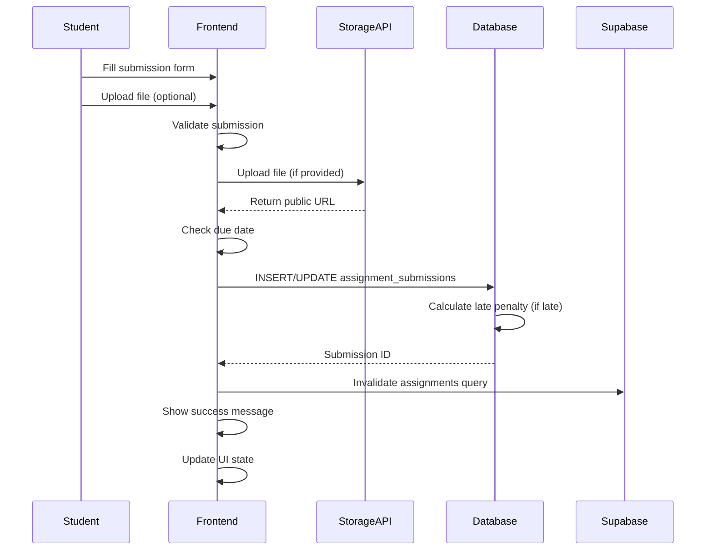
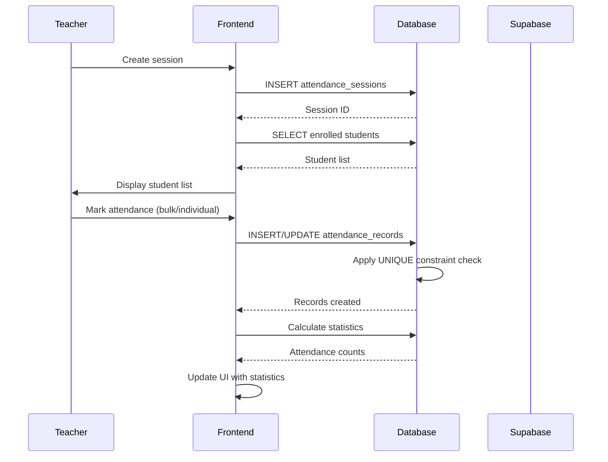
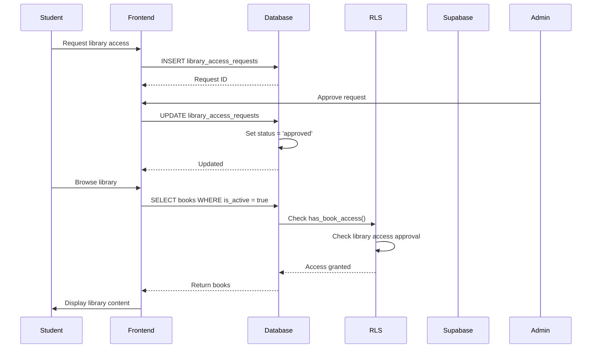
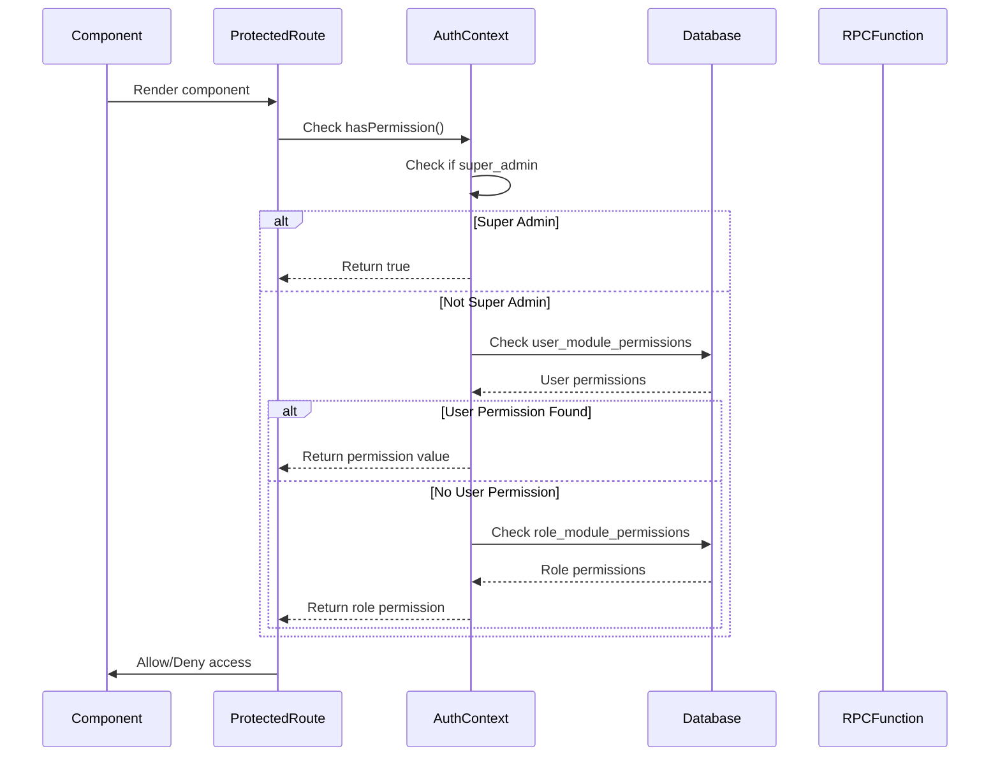
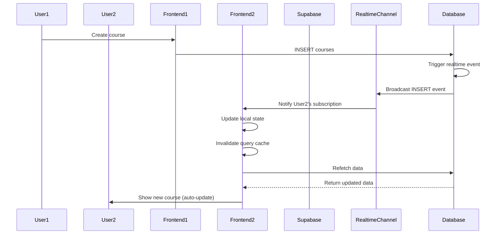

# EduLearn Platform - Ultra-Detailed Project Overview Documentation

## Table of Contents

1. [Executive Summary & Introduction](#1-executive-summary--introduction)
2. [Technology Stack (Complete Breakdown)](#2-technology-stack-complete-breakdown)
3. [System Architecture](#3-system-architecture)
4. [Database Schema (Complete)](#4-database-schema-complete)
5. [API Reference (Complete)](#5-api-reference-complete)
6. [Feature Documentation (Exhaustive)](#6-feature-documentation-exhaustive)
7. [User Roles & Permissions (Detailed)](#7-user-roles--permissions-detailed)
8. [Security Architecture](#8-security-architecture)
9. [Workflows (Detailed Step-by-Step)](#9-workflows-detailed-step-by-step)
10. [Data Flows](#10-data-flows)
11. [Route System (Complete)](#11-route-system-complete)
12. [Component Architecture](#12-component-architecture)
13. [State Management](#13-state-management)
14. [Functional Requirements](#14-functional-requirements)
15. [Non-Functional Requirements](#15-non-functional-requirements)
16. [UI/UX Design System](#16-uiux-design-system)
17. [Testing Strategy](#17-testing-strategy)
18. [Deployment & DevOps](#18-deployment--devops)
19. [Performance Optimizations](#19-performance-optimizations)
20. [Project Statistics](#20-project-statistics)
21. [Future Roadmap](#21-future-roadmap)

---

## 1. Executive Summary & Introduction

### 1.1 Project Vision and Mission

**EduLearn** is a comprehensive, production-ready Learning Management System (LMS) designed for educational institutions of all sizes. The platform provides a unified solution for course management, student enrollment, content delivery, assessment administration, attendance tracking, and administrative oversight.

**Mission Statement**: To democratize quality education by providing institutions with an intuitive, scalable, and secure platform that empowers educators, engages students, and enables guardians to actively monitor their children's academic progress.

**Vision**: To become the leading open-source LMS solution that combines enterprise-grade features with simplicity, enabling educational institutions worldwide to deliver exceptional online learning experiences.

### 1.2 Problem Statement and Solution Approach

**Problems Addressed**:
1. **Fragmented Tools**: Many institutions use separate systems for course management, content delivery, grading, and student tracking, leading to data silos and inefficiencies.
2. **Limited Guardian Engagement**: Parents and guardians often lack visibility into their children's academic progress, creating communication gaps.
3. **Inflexible Permission Systems**: Traditional LMS solutions offer rigid role-based access, making it difficult to implement institution-specific workflows.
4. **Poor User Experience**: Complex interfaces and inconsistent navigation patterns hinder adoption among educators and students.
5. **Scalability Concerns**: Many solutions don't scale efficiently as institutions grow, leading to performance degradation.

**Solution Approach**:
- **Unified Platform**: Single integrated system handling all aspects of educational management
- **Role-Based Access Control (RBAC)**: Flexible permission system supporting five distinct roles (Super Admin, Admin, Teacher, Student, Guardian) with granular module-based permissions
- **Modern Technology Stack**: Built on React 18, TypeScript, and Supabase for scalability, type safety, and real-time capabilities
- **Row-Level Security (RLS)**: Database-level security ensuring data privacy even if application-level checks are bypassed
- **Responsive Design**: Mobile-first approach ensuring accessibility across all devices
- **Real-Time Updates**: Live synchronization using Supabase Realtime for instant data updates across sessions

### 1.3 Target Audience and Use Cases

**Primary Target Audiences**:

1. **Educational Institutions**
   - Schools (K-12)
   - Colleges and Universities
   - Online Learning Platforms
   - Corporate Training Departments

2. **End Users by Role**:
   - **Super Admins**: IT administrators managing system-wide settings, user roles, and platform configuration
   - **Admins**: Academic coordinators managing enrollments, user approvals, content assignments, and system monitoring
   - **Teachers**: Educators creating courses, managing students, grading assignments, and tracking attendance
   - **Students**: Learners accessing courses, submitting assignments, taking quizzes, and tracking progress
   - **Guardians**: Parents/guardians monitoring their children's academic progress with read-only access

**Key Use Cases**:

1. **Course Creation and Management**
   - Admin/Teacher creates a new course with modules and lessons
   - Uploads video lectures and PDF materials
   - Attaches library resources to course content
   - Publishes course for enrollment

2. **Student Enrollment**
   - Admin enrolls students in courses
   - Assigns teachers to student-course pairs
   - Approves library access requests
   - Tracks enrollment status and progress

3. **Content Delivery**
   - Students access enrolled courses
   - View video lectures with progress tracking
   - Download PDF materials
   - Track completion status per lesson

4. **Assessment Administration**
   - Teachers create assignments and quizzes
   - Students submit assignments with file attachments
   - Teachers grade submissions with rubrics
   - Results published with controlled visibility

5. **Attendance Management**
   - Teachers create attendance sessions for courses
   - Mark student attendance (Present/Absent/Late/Excused)
   - Generate attendance reports
   - Guardians view their children's attendance

6. **Library Management**
   - Admins/Teachers upload books (PDFs) and videos
   - Organize content by categories
   - Students request library access
   - Admins approve/reject access requests

7. **Landing Page CMS**
   - Super Admin manages public landing page
   - Creates sections (Hero, Features, Testimonials, etc.)
   - Publishes/drafts changes with version control
   - Manages site-wide settings

### 1.4 Project Timeline and Development Phases

**Phase 1: Foundation (Months 1-2)**
- Initial schema design and database setup
- Authentication system implementation
- Basic user management (profiles, roles)
- Core UI component library (shadcn-ui integration)
- Routing and navigation structure

**Phase 2: Core Features (Months 3-4)**
- Course management system
- Enrollment workflow
- Content library (books and videos)
- Basic dashboard implementations for all roles
- RLS policies for security

**Phase 3: Advanced Features (Months 5-6)**
- Assessment system (assignments, quizzes)
- Submission and grading workflows
- Attendance management
- Teacher-student relationship management
- Library permission system

**Phase 4: Guardian System (Month 7)**
- Guardian role implementation
- Student-guardian relationship tracking
- Read-only access for guardians
- Guardian dashboard with student monitoring
- RLS policies for guardian access

**Phase 5: CMS and Enhancements (Month 8)**
- Landing page CMS system
- Section types and layouts
- Version history and rollback
- Draft/publish workflow
- Media library integration

**Phase 6: Assessment Enhancements (Month 9)**
- Late submission penalties
- Plagiarism detection flags
- Rubric-based grading
- Result publishing controls
- Quiz attempt tracking

**Phase 7: UX Improvements (Month 10)**
- Smart navigation system
- Back button functionality
- UI/UX refinements
- Performance optimizations
- Bug fixes and polish

### 1.5 Key Achievements and Milestones

**Technical Achievements**:
- ✅ **46 Database Migrations**: Systematic evolution of schema with full migration history
- ✅ **37+ Database Tables**: Comprehensive data model covering all aspects of LMS functionality
- ✅ **30+ Database Functions**: Reusable SQL functions for complex operations and RLS checks
- ✅ **70+ React Components**: Reusable UI components organized by feature domain
- ✅ **35+ Routes**: Complete routing structure with role-based protection
- ✅ **100% TypeScript Coverage**: Full type safety across frontend codebase
- ✅ **Row-Level Security**: Database-enforced security preventing unauthorized access

**Feature Achievements**:
- ✅ **5 User Roles**: Complete role hierarchy with granular permissions
- ✅ **5 Assessment Types**: Assignments, Quizzes, Exams, Presentations, Projects
- ✅ **11 CMS Section Types**: Flexible landing page content management
- ✅ **Real-Time Updates**: Live data synchronization across sessions
- ✅ **Version Control**: CMS version history with rollback capability
- ✅ **Multi-Format Content**: Support for PDFs, videos, YouTube links
- ✅ **Attendance Tracking**: Complete attendance management with status tracking
- ✅ **Guardian Monitoring**: Read-only access for parents/guardians

**Performance Achievements**:
- ✅ **Fast Initial Load**: Optimized bundle sizes with code splitting
- ✅ **Efficient Queries**: Database indexes on frequently queried columns
- ✅ **Caching Strategy**: TanStack Query for intelligent API caching
- ✅ **Lazy Loading**: Component-level code splitting for faster page loads
- ✅ **Image Optimization**: Thumbnail generation and optimized storage

---

## 2. Technology Stack (Complete Breakdown)

### 2.1 Frontend Technologies

#### 2.1.1 React 18.3.1
**Purpose**: Core UI framework for building interactive user interfaces.

**Key Features Used**:
- **Hooks API**: Extensive use of `useState`, `useEffect`, `useContext`, `useCallback`, `useMemo`
- **Context API**: `AuthContext` for authentication state, `ThemeContext` for theme management
- **Functional Components**: All components are functional with hooks
- **Concurrent Features**: React 18's concurrent rendering capabilities for better performance
- **Suspense**: Used with React Router for code splitting and lazy loading

**Implementation Patterns**:
```typescript
// Example: Custom hook pattern
export const useAuth = () => {
  const context = useContext(AuthContext);
  if (!context) throw new Error('useAuth must be used within AuthProvider');
  return context;
};
```

#### 2.1.2 TypeScript 5.8.3
**Purpose**: Type-safe JavaScript for better developer experience and fewer runtime errors.

**Configuration** (`tsconfig.json`):
- `strictNullChecks: false` - Relaxed for faster development (can be enabled for production)
- `noImplicitAny: false` - Allows implicit any for flexibility
- `skipLibCheck: true` - Faster compilation
- Path aliases: `@/*` maps to `./src/*`

**Type System Usage**:
- **Generic Types**: Used extensively for reusable components and hooks
- **Utility Types**: `Omit`, `Pick`, `Partial`, `Required` for type transformations
- **Union Types**: For role enums, content types, assessment types
- **Discriminated Unions**: For different content types (book, video, course)
- **Type Inference**: Leveraged for TanStack Query return types

**Generated Types**:
- Auto-generated Supabase types from database schema (`src/integrations/supabase/types.ts`)
- Type-safe database queries with full IntelliSense support

#### 2.1.3 Vite 5.4.19
**Purpose**: Fast build tool and development server.

**Configuration** (`vite.config.ts`):
```typescript
export default defineConfig({
  server: {
    host: "::",  // Listen on all network interfaces
    port: 8080,  // Custom port
  },
  plugins: [
    react(),
    mode === "development" && componentTagger()  // Development-only plugin
  ],
  resolve: {
    alias: {
      "@": path.resolve(__dirname, "./src"),  // Path alias
    },
  },
});
```

**Features**:
- **Hot Module Replacement (HMR)**: Instant updates during development
- **Fast Cold Start**: Near-instant dev server startup
- **Optimized Builds**: Production builds with code splitting and tree shaking
- **Plugin System**: React SWC plugin for faster transpilation

**Build Process**:
- Entry point: `index.html` → `src/main.tsx`
- Output: `dist/` directory with optimized static assets
- Code splitting: Automatic route-based splitting

#### 2.1.4 TanStack Query 5.83.0
**Purpose**: Powerful data synchronization library for React.

**Configuration**:
```typescript
const queryClient = new QueryClient({
  defaultOptions: {
    queries: {
      staleTime: 5 * 60 * 1000,  // 5 minutes
      cacheTime: 10 * 60 * 1000,  // 10 minutes
      refetchOnWindowFocus: false,
      retry: 1,
    },
  },
});
```

**Usage Patterns**:
1. **Query Hooks**: For fetching data
   ```typescript
   const { data, isLoading, error } = useQuery({
     queryKey: ['courses', userId],
     queryFn: () => fetchCourses(userId),
   });
   ```

2. **Mutation Hooks**: For data modifications
   ```typescript
   const mutation = useMutation({
     mutationFn: createCourse,
     onSuccess: () => {
       queryClient.invalidateQueries(['courses']);
     },
   });
   ```

3. **Query Keys**: Hierarchical structure for cache management
   - `['courses']` - All courses
   - `['courses', courseId]` - Specific course
   - `['courses', courseId, 'materials']` - Course materials

**Cache Strategy**:
- **Stale-While-Revalidate**: Shows cached data while fetching fresh data
- **Background Refetching**: Automatically refetches stale data
- **Optimistic Updates**: Updates UI before server confirmation

#### 2.1.5 React Router 6.30.1
**Purpose**: Declarative routing for single-page applications.

**Route Structure** (from `src/App.tsx`):
- **Public Routes**: `/`, `/auth`
- **Protected Routes**: All routes wrapped in `<ProtectedRoute>`
- **Role-Based Routes**: Different dashboards for each role
- **Nested Routes**: Course detail pages, admin sub-routes

**ProtectedRoute Component**:
- Checks authentication status
- Validates user roles
- Checks module permissions
- Redirects unauthorized users
- Supports `allowRoles` prop for role-based access
- Supports `requiredPermission` prop for permission-based access

**Navigation Patterns**:
- `useNavigate()` hook for programmatic navigation
- `useLocation()` for accessing route state
- `useParams()` for route parameters
- Custom `useBackNavigation()` hook for smart back navigation

### 2.2 UI/UX Libraries

#### 2.2.1 shadcn-ui Components
**Purpose**: High-quality, accessible React components built on Radix UI.

**Component List** (Complete inventory from `src/components/ui/`):
1. **Layout Components**:
   - `accordion.tsx` - Collapsible content sections
   - `card.tsx` - Container component for content grouping
   - `separator.tsx` - Visual divider between sections
   - `tabs.tsx` - Tabbed interface for organizing content
   - `sidebar.tsx` - Sidebar navigation component

2. **Form Components**:
   - `button.tsx` - Interactive button with variants
   - `input.tsx` - Text input field
   - `textarea.tsx` - Multi-line text input
   - `select.tsx` - Dropdown selection
   - `checkbox.tsx` - Checkbox input
   - `radio-group.tsx` - Radio button group
   - `switch.tsx` - Toggle switch
   - `slider.tsx` - Range slider input
   - `calendar.tsx` - Date picker calendar
   - `form.tsx` - Form wrapper with validation

3. **Feedback Components**:
   - `alert.tsx` - Alert message display
   - `alert-dialog.tsx` - Modal alert dialog
   - `toast.tsx` - Toast notification system
   - `toaster.tsx` - Toast container component
   - `sonner.tsx` - Alternative toast system
   - `skeleton.tsx` - Loading placeholder
   - `progress.tsx` - Progress indicator

4. **Overlay Components**:
   - `dialog.tsx` - Modal dialog
   - `drawer.tsx` - Slide-out drawer
   - `popover.tsx` - Popover tooltip
   - `tooltip.tsx` - Hover tooltip
   - `hover-card.tsx` - Card shown on hover
   - `context-menu.tsx` - Right-click menu
   - `dropdown-menu.tsx` - Dropdown menu
   - `menubar.tsx` - Application menu bar

5. **Data Display Components**:
   - `table.tsx` - Data table component
   - `badge.tsx` - Status badge/label
   - `avatar.tsx` - User avatar display
   - `chart.tsx` - Chart wrapper (Recharts integration)

6. **Navigation Components**:
   - `navigation-menu.tsx` - Navigation menu
   - `breadcrumb.tsx` - Breadcrumb navigation
   - `pagination.tsx` - Pagination controls

7. **Utility Components**:
   - `aspect-ratio.tsx` - Maintain aspect ratios
   - `scroll-area.tsx` - Custom scrollable area
   - `collapsible.tsx` - Collapsible content
   - `resizable.tsx` - Resizable panels
   - `toggle.tsx` - Toggle button
   - `toggle-group.tsx` - Toggle button group
   - `command.tsx` - Command palette (cmdk)
   - `carousel.tsx` - Image/content carousel
   - `input-otp.tsx` - OTP input field

**Component Variants**: All components use `class-variance-authority` for variant management:
- **Button**: default, destructive, outline, secondary, ghost, link
- **Input**: default, error states
- **Card**: default, elevated variants

#### 2.2.2 Radix UI Primitives
**Purpose**: Unstyled, accessible component primitives.

**Accessibility Features**:
- **ARIA Attributes**: All components include proper ARIA labels and roles
- **Keyboard Navigation**: Full keyboard support for all interactive components
- **Focus Management**: Proper focus trapping in modals and dialogs
- **Screen Reader Support**: Semantic HTML and ARIA announcements
- **Color Contrast**: WCAG AA compliant contrast ratios

**Used Primitives**:
- `@radix-ui/react-dialog` - Modal dialogs
- `@radix-ui/react-dropdown-menu` - Dropdown menus
- `@radix-ui/react-select` - Select dropdowns
- `@radix-ui/react-tabs` - Tabs
- `@radix-ui/react-toast` - Toast notifications
- `@radix-ui/react-tooltip` - Tooltips
- `@radix-ui/react-popover` - Popovers
- `@radix-ui/react-accordion` - Accordions
- And 20+ more primitives

#### 2.2.3 Tailwind CSS 3.4.17
**Purpose**: Utility-first CSS framework for rapid UI development.

**Configuration** (`tailwind.config.ts`):
- **Custom Colors**: HSL-based color system with CSS variables
- **Dark Mode**: `class` strategy (`.dark` class on root)
- **Custom Fonts**: Roboto (sans), Libre Caslon Text (serif), Roboto Mono (mono)
- **Custom Shadows**: 7 shadow levels (2xs, xs, sm, md, lg, xl, 2xl)
- **Border Radius**: Custom radius values with CSS variables
- **Extended Theme**: Custom colors for primary, secondary, destructive, muted, accent

**Design System Variables** (from `src/index.css`):
```css
:root {
  --background: 0 0% 96%;
  --foreground: 0 0% 9%;
  --primary: 20 90% 48%;
  --secondary: 0 0% 32%;
  --destructive: 0 72% 50%;
  --muted: 0 0% 63%;
  --accent: 47 100% 96%;
  --radius: 0.75rem;
}
```

**Dark Mode**:
```css
.dark {
  --background: 0 0% 9%;
  --foreground: 0 0% 98%;
  --primary: 27 95% 60%;
  /* ... additional dark mode colors ... */
}
```

**Custom Utilities**:
- `.bg-course-detail` - Course detail background color
- Scrollbar styling for webkit and Firefox browsers
- Custom animations for accordion components

#### 2.2.4 Lucide React 0.462.0
**Purpose**: Beautiful, customizable icon library.

**Usage**: 100+ icons used throughout the application for:
- Navigation items
- Action buttons
- Status indicators
- Feature icons
- Dashboard widgets

**Examples**:
- `BookOpen`, `Video`, `Users`, `GraduationCap`, `FileText`
- `Plus`, `Edit`, `Trash`, `Check`, `X`
- `ChevronDown`, `ArrowLeft`, `ArrowRight`
- `Bell`, `Search`, `Settings`, `LogOut`

#### 2.2.5 Recharts 2.15.4
**Purpose**: Composable charting library for React.

**Usage**:
- **Dashboard Analytics**: User growth charts, role distribution pie charts
- **Progress Visualization**: Course completion progress, assignment submission rates
- **Attendance Reports**: Attendance trends over time
- **Performance Metrics**: Student performance over time

**Chart Types Used**:
- `LineChart` - Trends over time
- `BarChart` - Comparison charts
- `PieChart` - Distribution charts
- `AreaChart` - Filled trend charts

### 2.3 Form Handling

#### 2.3.1 React Hook Form 7.61.1
**Purpose**: Performant forms with easy validation.

**Patterns Used**:
```typescript
const form = useForm<FormData>({
  resolver: zodResolver(schema),
  defaultValues: { /* ... */ },
});

const onSubmit = form.handleSubmit(async (data) => {
  // Handle submission
});
```

**Features**:
- **Uncontrolled Components**: Better performance with native inputs
- **Validation Integration**: Works seamlessly with Zod
- **Error Handling**: Built-in error state management
- **Field Arrays**: Dynamic form fields (used in CMS sections)

#### 2.3.2 Zod 3.25.76
**Purpose**: TypeScript-first schema validation.

**Validation Schemas**:
- User registration/login
- Course creation/editing
- Assignment creation
- File upload validation
- CMS section validation

**Example Schema**:
```typescript
const courseSchema = z.object({
  title: z.string().min(3).max(200),
  description: z.string().optional(),
  thumbnail_url: z.string().url().optional(),
  difficulty: z.enum(['beginner', 'intermediate', 'advanced']).optional(),
});
```

### 2.4 Backend/Infrastructure

#### 2.4.1 Supabase
**Purpose**: Backend-as-a-Service providing PostgreSQL database, authentication, storage, and real-time capabilities.

**Services Used**:

1. **PostgreSQL Database**:
   - Version: PostgreSQL 15+
   - 37+ tables with comprehensive relationships
   - Row-Level Security (RLS) on all tables
   - 30+ database functions
   - Full-text search capabilities
   - JSONB support for flexible data structures

2. **Supabase Auth**:
   - Email/password authentication
   - Phone authentication
   - Session management with JWT tokens
   - Password reset functionality
   - Email confirmation (optional)
   - User metadata storage

3. **Supabase Storage**:
   - Bucket: `library-files` - For PDFs, documents, images
   - Bucket: `avatars` - For user profile pictures
   - Bucket: `submissions` - For assignment submissions
   - Public/private access control
   - File size limits enforced
   - Automatic CDN distribution

4. **Supabase Realtime**:
   - Real-time subscriptions to database changes
   - Used for live dashboard updates
   - Efficient change detection
   - WebSocket-based communication

**Connection Configuration**:
```typescript
// src/integrations/supabase/client.ts
import { createClient } from '@supabase/supabase-js';

export const supabase = createClient(
  import.meta.env.VITE_SUPABASE_URL,
  import.meta.env.VITE_SUPABASE_ANON_KEY
);
```

**Environment Variables**:
- `VITE_SUPABASE_URL` - Project URL
- `VITE_SUPABASE_ANON_KEY` - Anonymous/public API key

### 2.5 Development Tools

#### 2.5.1 ESLint Configuration
**Configuration** (`eslint.config.js`):
- **Base**: ESLint recommended + TypeScript ESLint
- **Plugins**: React Hooks, React Refresh
- **Rules**:
  - React Hooks rules enabled
  - `react-refresh/only-export-components`: Warn
  - `@typescript-eslint/no-unused-vars`: Off (relaxed for development)

#### 2.5.2 TypeScript Compiler Options
**Configuration** (`tsconfig.json`):
- **Base**: TypeScript 5.8.3
- **Target**: ES2020
- **Module**: ESNext
- **JSX**: React
- **Paths**: `@/*` alias configured
- **Relaxed Checks**: `strictNullChecks`, `noImplicitAny` disabled for faster development

#### 2.5.3 Build Tools and Scripts
**Package.json Scripts**:
```json
{
  "dev": "vite",              // Development server
  "build": "vite build",      // Production build
  "build:dev": "vite build --mode development",  // Development build
  "lint": "eslint .",         // Lint code
  "preview": "vite preview"   // Preview production build
}
```

**Additional Tools**:
- **Lovable Tagger**: Component tagging for development (dev mode only)
- **PDF.js**: PDF rendering in browser (`pdfjs-dist` 4.4.168)
- **Date-fns**: Date manipulation library (3.6.0)
- **Framer Motion**: Animation library (12.23.26)
- **dnd-kit**: Drag-and-drop functionality for CMS sections

---

## 3. System Architecture

### 3.1 High-Level Architecture Diagram

```
┌─────────────────────────────────────────────────────────────────┐
│                        Client Layer (Browser)                    │
│  ┌──────────────────────────────────────────────────────────┐  │
│  │              React Application (SPA)                      │  │
│  │  ┌──────────────┐  ┌──────────────┐  ┌──────────────┐   │  │
│  │  │   Pages      │  │ Components   │  │   Hooks      │   │  │
│  │  └──────────────┘  └──────────────┘  └──────────────┘   │  │
│  │  ┌──────────────┐  ┌──────────────┐  ┌──────────────┐   │  │
│  │  │  Contexts    │  │   Routing    │  │  State Mgmt  │   │  │
│  │  └──────────────┘  └──────────────┘  └──────────────┘   │  │
│  └──────────────────────────────────────────────────────────┘  │
└─────────────────────────────────────────────────────────────────┘
                              │
                              │ HTTPS/REST API
                              │ WebSocket (Realtime)
                              ▼
┌─────────────────────────────────────────────────────────────────┐
│                    Supabase Backend Services                     │
│  ┌──────────────┐  ┌──────────────┐  ┌──────────────┐          │
│  │   Auth       │  │  Database    │  │   Storage    │          │
│  │   Service    │  │  (PostgreSQL)│  │   Service    │          │
│  └──────────────┘  └──────────────┘  └──────────────┘          │
│  ┌──────────────┐  ┌──────────────┐  ┌──────────────┐          │
│  │  Realtime    │  │   RLS        │  │   Functions  │          │
│  │   Service    │  │  Policies    │  │   (RPC)      │          │
│  └──────────────┘  └──────────────┘  └──────────────┘          │
└─────────────────────────────────────────────────────────────────┘
```

### 3.2 Frontend Architecture

#### 3.2.1 Component Hierarchy

```
App (Root)
├── QueryClientProvider
├── AuthProvider
├── ThemeProvider
├── TooltipProvider
├── Toaster Components
├── BrowserRouter
│   ├── Navbar
│   └── Routes
│       ├── Public Routes
│       │   ├── Landing (/)
│       │   └── Auth (/auth)
│       └── Protected Routes
│           ├── Dashboard Routes
│           │   ├── /dashboard (role-based redirect)
│           │   ├── /dashboard/admin
│           │   ├── /dashboard/teacher
│           │   ├── /dashboard/student
│           │   └── /dashboard/guardian
│           ├── Course Routes
│           │   ├── /courses
│           │   └── /courses/:courseId
│           ├── Library Routes
│           │   ├── /library
│           │   ├── /library/book/:id
│           │   └── /library/video/:id
│           ├── Admin Routes
│           │   ├── /admin/courses/new
│           │   ├── /admin/users
│           │   ├── /admin/assignments
│           │   └── ... (20+ admin routes)
│           ├── Teacher Routes
│           │   ├── /teacher/students
│           │   └── /teacher/courses/:courseId/attendance
│           └── Student Routes
│               ├── /student/assignments
│               └── /student/quiz/:quizId/take
```

#### 3.2.2 State Management Patterns

**1. Server State (TanStack Query)**:
- All data fetched from Supabase is managed by TanStack Query
- Automatic caching, background refetching, and error handling
- Query invalidation on mutations ensures data consistency

**2. Client State (React Context)**:
- **AuthContext**: User authentication state, roles, permissions
- **ThemeContext**: Dark/light mode preference

**3. Form State (React Hook Form)**:
- Local form state managed by React Hook Form
- Integration with Zod for validation
- Minimal re-renders with uncontrolled components

**4. URL State (React Router)**:
- Route parameters for dynamic routes
- Query parameters for filtering/searching
- Location state for passing data between routes

#### 3.2.3 Context Providers Structure

```typescript
// Provider hierarchy
<QueryClientProvider>  // Top level - manages server state
  <AuthProvider>       // Authentication state
    <ThemeProvider>    // Theme preferences
      <TooltipProvider> // UI tooltip context
        <App />        // Main application
      </TooltipProvider>
    </ThemeProvider>
  </AuthProvider>
</QueryClientProvider>
```

**AuthProvider Responsibilities**:
- User session management
- Role and permission fetching
- Authentication methods (signIn, signUp, signOut)
- Permission checking utilities (`hasPermission`, `hasRole`)
- Multi-role support with primary role selection

**ThemeProvider Responsibilities**:
- Dark/light mode state
- Theme persistence in localStorage
- System preference detection
- Theme toggle functionality

#### 3.2.4 Routing Architecture

**Route Protection Levels**:
1. **Public Routes**: No authentication required (`/`, `/auth`)
2. **Authenticated Routes**: Requires login (all other routes)
3. **Role-Based Routes**: Requires specific role(s)
4. **Permission-Based Routes**: Requires specific module permissions

**ProtectedRoute Component Logic**:
```typescript
1. Check if user is authenticated
2. If not authenticated → redirect to /auth
3. If authenticated:
   a. Check if route requires specific role(s)
   b. Check if route requires specific permission(s)
   c. If checks pass → render component
   d. If checks fail → redirect to appropriate dashboard
```

### 3.3 Backend Architecture

#### 3.3.1 Database Architecture

**PostgreSQL Database (Supabase)**:
- **Version**: PostgreSQL 15+
- **Schema**: `public` schema for application tables
- **Extensions**: UUID extension, JSONB support, Full-text search

**Database Structure**:
- **37+ Tables**: Comprehensive data model
- **30+ Functions**: Reusable SQL functions
- **2 Enums**: `app_role`, `content_type`
- **Row-Level Security**: Enabled on all tables
- **Triggers**: For updated_at timestamps, automatic role assignment
- **Indexes**: Performance optimization on frequently queried columns

#### 3.3.2 API Layer (Supabase Client)

**Supabase Client API Usage Patterns**:

1. **Table Operations**:
```typescript
// SELECT query
const { data, error } = await supabase
  .from('courses')
  .select('*')
  .eq('created_by', userId)
  .order('created_at', { ascending: false });

// INSERT operation
const { data, error } = await supabase
  .from('courses')
  .insert({ title, description, created_by: userId });

// UPDATE operation
const { error } = await supabase
  .from('courses')
  .update({ title: newTitle })
  .eq('id', courseId);

// DELETE operation
const { error } = await supabase
  .from('courses')
  .delete()
  .eq('id', courseId);
```

2. **Real-time Subscriptions**:
```typescript
const subscription = supabase
  .channel('courses')
  .on('postgres_changes', 
    { event: 'INSERT', schema: 'public', table: 'courses' },
    (payload) => {
      // Handle new course
    }
  )
  .subscribe();
```

3. **Storage Operations**:
```typescript
// Upload file
const { data, error } = await supabase.storage
  .from('library-files')
  .upload(fileName, file);

// Get public URL
const { data } = supabase.storage
  .from('library-files')
  .getPublicUrl(fileName);
```

4. **RPC Function Calls**:
```typescript
const { data, error } = await supabase.rpc('admin_enroll_student', {
  p_user_id: userId,
  p_course_id: courseId
});
```

#### 3.3.3 Authentication Flow

**Email/Password Authentication**:
```
1. User enters email and password
2. Frontend calls: supabase.auth.signInWithPassword({ email, password })
3. Supabase Auth validates credentials
4. If valid:
   a. Creates JWT session token
   b. Stores token in secure HTTP-only cookie
   c. Returns user object with metadata
5. Frontend receives user object
6. AuthProvider fetches user roles and permissions
7. User is redirected to role-based dashboard
```

**Phone Authentication**:
```
1. User enters phone number and password
2. Frontend calls: supabase.auth.signInWithPassword({ phone, password })
3. Same flow as email authentication
```

**Registration Flow**:
```
1. User enters email, password, full name (optional phone)
2. Frontend calls: supabase.auth.signUp({ email, password, options })
3. Supabase Auth creates user account
4. Database trigger (handle_new_user) fires:
   a. Creates profile record
   b. Assigns default 'student' role
   c. Sets profile_completed to false
5. User receives confirmation email (if enabled)
6. User redirected to pending approval page
7. Admin approves user → user gains full access
```

**Session Management**:
- **Token Storage**: Secure HTTP-only cookies (managed by Supabase)
- **Token Refresh**: Automatic refresh before expiration
- **Session Duration**: Configurable (default: 7 days)
- **Multi-Device**: Supports concurrent sessions
- **Logout**: Clears session and redirects to /auth

#### 3.3.4 Real-time Subscriptions

**Usage Patterns**:
1. **Dashboard Updates**: Real-time updates for statistics
2. **Activity Feeds**: Live activity stream updates
3. **Notifications**: Real-time notification delivery
4. **Collaborative Editing**: Multiple users editing same resource (with conflict detection)

**Implementation**:
```typescript
useEffect(() => {
  const channel = supabase
    .channel('activity')
    .on('postgres_changes', 
      { event: '*', schema: 'public', table: 'activity_feed' },
      (payload) => {
        // Update local state
        queryClient.invalidateQueries(['activity']);
      }
    )
    .subscribe();

  return () => {
    supabase.removeChannel(channel);
  };
}, []);
```

### 3.4 Data Flow Architecture

#### 3.4.1 Request/Response Patterns

**Standard Data Fetch Pattern**:
```
Component → useQuery Hook → Supabase Client → PostgreSQL
                                         ↓
                              RLS Policy Check
                                         ↓
                              Query Execution
                                         ↓
                              Response Data
                                         ↓
Component ← TanStack Query ← Supabase Client ← PostgreSQL
```

**Mutation Pattern**:
```
Component → useMutation Hook → Supabase Client → PostgreSQL
                                           ↓
                                RLS Policy Check
                                           ↓
                                Permission Check (via RLS)
                                           ↓
                                Mutation Execution
                                           ↓
                                Success/Error Response
                                           ↓
Component ← TanStack Query ← Supabase Client ← PostgreSQL
(Cache Invalidation)
```

#### 3.4.2 Caching Strategies

**TanStack Query Cache Configuration**:
- **Stale Time**: 5 minutes (data considered fresh for 5 minutes)
- **Cache Time**: 10 minutes (data kept in cache for 10 minutes after unused)
- **Refetch on Window Focus**: Disabled (prevents unnecessary refetches)
- **Retry**: 1 attempt on failure

**Cache Key Structure**:
- Hierarchical keys for related data:
  - `['courses']` - All courses
  - `['courses', courseId]` - Specific course
  - `['courses', courseId, 'materials']` - Course materials
  - `['courses', courseId, 'enrollments']` - Course enrollments

**Cache Invalidation**:
- After mutations, related queries are invalidated
- Ensures UI shows up-to-date data
- Example: After creating course, `['courses']` is invalidated

#### 3.4.3 Error Handling Patterns

**Error Hierarchy**:
1. **Network Errors**: Connection failures, timeout
2. **Authentication Errors**: Invalid credentials, expired session
3. **Authorization Errors**: Insufficient permissions
4. **Validation Errors**: Invalid input data
5. **Server Errors**: Database errors, RLS policy violations

**Error Handling Implementation**:
```typescript
const { data, error, isLoading } = useQuery({
  queryKey: ['courses'],
  queryFn: async () => {
    const { data, error } = await supabase.from('courses').select('*');
    if (error) {
      // Handle Supabase errors
      if (error.code === 'PGRST116') {
        // Not found
        throw new Error('Course not found');
      }
      throw error;
    }
    return data;
  },
  onError: (error) => {
    // Global error handling
    toast.error(error.message);
  },
});
```

---

## 4. Database Schema (Complete)

### 4.1 Database Overview

**Database Engine**: PostgreSQL 15+  
**Total Tables**: 37+  
**Total Functions**: 30+  
**Total Enums**: 2  
**Row-Level Security**: Enabled on all tables

### 4.2 Enum Types

#### 4.2.1 app_role
```sql
CREATE TYPE public.app_role AS ENUM (
  'admin',
  'teacher',
  'student',
  'super_admin',
  'guardian'
);
```
**Purpose**: Defines user roles in the system  
**Values**:
- `admin`: Administrative users with management capabilities
- `teacher`: Educators who create and manage courses
- `student`: Learners who consume content
- `super_admin`: Highest privilege level with full system access
- `guardian`: Parents/guardians with read-only monitoring access

#### 4.2.2 content_type
```sql
CREATE TYPE public.content_type AS ENUM (
  'book',
  'video',
  'course'
);
```
**Purpose**: Classifies content types for library and activity tracking  
**Values**:
- `book`: PDF documents and books
- `video`: Video content (YouTube links)
- `course`: Course content references

### 4.3 Core Tables

#### 4.3.1 profiles
**Purpose**: User profile information

| Column | Type | Constraints | Description |
|--------|------|-------------|-------------|
| id | UUID | PRIMARY KEY, FK → auth.users(id) | User ID (matches auth.users) |
| full_name | TEXT | | User's full name |
| avatar_url | TEXT | | URL to profile picture |
| email | TEXT | | User's email address |
| phone | TEXT | | User's phone number |
| address | TEXT | | User's physical address |
| dark_mode | BOOLEAN | DEFAULT false | Dark mode preference |
| profile_completed | BOOLEAN | DEFAULT false | Profile completion status |
| guardian_name | TEXT | | Guardian name (for students) |
| guardian_email | TEXT | | Guardian email (for students) |
| guardian_phone | TEXT | | Guardian phone (for students) |
| guardian_address | TEXT | | Guardian address (for students) |
| created_at | TIMESTAMPTZ | NOT NULL, DEFAULT NOW() | Creation timestamp |
| updated_at | TIMESTAMPTZ | NOT NULL, DEFAULT NOW() | Last update timestamp |

**Indexes**:
- `idx_profiles_email` on `email`
- `idx_profiles_profile_completed` on `profile_completed`

**Relationships**:
- One-to-one with `auth.users`
- One-to-many with `user_roles`

#### 4.3.2 user_roles
**Purpose**: Multi-role support for users (users can have multiple roles)

| Column | Type | Constraints | Description |
|--------|------|-------------|-------------|
| id | UUID | PRIMARY KEY, DEFAULT gen_random_uuid() | Record ID |
| user_id | UUID | NOT NULL, FK → auth.users(id) | User ID |
| role | app_role | NOT NULL | User role |
| created_at | TIMESTAMPTZ | NOT NULL, DEFAULT NOW() | Creation timestamp |

**Constraints**:
- UNIQUE(user_id, role) - Prevents duplicate role assignments

**Indexes**:
- Index on `user_id` for fast role lookups

**Relationships**:
- Many-to-one with `auth.users`
- Many-to-one with `profiles` (via user_id)

#### 4.3.3 courses
**Purpose**: Course information and metadata

| Column | Type | Constraints | Description |
|--------|------|-------------|-------------|
| id | UUID | PRIMARY KEY, DEFAULT gen_random_uuid() | Course ID |
| title | TEXT | NOT NULL | Course title |
| description | TEXT | | Course description |
| thumbnail_url | TEXT | | Course thumbnail image URL |
| created_by | UUID | FK → auth.users(id) | Creator user ID |
| instructor_id | UUID | FK → auth.users(id) | Primary instructor ID |
| difficulty | TEXT | CHECK IN ('beginner', 'intermediate', 'advanced') | Difficulty level |
| estimated_duration_minutes | INTEGER | | Estimated course duration |
| max_capacity | INTEGER | | Maximum enrollment capacity |
| created_at | TIMESTAMPTZ | NOT NULL, DEFAULT NOW() | Creation timestamp |
| updated_at | TIMESTAMPTZ | NOT NULL, DEFAULT NOW() | Last update timestamp |

**Indexes**:
- Index on `created_by`
- Index on `instructor_id`
- Full-text search index on `title` and `description`

**Relationships**:
- One-to-many with `course_enrollments`
- One-to-many with `course_modules`
- One-to-many with `lessons`
- One-to-many with `course_materials`
- One-to-many with `course_assignments`

### 4.4 Enrollment and Relationship Tables

#### 4.4.1 course_enrollments
**Purpose**: Student course enrollments

| Column | Type | Constraints | Description |
|--------|------|-------------|-------------|
| id | UUID | PRIMARY KEY, DEFAULT gen_random_uuid() | Enrollment ID |
| user_id | UUID | NOT NULL, FK → auth.users(id) | Student user ID |
| course_id | UUID | NOT NULL, FK → courses(id) | Course ID |
| enrolled_at | TIMESTAMPTZ | NOT NULL, DEFAULT NOW() | Enrollment timestamp |
| completed_at | TIMESTAMPTZ | | Course completion timestamp |

**Constraints**:
- UNIQUE(user_id, course_id) - One enrollment per student per course

**Indexes**:
- Index on `user_id`
- Index on `course_id`
- Composite index on `(user_id, course_id)`

**Relationships**:
- Many-to-one with `courses`
- Many-to-one with `auth.users` (students)

#### 4.4.2 course_assignments
**Purpose**: Teacher assignments to courses

| Column | Type | Constraints | Description |
|--------|------|-------------|-------------|
| id | UUID | PRIMARY KEY, DEFAULT gen_random_uuid() | Assignment ID |
| user_id | UUID | NOT NULL, FK → auth.users(id) | Teacher user ID |
| course_id | UUID | NOT NULL, FK → courses(id) | Course ID |
| assigned_by | UUID | NOT NULL, FK → auth.users(id) | Admin who assigned |
| assigned_at | TIMESTAMPTZ | NOT NULL, DEFAULT NOW() | Assignment timestamp |

**Constraints**:
- UNIQUE(user_id, course_id) - One assignment per teacher per course

**Relationships**:
- Many-to-one with `courses`
- Many-to-one with `auth.users` (teachers)

#### 4.4.3 student_guardians
**Purpose**: Links students with their guardians

| Column | Type | Constraints | Description |
|--------|------|-------------|-------------|
| id | UUID | PRIMARY KEY, DEFAULT gen_random_uuid() | Relationship ID |
| student_id | UUID | NOT NULL, FK → auth.users(id) | Student user ID |
| guardian_id | UUID | NOT NULL, FK → auth.users(id) | Guardian user ID |
| relationship_type | TEXT | DEFAULT 'parent' | Type of relationship |
| verified | BOOLEAN | DEFAULT false | Verification status |
| created_at | TIMESTAMPTZ | NOT NULL, DEFAULT NOW() | Creation timestamp |

**Constraints**:
- UNIQUE(student_id, guardian_id) - One relationship per pair
- CHECK: student_id != guardian_id

**Indexes**:
- Index on `student_id`
- Index on `guardian_id`

**Relationships**:
- Many-to-one with `auth.users` (students)
- Many-to-one with `auth.users` (guardians)

### 4.5 Content Tables

#### 4.5.1 course_modules
**Purpose**: Course modules/units organization

| Column | Type | Constraints | Description |
|--------|------|-------------|-------------|
| id | UUID | PRIMARY KEY, DEFAULT gen_random_uuid() | Module ID |
| course_id | UUID | NOT NULL, FK → courses(id) | Course ID |
| title | TEXT | NOT NULL | Module title |
| description | TEXT | | Module description |
| order_index | INTEGER | DEFAULT 0 | Display order |
| created_at | TIMESTAMPTZ | NOT NULL, DEFAULT NOW() | Creation timestamp |
| updated_at | TIMESTAMPTZ | NOT NULL, DEFAULT NOW() | Last update timestamp |

**Relationships**:
- Many-to-one with `courses`
- One-to-many with `lessons`

#### 4.5.2 lessons
**Purpose**: Individual lessons within courses

| Column | Type | Constraints | Description |
|--------|------|-------------|-------------|
| id | UUID | PRIMARY KEY, DEFAULT gen_random_uuid() | Lesson ID |
| course_id | UUID | NOT NULL, FK → courses(id) | Course ID |
| module_id | UUID | FK → course_modules(id) | Module ID (optional) |
| title | TEXT | NOT NULL | Lesson title |
| video_url | TEXT | | Video URL (YouTube or direct) |
| pdf_url | TEXT | | PDF document URL |
| order_index | INTEGER | DEFAULT 0 | Display order |
| created_at | TIMESTAMPTZ | NOT NULL, DEFAULT NOW() | Creation timestamp |
| updated_at | TIMESTAMPTZ | NOT NULL, DEFAULT NOW() | Last update timestamp |

**Relationships**:
- Many-to-one with `courses`
- Many-to-one with `course_modules`

#### 4.5.3 books
**Purpose**: Library books (PDF documents)

| Column | Type | Constraints | Description |
|--------|------|-------------|-------------|
| id | UUID | PRIMARY KEY, DEFAULT gen_random_uuid() | Book ID |
| title | TEXT | NOT NULL | Book title |
| description | TEXT | | Book description |
| author | TEXT | | Author name |
| pdf_url | TEXT | NOT NULL | PDF file URL |
| thumbnail_url | TEXT | | Book cover image URL |
| category_id | UUID | FK → categories(id) | Category ID |
| tags | TEXT[] | | Array of tags |
| file_size_mb | DECIMAL(10,2) | | File size in MB |
| page_count | INTEGER | | Number of pages |
| download_count | INTEGER | DEFAULT 0 | Download counter |
| view_count | INTEGER | DEFAULT 0 | View counter |
| uploaded_by | UUID | NOT NULL, FK → auth.users(id) | Uploader user ID |
| is_active | BOOLEAN | DEFAULT true | Active status |
| created_at | TIMESTAMPTZ | NOT NULL, DEFAULT NOW() | Creation timestamp |
| updated_at | TIMESTAMPTZ | NOT NULL, DEFAULT NOW() | Last update timestamp |

**Indexes**:
- Index on `category_id`
- Index on `uploaded_by`
- Full-text search index on `title`, `description`, `author`
- GIN index on `tags` array

**Relationships**:
- Many-to-one with `categories`
- Many-to-one with `auth.users` (uploaders)

#### 4.5.4 videos
**Purpose**: Library videos (YouTube links)

| Column | Type | Constraints | Description |
|--------|------|-------------|-------------|
| id | UUID | PRIMARY KEY, DEFAULT gen_random_uuid() | Video ID |
| title | TEXT | NOT NULL | Video title |
| description | TEXT | | Video description |
| youtube_url | TEXT | NOT NULL | YouTube URL |
| thumbnail_url | TEXT | | Thumbnail image URL |
| category_id | UUID | FK → categories(id) | Category ID |
| tags | TEXT[] | | Array of tags |
| duration_minutes | INTEGER | | Video duration |
| view_count | INTEGER | DEFAULT 0 | View counter |
| uploaded_by | UUID | NOT NULL, FK → auth.users(id) | Uploader user ID |
| is_active | BOOLEAN | DEFAULT true | Active status |
| created_at | TIMESTAMPTZ | NOT NULL, DEFAULT NOW() | Creation timestamp |
| updated_at | TIMESTAMPTZ | NOT NULL, DEFAULT NOW() | Last update timestamp |

**Indexes**: Similar to books table

**Relationships**:
- Many-to-one with `categories`
- Many-to-one with `auth.users` (uploaders)

### 4.6 Assessment Tables

#### 4.6.1 assignments
**Purpose**: Assignment definitions

| Column | Type | Constraints | Description |
|--------|------|-------------|-------------|
| id | UUID | PRIMARY KEY, DEFAULT gen_random_uuid() | Assignment ID |
| title | TEXT | NOT NULL | Assignment title |
| description | TEXT | | Assignment description |
| assignment_type | TEXT | NOT NULL, CHECK IN ('assignment', 'quiz', 'exam', 'presentation', 'project') | Assignment type |
| course_id | UUID | FK → courses(id) | Course ID (if linked) |
| category_id | UUID | FK → categories(id) | Category ID |
| created_by | UUID | NOT NULL, FK → auth.users(id) | Creator user ID |
| due_date | TIMESTAMPTZ | | Due date and time |
| max_score | INTEGER | DEFAULT 100 | Maximum possible score |
| attachment_url | TEXT | | Attachment file URL |
| late_submission_allowed | BOOLEAN | DEFAULT true | Allow late submissions |
| late_penalty_per_day | INTEGER | DEFAULT 0, CHECK 0-100 | Penalty percentage per day |
| is_active | BOOLEAN | DEFAULT true | Active status |
| created_at | TIMESTAMPTZ | NOT NULL, DEFAULT NOW() | Creation timestamp |
| updated_at | TIMESTAMPTZ | NOT NULL, DEFAULT NOW() | Last update timestamp |

**Relationships**:
- Many-to-one with `courses` (optional)
- Many-to-one with `categories`
- One-to-many with `assignment_submissions`

#### 4.6.2 assignment_submissions
**Purpose**: Student assignment submissions

| Column | Type | Constraints | Description |
|--------|------|-------------|-------------|
| id | UUID | PRIMARY KEY, DEFAULT gen_random_uuid() | Submission ID |
| assignment_id | UUID | NOT NULL, FK → assignments(id) | Assignment ID |
| student_id | UUID | NOT NULL, FK → auth.users(id) | Student user ID |
| submission_text | TEXT | | Text submission |
| attachment_url | TEXT | | File attachment URL |
| score | INTEGER | | Assigned score |
| feedback | TEXT | | Teacher feedback |
| is_late | BOOLEAN | DEFAULT false | Late submission flag |
| late_penalty_percentage | INTEGER | DEFAULT 0, CHECK 0-100 | Applied penalty |
| final_score | INTEGER | | Score after penalty |
| plagiarism_flag | BOOLEAN | DEFAULT false | Plagiarism detected |
| plagiarism_score | NUMERIC(5,2) | | Similarity percentage |
| plagiarism_checked_at | TIMESTAMPTZ | | Plagiarism check timestamp |
| plagiarism_checked_by | UUID | FK → auth.users(id) | Checker user ID |
| result_status | TEXT | DEFAULT 'draft', CHECK IN ('draft', 'reviewed', 'published') | Result visibility |
| published_at | TIMESTAMPTZ | | Publication timestamp |
| submitted_at | TIMESTAMPTZ | NOT NULL, DEFAULT NOW() | Submission timestamp |
| graded_at | TIMESTAMPTZ | | Grading timestamp |
| graded_by | UUID | FK → auth.users(id) | Grader user ID |

**Constraints**:
- UNIQUE(assignment_id, student_id) - One submission per student per assignment

**Indexes**:
- Index on `assignment_id`
- Index on `student_id`
- Index on `result_status`
- Index on `plagiarism_flag`

**Relationships**:
- Many-to-one with `assignments`
- Many-to-one with `auth.users` (students)
- One-to-many with `rubric_scores`

#### 4.6.3 quizzes
**Purpose**: Quiz/exam definitions

| Column | Type | Constraints | Description |
|--------|------|-------------|-------------|
| id | UUID | PRIMARY KEY, DEFAULT gen_random_uuid() | Quiz ID |
| title | TEXT | NOT NULL | Quiz title |
| description | TEXT | | Quiz description |
| course_id | UUID | FK → courses(id) | Course ID (if linked) |
| category_id | UUID | FK → categories(id) | Category ID |
| created_by | UUID | NOT NULL, FK → auth.users(id) | Creator user ID |
| passing_score | INTEGER | | Minimum score to pass |
| time_limit_minutes | INTEGER | | Time limit in minutes |
| max_attempts | INTEGER | DEFAULT 1, CHECK > 0 | Maximum attempts allowed |
| allow_multiple_attempts | BOOLEAN | DEFAULT false | Allow multiple attempts |
| is_active | BOOLEAN | DEFAULT true | Active status |
| created_at | TIMESTAMPTZ | NOT NULL, DEFAULT NOW() | Creation timestamp |
| updated_at | TIMESTAMPTZ | NOT NULL, DEFAULT NOW() | Last update timestamp |

**Relationships**:
- Many-to-one with `courses` (optional)
- One-to-many with `quiz_questions`
- One-to-many with `quiz_submissions`

#### 4.6.4 quiz_questions
**Purpose**: Quiz question definitions

| Column | Type | Constraints | Description |
|--------|------|-------------|-------------|
| id | UUID | PRIMARY KEY, DEFAULT gen_random_uuid() | Question ID |
| quiz_id | UUID | NOT NULL, FK → quizzes(id) | Quiz ID |
| question_text | TEXT | NOT NULL | Question text |
| question_type | TEXT | NOT NULL, CHECK IN ('multiple_choice', 'true_false', 'short_answer') | Question type |
| options | JSONB | | Answer options (for multiple choice) |
| correct_answer | TEXT | NOT NULL | Correct answer |
| points | INTEGER | DEFAULT 1 | Points for correct answer |
| order_index | INTEGER | DEFAULT 0 | Display order |
| created_at | TIMESTAMPTZ | NOT NULL, DEFAULT NOW() | Creation timestamp |

**Relationships**:
- Many-to-one with `quizzes`

#### 4.6.5 quiz_submissions
**Purpose**: Student quiz submissions

| Column | Type | Constraints | Description |
|--------|------|-------------|-------------|
| id | UUID | PRIMARY KEY, DEFAULT gen_random_uuid() | Submission ID |
| quiz_id | UUID | NOT NULL, FK → quizzes(id) | Quiz ID |
| student_id | UUID | NOT NULL, FK → auth.users(id) | Student user ID |
| answers | JSONB | NOT NULL | Student answers (JSON object) |
| score | INTEGER | | Calculated score |
| passed | BOOLEAN | | Pass/fail status |
| attempt_number | INTEGER | DEFAULT 1 | Attempt number |
| started_at | TIMESTAMPTZ | | Quiz start timestamp |
| time_spent_seconds | INTEGER | | Total time spent |
| result_status | TEXT | DEFAULT 'draft', CHECK IN ('draft', 'reviewed', 'published') | Result visibility |
| published_at | TIMESTAMPTZ | | Publication timestamp |
| submitted_at | TIMESTAMPTZ | NOT NULL, DEFAULT NOW() | Submission timestamp |
| graded_at | TIMESTAMPTZ | | Grading timestamp |
| graded_by | UUID | FK → auth.users(id) | Grader user ID |

**Relationships**:
- Many-to-one with `quizzes`
- Many-to-one with `auth.users` (students)

### 4.7 Attendance Tables

#### 4.7.1 attendance_sessions
**Purpose**: Attendance session definitions

| Column | Type | Constraints | Description |
|--------|------|-------------|-------------|
| id | UUID | PRIMARY KEY, DEFAULT gen_random_uuid() | Session ID |
| course_id | UUID | NOT NULL, FK → courses(id) | Course ID |
| session_date | DATE | NOT NULL | Session date |
| session_name | TEXT | | Optional session name |
| created_by | UUID | NOT NULL, FK → auth.users(id) | Creator user ID |
| created_at | TIMESTAMPTZ | NOT NULL, DEFAULT NOW() | Creation timestamp |

**Relationships**:
- Many-to-one with `courses`
- One-to-many with `attendance_records`

#### 4.7.2 attendance_records
**Purpose**: Individual student attendance records

| Column | Type | Constraints | Description |
|--------|------|-------------|-------------|
| id | UUID | PRIMARY KEY, DEFAULT gen_random_uuid() | Record ID |
| session_id | UUID | NOT NULL, FK → attendance_sessions(id) | Session ID |
| user_id | UUID | NOT NULL, FK → auth.users(id) | Student user ID |
| status | TEXT | NOT NULL, CHECK IN ('present', 'absent', 'late', 'excused') | Attendance status |
| notes | TEXT | | Optional notes |
| marked_at | TIMESTAMPTZ | NOT NULL, DEFAULT NOW() | Marking timestamp |
| marked_by | UUID | NOT NULL, FK → auth.users(id) | Teacher who marked |

**Constraints**:
- UNIQUE(session_id, user_id) - One record per student per session

**Indexes**:
- Index on `session_id`
- Index on `user_id`
- Index on `status`
- Index on `marked_at`

**Relationships**:
- Many-to-one with `attendance_sessions`
- Many-to-one with `auth.users` (students)

### 4.8 Permission and Module Tables

#### 4.8.1 modules
**Purpose**: Permission module definitions

| Column | Type | Constraints | Description |
|--------|------|-------------|-------------|
| id | UUID | PRIMARY KEY, DEFAULT gen_random_uuid() | Module ID |
| name | TEXT | NOT NULL, UNIQUE | Module name (e.g., 'courses', 'library') |
| description | TEXT | | Module description |
| created_at | TIMESTAMPTZ | NOT NULL, DEFAULT NOW() | Creation timestamp |

**Available Modules**:
- `courses` - Course management
- `lessons` - Lesson content management
- `users` - User management
- `analytics` - Analytics and reporting
- `library` - E-Library content
- `quizzes` - Quiz and assignment management
- `certificates` - Certificate generation
- `comments` - Comments and ratings
- `enrollments` - Course enrollment management

#### 4.8.2 user_module_permissions
**Purpose**: User-specific module permissions

| Column | Type | Constraints | Description |
|--------|------|-------------|-------------|
| id | UUID | PRIMARY KEY, DEFAULT gen_random_uuid() | Permission ID |
| user_id | UUID | NOT NULL, FK → auth.users(id) | User ID |
| module_id | UUID | NOT NULL, FK → modules(id) | Module ID |
| can_create | BOOLEAN | DEFAULT false | Create permission |
| can_read | BOOLEAN | DEFAULT false | Read permission |
| can_update | BOOLEAN | DEFAULT false | Update permission |
| can_delete | BOOLEAN | DEFAULT false | Delete permission |
| can_assign | BOOLEAN | DEFAULT false | Assign permission |
| can_approve | BOOLEAN | DEFAULT false | Approve permission |
| created_at | TIMESTAMPTZ | DEFAULT NOW() | Creation timestamp |

**Constraints**:
- UNIQUE(user_id, module_id) - One permission record per user per module

**Relationships**:
- Many-to-one with `auth.users`
- Many-to-one with `modules`

#### 4.8.3 role_module_permissions
**Purpose**: Role-based default module permissions

| Column | Type | Constraints | Description |
|--------|------|-------------|-------------|
| id | UUID | PRIMARY KEY, DEFAULT gen_random_uuid() | Permission ID |
| role | app_role | NOT NULL | Role name |
| module_id | UUID | NOT NULL, FK → modules(id) | Module ID |
| can_create | BOOLEAN | DEFAULT false | Create permission |
| can_read | BOOLEAN | DEFAULT false | Read permission |
| can_update | BOOLEAN | DEFAULT false | Update permission |
| can_delete | BOOLEAN | DEFAULT false | Delete permission |
| can_assign | BOOLEAN | DEFAULT false | Assign permission |
| can_approve | BOOLEAN | DEFAULT false | Approve permission |
| created_at | TIMESTAMPTZ | DEFAULT NOW() | Creation timestamp |

**Constraints**:
- UNIQUE(role, module_id) - One permission record per role per module

**Relationships**:
- Many-to-one with `modules`

### 4.9 CMS Tables

#### 4.9.1 landing_page_sections
**Purpose**: Landing page CMS sections

| Column | Type | Constraints | Description |
|--------|------|-------------|-------------|
| id | UUID | PRIMARY KEY, DEFAULT gen_random_uuid() | Section ID |
| section_type | TEXT | NOT NULL | Section type (11 types available) |
| layout_variant | TEXT | DEFAULT 'default' | Layout variant |
| title | TEXT | | Section title |
| content | JSONB | NOT NULL, DEFAULT '{}' | Section content (JSON) |
| order_index | INTEGER | NOT NULL, DEFAULT 0 | Display order |
| is_active | BOOLEAN | DEFAULT true | Active status |
| is_published | BOOLEAN | DEFAULT false | Published status |
| version | INTEGER | DEFAULT 1 | Version number |
| created_by | UUID | FK → auth.users(id) | Creator user ID |
| updated_by | UUID | FK → auth.users(id) | Last updater user ID |
| created_at | TIMESTAMPTZ | NOT NULL, DEFAULT NOW() | Creation timestamp |
| updated_at | TIMESTAMPTZ | NOT NULL, DEFAULT NOW() | Last update timestamp |

**Section Types** (11 available):
1. `hero` - Hero banner section
2. `features` - Features showcase
3. `testimonials` - Testimonials section
4. `cta` - Call-to-action section
5. `pricing` - Pricing table
6. `faq` - Frequently asked questions
7. `stats` - Statistics counter
8. `gallery` - Image gallery
9. `content` - Rich content section
10. `video` - Video embed section
11. `custom` - Custom HTML section

**Indexes**:
- Index on `section_type`
- Index on `is_published`
- Index on `order_index`

#### 4.9.2 landing_page_section_versions
**Purpose**: Version history for CMS sections

| Column | Type | Constraints | Description |
|--------|------|-------------|-------------|
| id | UUID | PRIMARY KEY, DEFAULT gen_random_uuid() | Version ID |
| section_id | UUID | NOT NULL, FK → landing_page_sections(id) | Section ID |
| version | INTEGER | NOT NULL | Version number |
| content | JSONB | NOT NULL | Section content snapshot |
| created_by | UUID | FK → auth.users(id) | Creator user ID |
| created_at | TIMESTAMPTZ | NOT NULL, DEFAULT NOW() | Creation timestamp |

**Constraints**:
- UNIQUE(section_id, version) - One version per section per version number

**Retention Policy**: Last 5 versions kept per section

### 4.10 Other Important Tables

#### 4.10.1 categories
**Purpose**: Content categorization

| Column | Type | Constraints | Description |
|--------|------|-------------|-------------|
| id | UUID | PRIMARY KEY, DEFAULT gen_random_uuid() | Category ID |
| name | TEXT | NOT NULL, UNIQUE | Category name |
| description | TEXT | | Category description |
| icon | TEXT | | Icon identifier |
| created_at | TIMESTAMPTZ | NOT NULL, DEFAULT NOW() | Creation timestamp |

**Relationships**:
- One-to-many with `books`
- One-to-many with `videos`
- One-to-many with `assignments`

#### 4.10.2 certificates
**Purpose**: Course completion certificates

| Column | Type | Constraints | Description |
|--------|------|-------------|-------------|
| id | UUID | PRIMARY KEY, DEFAULT gen_random_uuid() | Certificate ID |
| user_id | UUID | NOT NULL, FK → auth.users(id) | Student user ID |
| course_id | UUID | NOT NULL, FK → courses(id) | Course ID |
| certificate_url | TEXT | | Certificate PDF URL |
| issued_at | TIMESTAMPTZ | NOT NULL, DEFAULT NOW() | Issue timestamp |

**Constraints**:
- UNIQUE(user_id, course_id) - One certificate per student per course

#### 4.10.3 learning_progress
**Purpose**: Student learning progress tracking

| Column | Type | Constraints | Description |
|--------|------|-------------|-------------|
| id | UUID | PRIMARY KEY, DEFAULT gen_random_uuid() | Progress ID |
| student_id | UUID | NOT NULL, FK → auth.users(id) | Student user ID |
| content_id | UUID | NOT NULL | Content ID (lesson, book, video) |
| content_type | content_type | NOT NULL | Content type |
| progress_percentage | INTEGER | CHECK 0-100 | Progress percentage |
| completed | BOOLEAN | DEFAULT false | Completion status |
| completed_at | TIMESTAMPTZ | | Completion timestamp |
| last_accessed_at | TIMESTAMPTZ | NOT NULL, DEFAULT NOW() | Last access timestamp |

**Relationships**:
- Many-to-one with `auth.users` (students)

### 4.11 Database Functions

#### 4.11.1 Role and Permission Functions

**has_role(_user_id UUID, _role app_role) → BOOLEAN**
- Purpose: Check if user has specific role
- Security: SECURITY DEFINER (bypasses RLS)
- Returns: true if user has role, false otherwise

**get_user_role(_user_id UUID) → app_role**
- Purpose: Get user's primary role
- Security: SECURITY DEFINER
- Returns: User's role or NULL

**get_user_roles(_user_id UUID) → app_role[]**
- Purpose: Get all user roles
- Security: SECURITY DEFINER
- Returns: Array of user roles

**is_super_admin(_user_id UUID) → BOOLEAN**
- Purpose: Check if user is super admin
- Security: SECURITY DEFINER
- Returns: true if super admin

**is_admin_or_higher(_user_id UUID) → BOOLEAN**
- Purpose: Check if user is admin or super admin
- Security: SECURITY DEFINER
- Returns: true if admin/super admin

**has_module_permission(_user_id UUID, _module_name TEXT, _permission TEXT) → BOOLEAN**
- Purpose: Check if user has module permission
- Security: SECURITY DEFINER
- Parameters: user_id, module name, permission ('create', 'read', 'update', 'delete', 'assign', 'approve')
- Returns: true if user has permission

#### 4.11.2 Access Check Functions

**is_user_enrolled_in_course(_user_id UUID, _course_id UUID) → BOOLEAN**
- Purpose: Check if user is enrolled in course
- Security: SECURITY DEFINER (prevents RLS recursion)
- Returns: true if enrolled

**is_teacher_assigned_to_course(_teacher_id UUID, _course_id UUID) → BOOLEAN**
- Purpose: Check if teacher is assigned to course
- Security: SECURITY DEFINER
- Returns: true if assigned

**is_guardian_has_student_enrolled_in_course(_guardian_id UUID, _course_id UUID) → BOOLEAN**
- Purpose: Check if guardian's linked student is enrolled in course
- Security: SECURITY DEFINER (prevents RLS recursion)
- Returns: true if guardian can access course via student enrollment

**has_course_access(_user_id UUID, _course_id UUID) → BOOLEAN**
- Purpose: Generic course access check (enrollment or assignment)
- Security: SECURITY DEFINER
- Returns: true if user has access

**has_book_access(_book_id UUID, _user_id UUID) → BOOLEAN**
- Purpose: Check if user has access to book
- Security: SECURITY DEFINER
- Returns: true if user has library access and book is active

**has_video_access(_video_id UUID, _user_id UUID) → BOOLEAN**
- Purpose: Check if user has access to video
- Security: SECURITY DEFINER
- Returns: true if user has library access and video is active

#### 4.11.3 Enrollment Functions

**admin_enroll_student(p_user_id UUID, p_course_id UUID, p_teacher_id UUID DEFAULT NULL) → UUID**
- Purpose: Admin function to enroll student in course
- Security: SECURITY DEFINER
- Parameters: student user_id, course_id, optional teacher_id
- Returns: Enrollment ID
- Actions:
  - Creates enrollment record
  - Optionally creates teacher assignment
  - Handles duplicate enrollment gracefully

**get_next_waitlist_position(p_course_id UUID) → INTEGER**
- Purpose: Get next position in course waitlist
- Security: SECURITY DEFINER
- Returns: Next waitlist position number

#### 4.11.4 Profile Functions

**is_profile_complete(_user_id UUID) → BOOLEAN**
- Purpose: Check if user profile is complete
- Security: SECURITY DEFINER
- Returns: true if profile has required fields filled

**handle_new_user() → TRIGGER**
- Purpose: Automatic trigger function on new user creation
- Actions:
  - Creates profile record
  - Assigns default 'student' role
  - Sets profile_completed to false

### 4.12 Row-Level Security (RLS) Policies

**RLS Overview**: All tables have RLS enabled. Policies enforce access control at the database level.

**Policy Patterns**:

1. **SELECT Policies**:
   - Users can view their own data
   - Role-based viewing (students see enrolled courses, teachers see assigned courses)
   - Permission-based viewing (module permissions checked)

2. **INSERT Policies**:
   - Users can create their own records (e.g., profiles)
   - Role/permission-based creation (e.g., only admins can create courses)
   - Creator ownership tracking

3. **UPDATE Policies**:
   - Users can update their own records
   - Role/permission-based updates
   - Ownership checks (e.g., course creator can update)

4. **DELETE Policies**:
   - Users can delete their own records (with restrictions)
   - Admin/super admin can delete most records
   - Cascade rules respected

**Special RLS Considerations**:

1. **RLS Recursion Prevention**:
   - SECURITY DEFINER functions bypass RLS to prevent infinite recursion
   - Used in role checks, enrollment checks, access checks
   - Example: `is_user_enrolled_in_course` uses SECURITY DEFINER

2. **Guardian Read-Only Access**:
   - Guardians have SELECT-only policies
   - Explicitly excluded from INSERT/UPDATE/DELETE policies
   - Access limited to their linked students' data

3. **Multi-Role Support**:
   - Policies check multiple roles when applicable
   - Super admin always bypasses checks
   - Role priority considered (super_admin > admin > teacher > student > guardian)

---

## 5. API Reference (Complete)

### 5.1 Supabase Client Initialization

**File**: `src/integrations/supabase/client.ts`

```typescript
import { createClient } from '@supabase/supabase-js';
import type { Database } from './types';

export const supabase = createClient<Database>(
  import.meta.env.VITE_SUPABASE_URL,
  import.meta.env.VITE_SUPABASE_ANON_KEY,
  {
    auth: {
      storage: localStorage,
      persistSession: true,
      autoRefreshToken: true,
    }
  }
);
```

**Configuration**:
- **Type Safety**: Full TypeScript types from generated `Database` type
- **Session Persistence**: Stored in localStorage
- **Auto Token Refresh**: Automatically refreshes JWT tokens before expiration
- **Environment Variables**: Uses `VITE_SUPABASE_URL` and `VITE_SUPABASE_ANON_KEY`

### 5.2 RPC Functions (Remote Procedure Calls)

#### 5.2.1 Role and Permission Functions

**has_role(_user_id UUID, _role app_role) → BOOLEAN**

**Purpose**: Check if a user has a specific role.

**Parameters**:
- `_user_id`: User UUID to check
- `_role`: Role enum value ('super_admin', 'admin', 'teacher', 'student', 'guardian')

**Returns**: `boolean` - true if user has the role, false otherwise

**Security**: SECURITY DEFINER (bypasses RLS to prevent recursion)

**Usage Example**:
```typescript
// Not typically called directly from frontend
// Used internally in RLS policies and other functions
```

**Implementation Location**: `supabase/migrations/001_initial_schema.sql`

---

**get_user_role(_user_id UUID) → app_role**

**Purpose**: Get user's primary role (first role found).

**Parameters**:
- `_user_id`: User UUID

**Returns**: `app_role` enum or NULL if no role found

**Security**: SECURITY DEFINER

**Usage Example**:
```typescript
const { data, error } = await supabase.rpc('get_user_role', {
  _user_id: userId
});
// Returns: 'admin' | 'teacher' | 'student' | 'super_admin' | 'guardian' | null
```

---

**get_user_roles(_user_id UUID) → app_role[]**

**Purpose**: Get all roles for a user (supports multi-role).

**Parameters**:
- `_user_id`: User UUID

**Returns**: Array of `app_role` enum values

**Security**: SECURITY DEFINER

**Usage Example**:
```typescript
const { data, error } = await supabase.rpc('get_user_roles', {
  _user_id: userId
});
// Returns: ['student', 'guardian'] or ['admin'] etc.
```

---

**is_super_admin(_user_id UUID) → BOOLEAN**

**Purpose**: Check if user is a super admin.

**Parameters**:
- `_user_id`: User UUID

**Returns**: `boolean`

**Security**: SECURITY DEFINER

**Usage Example**:
```typescript
const { data, error } = await supabase.rpc('is_super_admin', {
  _user_id: userId
});
// Returns: true or false
```

---

**is_admin_or_higher(_user_id UUID) → BOOLEAN**

**Purpose**: Check if user is admin or super admin.

**Parameters**:
- `_user_id`: User UUID

**Returns**: `boolean` - true if user is admin or super_admin

**Security**: SECURITY DEFINER

**Usage Example**:
```typescript
const { data, error } = await supabase.rpc('is_admin_or_higher', {
  _user_id: userId
});
```

---

**has_module_permission(_user_id UUID, _module_name TEXT, _permission TEXT) → BOOLEAN**

**Purpose**: Check if user has specific module permission.

**Parameters**:
- `_user_id`: User UUID
- `_module_name`: Module name (e.g., 'courses', 'library', 'users')
- `_permission`: Permission type ('create', 'read', 'update', 'delete', 'assign', 'approve')

**Returns**: `boolean` - true if user has permission

**Security**: SECURITY DEFINER

**Permission Types**:
- `create`: Create new resources
- `read`: View resources
- `update`: Edit resources
- `delete`: Delete resources
- `assign`: Assign resources to users/courses
- `approve`: Approve requests

**Usage Example**:
```typescript
const { data, error } = await supabase.rpc('has_module_permission', {
  _user_id: userId,
  _module_name: 'courses',
  _permission: 'create'
});
```

**Special Logic**:
- Super admins always return `true`
- Checks user-specific permissions first
- Falls back to role-based permissions
- `assign` permission can use `update` or `create` as fallback
- `approve` permission can use `update` or `delete` as fallback

---

#### 5.2.2 Access Check Functions

**is_user_enrolled_in_course(_user_id UUID, _course_id UUID) → BOOLEAN**

**Purpose**: Check if user is enrolled in a course.

**Parameters**:
- `_user_id`: Student user UUID
- `_course_id`: Course UUID

**Returns**: `boolean`

**Security**: SECURITY DEFINER (prevents RLS recursion)

**Usage**: Used in RLS policies and access checks

---

**is_teacher_assigned_to_course(_teacher_id UUID, _course_id UUID) → BOOLEAN**

**Purpose**: Check if teacher is assigned to a course.

**Parameters**:
- `_teacher_id`: Teacher user UUID
- `_course_id`: Course UUID

**Returns**: `boolean`

**Security**: SECURITY DEFINER

---

**is_guardian_has_student_enrolled_in_course(_guardian_id UUID, _course_id UUID) → BOOLEAN**

**Purpose**: Check if guardian's linked student is enrolled in a course (for read-only access).

**Parameters**:
- `_guardian_id`: Guardian user UUID
- `_course_id`: Course UUID

**Returns**: `boolean`

**Security**: SECURITY DEFINER (prevents RLS recursion)

**Implementation**: Joins `student_guardians` with `course_enrollments` to check relationship

**Migration**: `supabase/migrations/046_fix_courses_rls_recursion_guardian.sql`

---

**has_course_access(_user_id UUID, _course_id UUID) → BOOLEAN**

**Purpose**: Generic course access check (enrollment or teacher assignment).

**Parameters**:
- `_user_id`: User UUID
- `_course_id`: Course UUID

**Returns**: `boolean` - true if user has any form of course access

**Security**: SECURITY DEFINER

---

**has_book_access(_book_id UUID, _user_id UUID) → BOOLEAN**

**Purpose**: Check if user has access to a book (library access required).

**Parameters**:
- `_book_id`: Book UUID
- `_user_id`: User UUID

**Returns**: `boolean` - true if user has library access and book is active

**Security**: SECURITY DEFINER

**Checks**:
- User has library access permission
- Book is active (`is_active = true`)
- User-specific book assignments (if applicable)

---

**has_video_access(_video_id UUID, _user_id UUID) → BOOLEAN**

**Purpose**: Check if user has access to a video (library access required).

**Parameters**:
- `_video_id`: Video UUID
- `_user_id`: User UUID

**Returns**: `boolean` - true if user has library access and video is active

**Security**: SECURITY DEFINER

---

#### 5.2.3 Enrollment Functions

**admin_enroll_student(_student_id UUID, _course_id UUID, _admin_id UUID) → JSON**

**Purpose**: Admin function to enroll a student in a course.

**Parameters**:
- `_student_id`: Student user UUID
- `_course_id`: Course UUID
- `_admin_id`: Admin user UUID (caller)

**Returns**: JSON object
```json
{
  "success": true,
  "enrollment_id": "uuid"
}
```
or
```json
{
  "success": false,
  "error": "Error message"
}
```

**Security**: SECURITY DEFINER

**Validation**:
- Verifies caller is admin or higher
- Checks for duplicate enrollment
- Creates enrollment record
- Returns enrollment ID on success

**Usage Example**:
```typescript
const { data, error } = await supabase.rpc('admin_enroll_student', {
  _student_id: studentId,
  _course_id: courseId,
  _admin_id: user?.id
});

if (data?.success) {
  console.log('Enrollment ID:', data.enrollment_id);
} else {
  console.error('Error:', data?.error);
}
```

**Implementation Location**: `supabase/migrations/015_admin_enroll_function.sql`

---

**admin_assign_teacher(_teacher_id UUID, _course_id UUID, _admin_id UUID) → JSON**

**Purpose**: Admin function to assign a teacher to a course.

**Parameters**:
- `_teacher_id`: Teacher user UUID
- `_course_id`: Course UUID
- `_admin_id`: Admin user UUID (caller)

**Returns**: JSON object with `success` and `assignment_id` or `error`

**Security**: SECURITY DEFINER

**Usage Example**:
```typescript
const { data, error } = await supabase.rpc('admin_assign_teacher', {
  _teacher_id: teacherId,
  _course_id: courseId,
  _admin_id: user?.id
});
```

---

**get_next_waitlist_position(p_course_id UUID) → INTEGER**

**Purpose**: Get next position number in course waitlist.

**Parameters**:
- `p_course_id`: Course UUID

**Returns**: `number` - Next waitlist position

**Security**: SECURITY DEFINER

**Usage**: Used when adding students to course waitlist

---

#### 5.2.4 Bootstrap Functions

**bootstrap_super_admin() → void**

**Purpose**: One-time function to bootstrap super_admin role for default account (super@gmail.com).

**Parameters**: None (uses `auth.uid()` internally)

**Returns**: `void`

**Security**: SECURITY DEFINER

**Restrictions**:
- Only works for user with email `super@gmail.com`
- Must be authenticated
- Creates super_admin role for user
- Removes default student role (if exists)

**Usage Example**:
```typescript
// Called automatically during login for super@gmail.com
const { error } = await supabase.rpc('bootstrap_super_admin');
```

**Implementation Location**: `supabase/migrations/021_bootstrap_super_admin.sql`

---

### 5.3 Table Operations API

#### 5.3.1 SELECT Queries

**Basic Select Pattern**:
```typescript
const { data, error } = await supabase
  .from('table_name')
  .select('*');
```

**Filtering**:
```typescript
// Equal
.eq('column', value)

// Not equal
.neq('column', value)

// Greater than
.gt('column', value)

// Less than
.lt('column', value)

// In array
.in('column', [value1, value2])

// Contains (for arrays)
.contains('tags', ['tag1'])

// Text search
.ilike('column', '%search%')

// Null check
.is('column', null)

// Not null
.not('column', 'is', null)
```

**Joins and Relationships**:
```typescript
// Select with foreign key relationship
.select(`
  *,
  courses (
    title,
    description
  ),
  profiles!user_id (
    full_name,
    avatar_url
  )
`)

// Many-to-many relationships
.select(`
  *,
  course_categories (
    categories (
      name,
      icon
    )
  )
`)
```

**Ordering**:
```typescript
.order('created_at', { ascending: false })
.order('title', { ascending: true })

// Multiple ordering
.order('status', { ascending: true })
.order('created_at', { ascending: false })
```

**Pagination**:
```typescript
// Limit
.limit(10)

// Range (offset and limit)
.range(0, 9)  // First 10 records

// Pagination example
const pageSize = 20;
const page = 1;
const { data } = await supabase
  .from('courses')
  .select('*')
  .range((page - 1) * pageSize, page * pageSize - 1)
  .order('created_at', { ascending: false });
```

**Real-World Examples**:

**Example 1: Fetch Courses with Creator Info**:
```typescript
const { data, error } = await supabase
  .from('courses')
  .select(`
    *,
    profiles!created_by (
      full_name,
      avatar_url
    )
  `)
  .eq('is_active', true)
  .order('created_at', { ascending: false })
  .limit(10);
```

**Example 2: Fetch Enrolled Courses for Student**:
```typescript
const { data, error } = await supabase
  .from('course_enrollments')
  .select(`
    *,
    courses (
      id,
      title,
      description,
      thumbnail_url,
      created_at
    )
  `)
  .eq('user_id', userId)
  .order('enrolled_at', { ascending: false });
```

**Example 3: Fetch Assignments with Submissions**:
```typescript
const { data, error } = await supabase
  .from('assignments')
  .select(`
    *,
    assignment_submissions!inner (
      id,
      score,
      submitted_at,
      graded_at
    )
  `)
  .eq('assignment_submissions.student_id', userId)
  .order('due_date', { ascending: true });
```

---

#### 5.3.2 INSERT Operations

**Basic Insert**:
```typescript
const { data, error } = await supabase
  .from('courses')
  .insert({
    title: 'Course Title',
    description: 'Course description',
    created_by: userId
  })
  .select();  // Returns inserted row(s)
```

**Insert Multiple Rows**:
```typescript
const { data, error } = await supabase
  .from('course_enrollments')
  .insert([
    { user_id: studentId1, course_id: courseId },
    { user_id: studentId2, course_id: courseId }
  ])
  .select();
```

**Insert with Auto-generated Fields**:
```typescript
// UUID and timestamps are auto-generated
const { data, error } = await supabase
  .from('courses')
  .insert({
    title: 'New Course',
    created_by: userId
    // id, created_at, updated_at are auto-generated
  })
  .select();
```

**Error Handling**:
```typescript
const { data, error } = await supabase
  .from('courses')
  .insert({ title: 'Course' });

if (error) {
  if (error.code === '23505') {
    // Unique constraint violation
    console.error('Duplicate entry');
  } else if (error.code === '23503') {
    // Foreign key constraint violation
    console.error('Invalid reference');
  } else {
    console.error('Insert error:', error.message);
  }
}
```

---

#### 5.3.3 UPDATE Operations

**Basic Update**:
```typescript
const { error } = await supabase
  .from('courses')
  .update({ 
    title: 'Updated Title',
    description: 'Updated description'
  })
  .eq('id', courseId);
```

**Update Multiple Rows**:
```typescript
const { error } = await supabase
  .from('assignment_submissions')
  .update({ 
    result_status: 'published',
    published_at: new Date().toISOString()
  })
  .eq('assignment_id', assignmentId)
  .eq('result_status', 'reviewed');
```

**Conditional Update**:
```typescript
// Update only if condition is met
const { error } = await supabase
  .from('courses')
  .update({ is_active: false })
  .eq('id', courseId)
  .eq('is_active', true);  // Only update if currently active
```

**Update with Select (Returns Updated Rows)**:
```typescript
const { data, error } = await supabase
  .from('profiles')
  .update({ full_name: 'New Name' })
  .eq('id', userId)
  .select();  // Returns updated row(s)
```

---

#### 5.3.4 DELETE Operations

**Basic Delete**:
```typescript
const { error } = await supabase
  .from('courses')
  .delete()
  .eq('id', courseId);
```

**Delete Multiple Rows**:
```typescript
const { error } = await supabase
  .from('course_enrollments')
  .delete()
  .in('user_id', [studentId1, studentId2, studentId3]);
```

**Cascade Delete**:
```typescript
// Deleting a course will cascade delete:
// - course_enrollments
// - course_modules
// - lessons
// - course_materials
// - etc. (based on foreign key CASCADE rules)

const { error } = await supabase
  .from('courses')
  .delete()
  .eq('id', courseId);
```

**Conditional Delete**:
```typescript
// Delete only if user is the creator
const { error } = await supabase
  .from('courses')
  .delete()
  .eq('id', courseId)
  .eq('created_by', userId);
```

---

### 5.4 Storage API

#### 5.4.1 Storage Buckets

**Available Buckets**:
- **`library-files`**: PDFs, documents, images, submission files
- **`avatars`**: User profile pictures
- **`submissions`**: Assignment submission files (alternative to library-files)

**Bucket Configuration**:
- Public/private access controlled by RLS policies
- File size limits enforced
- Automatic CDN distribution
- Organized by user ID folders

---

#### 5.4.2 Upload Operations

**Basic Upload**:
```typescript
const fileName = `${userId}/thumbnails/${Date.now()}.jpg`;

const { data, error } = await supabase.storage
  .from('library-files')
  .upload(fileName, file, {
    contentType: 'image/jpeg',
    upsert: false  // Set to true to overwrite existing files
  });

if (error) {
  console.error('Upload error:', error);
} else {
  console.log('Upload successful:', data.path);
}
```

**Upload with Progress**:
```typescript
// Note: Supabase JS client doesn't support progress callbacks directly
// Use XMLHttpRequest for progress tracking if needed

const uploadFile = async (file: File, path: string) => {
  const { data, error } = await supabase.storage
    .from('library-files')
    .upload(path, file);
  
  return { data, error };
};
```

**Upload with Metadata**:
```typescript
const { data, error } = await supabase.storage
  .from('library-files')
  .upload(
    `${userId}/documents/${fileName}`,
    file,
    {
      contentType: file.type,
      cacheControl: '3600',
      upsert: true
    }
  );
```

**Real-World Examples**:

**Example 1: Upload Course Thumbnail**:
```typescript
const uploadThumbnail = async (courseId: string, file: File): Promise<string | null> => {
  const fileExt = file.name.split('.').pop();
  const fileName = `courses/${courseId}/thumbnail.${fileExt}`;

  const { error: uploadError } = await supabase.storage
    .from('library-files')
    .upload(fileName, file, { upsert: true });

  if (uploadError) {
    console.error('Thumbnail upload error:', uploadError);
    return null;
  }

  const { data } = supabase.storage
    .from('library-files')
    .getPublicUrl(fileName);

  return data?.publicUrl || null;
};
```

**Example 2: Upload Assignment Submission**:
```typescript
const uploadSubmission = async (
  assignmentId: string, 
  studentId: string, 
  file: File
): Promise<string | null> => {
  const fileExt = file.name.split('.').pop();
  const fileName = `submissions/${studentId}/${assignmentId}/${Date.now()}.${fileExt}`;

  const { error } = await supabase.storage
    .from('library-files')
    .upload(fileName, file, { upsert: true });

  if (error) throw error;

  const { data } = supabase.storage
    .from('library-files')
    .getPublicUrl(fileName);

  return data?.publicUrl || null;
};
```

**Example 3: Upload Avatar**:
```typescript
const uploadAvatar = async (userId: string, file: File): Promise<string | null> => {
  const fileExt = file.name.split('.').pop();
  const fileName = `${userId}/avatar.${fileExt}`;

  const { error } = await supabase.storage
    .from('avatars')
    .upload(fileName, file, { 
      upsert: true,
      contentType: file.type 
    });

  if (error) return null;

  const { data } = supabase.storage
    .from('avatars')
    .getPublicUrl(fileName);

  return data?.publicUrl || null;
};
```

---

#### 5.4.3 Get Public URL

**Get Public URL for Uploaded File**:
```typescript
const { data } = supabase.storage
  .from('library-files')
  .getPublicUrl(fileName);

const publicUrl = data.publicUrl;
// Returns: https://[project-ref].supabase.co/storage/v1/object/public/library-files/[path]
```

**CDN URL**: Public URLs are automatically served through Supabase CDN for fast global delivery.

---

#### 5.4.4 List Files

**List Files in Folder**:
```typescript
const { data, error } = await supabase.storage
  .from('library-files')
  .list(`${userId}/thumbnails`, {
    limit: 100,
    offset: 0,
    sortBy: { column: 'created_at', order: 'desc' }
  });
```

**List All Files**:
```typescript
const { data, error } = await supabase.storage
  .from('library-files')
  .list();
```

---

#### 5.4.5 Delete Files

**Delete Single File**:
```typescript
const { error } = await supabase.storage
  .from('library-files')
  .remove([`${userId}/thumbnails/old-image.jpg`]);
```

**Delete Multiple Files**:
```typescript
const { error } = await supabase.storage
  .from('library-files')
  .remove([
    'file1.jpg',
    'file2.pdf',
    'file3.mp4'
  ]);
```

---

### 5.5 Authentication API

#### 5.5.1 Sign Up

**Email/Password Sign Up**:
```typescript
const { data, error } = await supabase.auth.signUp({
  email: 'user@example.com',
  password: 'securePassword123',
  options: {
    emailRedirectTo: `${window.location.origin}/`,
    data: {
      full_name: 'John Doe',
      phone: '+1234567890'
    }
  }
});

if (data.user) {
  console.log('User created:', data.user.id);
}
```

**Registration Flow**:
1. User submits email, password, full name (optional phone)
2. Supabase Auth creates account in `auth.users`
3. Database trigger `handle_new_user()` fires:
   - Creates profile in `profiles` table
   - Assigns default 'student' role
   - Sets `profile_completed` to false
4. User receives confirmation email (if enabled)
5. User redirected to pending approval page

---

#### 5.5.2 Sign In

**Email/Password Sign In**:
```typescript
const { data, error } = await supabase.auth.signInWithPassword({
  email: 'user@example.com',
  password: 'password'
});

if (data.session) {
  console.log('Signed in:', data.user);
  // Session automatically stored in localStorage
}
```

**Phone/Password Sign In**:
```typescript
const { data, error } = await supabase.auth.signInWithPassword({
  phone: '+1234567890',
  password: 'password'
});
```

**Super Admin Bootstrap**:
```typescript
// Automatically called for super@gmail.com during login
const { error } = await supabase.rpc('bootstrap_super_admin');
```

---

#### 5.5.3 Sign Out

**Sign Out**:
```typescript
const { error } = await supabase.auth.signOut();

// Session cleared from localStorage
// User redirected to /auth page
```

---

#### 5.5.4 Session Management

**Get Current Session**:
```typescript
const { data: { session }, error } = await supabase.auth.getSession();

if (session) {
  console.log('User:', session.user);
  console.log('Access token:', session.access_token);
}
```

**Get Current User**:
```typescript
const { data: { user }, error } = await supabase.auth.getUser();

if (user) {
  console.log('User ID:', user.id);
  console.log('Email:', user.email);
  console.log('Metadata:', user.user_metadata);
}
```

**Listen to Auth State Changes**:
```typescript
const { data: { subscription } } = supabase.auth.onAuthStateChange(
  (event, session) => {
    console.log('Auth event:', event);  // 'SIGNED_IN', 'SIGNED_OUT', 'TOKEN_REFRESHED'
    
    if (session) {
      console.log('User authenticated:', session.user.email);
    } else {
      console.log('User signed out');
    }
  }
);

// Cleanup
subscription.unsubscribe();
```

**Auth Events**:
- `SIGNED_IN`: User successfully signed in
- `SIGNED_OUT`: User signed out
- `TOKEN_REFRESHED`: Access token refreshed
- `USER_UPDATED`: User metadata updated
- `PASSWORD_RECOVERY`: Password recovery initiated

**Token Refresh**: Automatic token refresh before expiration (configured in client)

---

#### 5.5.5 Password Reset

**Request Password Reset**:
```typescript
const { data, error } = await supabase.auth.resetPasswordForEmail(
  'user@example.com',
  {
    redirectTo: `${window.location.origin}/reset-password`
  }
);
```

**Update Password**:
```typescript
const { data, error } = await supabase.auth.updateUser({
  password: 'newPassword123'
});
```

---

### 5.6 Real-Time Subscriptions API

#### 5.6.1 Basic Real-Time Subscription

**Subscribe to Table Changes**:
```typescript
const channel = supabase
  .channel('table-changes')
  .on(
    'postgres_changes',
    {
      event: 'INSERT',  // or 'UPDATE', 'DELETE', '*'
      schema: 'public',
      table: 'courses'
    },
    (payload) => {
      console.log('New course:', payload.new);
      // Update local state or refetch data
    }
  )
  .subscribe();

// Cleanup
supabase.removeChannel(channel);
```

**Event Types**:
- `INSERT`: New row inserted
- `UPDATE`: Row updated
- `DELETE`: Row deleted
- `*`: All events

---

#### 5.6.2 Filtered Subscriptions

**Filter by Column Value**:
```typescript
const channel = supabase
  .channel('my-courses')
  .on(
    'postgres_changes',
    {
      event: '*',
      schema: 'public',
      table: 'courses',
      filter: 'created_by=eq.' + userId
    },
    (payload) => {
      // Only receives changes to courses created by current user
    }
  )
  .subscribe();
```

**Filter Syntax**:
- `column=eq.value` - Equal
- `column=neq.value` - Not equal
- `column=gt.value` - Greater than
- `column=lt.value` - Less than

---

#### 5.6.3 Real-World Examples

**Example 1: Activity Feed Subscription**:
```typescript
const subscribeToActivity = () => {
  const channel = supabase
    .channel('admin-activity')
    .on(
      'postgres_changes',
      { 
        event: 'INSERT', 
        schema: 'public', 
        table: 'activity_feed' 
      },
      (payload) => {
        // Add new activity to local state
        setRecentActivity((prev) => [
          payload.new as Activity,
          ...prev.slice(0, 9)  // Keep only latest 10
        ]);
      }
    )
    .subscribe();

  return () => {
    supabase.removeChannel(channel);
  };
};

// Use in useEffect
useEffect(() => {
  const unsubscribe = subscribeToActivity();
  return unsubscribe;
}, []);
```

**Example 2: Course Updates Subscription**:
```typescript
const subscribeToCourseUpdates = (courseId: string) => {
  const channel = supabase
    .channel(`course-${courseId}`)
    .on(
      'postgres_changes',
      {
        event: 'UPDATE',
        schema: 'public',
        table: 'courses',
        filter: `id=eq.${courseId}`
      },
      (payload) => {
        // Update course in local state
        queryClient.setQueryData(['courses', courseId], payload.new);
      }
    )
    .subscribe();

  return () => supabase.removeChannel(channel);
};
```

**Example 3: Attendance Session Updates**:
```typescript
const subscribeToAttendance = (sessionId: string) => {
  const channel = supabase
    .channel(`attendance-${sessionId}`)
    .on(
      'postgres_changes',
      {
        event: '*',
        schema: 'public',
        table: 'attendance_records',
        filter: `session_id=eq.${sessionId}`
      },
      (payload) => {
        if (payload.eventType === 'INSERT') {
          // New attendance record
          addAttendanceRecord(payload.new);
        } else if (payload.eventType === 'UPDATE') {
          // Updated attendance record
          updateAttendanceRecord(payload.new);
        }
      }
    )
    .subscribe();

  return () => supabase.removeChannel(channel);
};
```

---

### 5.7 Error Handling

#### 5.7.1 Common Error Codes

**PostgreSQL Errors**:
- `23505` - Unique constraint violation
- `23503` - Foreign key constraint violation
- `23502` - Not null constraint violation
- `PGRST116` - Row not found
- `PGRST301` - JWT expired

**Supabase Errors**:
- `invalid_credentials` - Invalid email/password
- `email_not_confirmed` - Email not confirmed
- `user_not_found` - User does not exist
- `too_many_requests` - Rate limit exceeded

**RLS Errors**:
- Policy violation errors indicate insufficient permissions
- Error messages typically don't reveal table structure for security

---

#### 5.7.2 Error Handling Patterns

**Try-Catch Pattern**:
```typescript
try {
  const { data, error } = await supabase
    .from('courses')
    .insert({ title: 'New Course' });

  if (error) throw error;
  
  // Success handling
  console.log('Course created:', data);
} catch (error: any) {
  if (error.code === '23505') {
    toast.error('Course with this title already exists');
  } else {
    toast.error('Failed to create course: ' + error.message);
  }
}
```

**Error Type Checking**:
```typescript
const handleError = (error: any) => {
  if (!error) return;

  switch (error.code) {
    case '23505':
      return 'Duplicate entry';
    case '23503':
      return 'Invalid reference';
    case 'PGRST116':
      return 'Resource not found';
    case 'invalid_credentials':
      return 'Invalid email or password';
    default:
      return error.message || 'An error occurred';
  }
};
```

---

### 5.8 API Rate Limits

**Default Limits** (Supabase Free Tier):
- **API Requests**: 500 requests per second
- **Database**: 2 GB storage
- **Bandwidth**: 5 GB/month
- **File Uploads**: 100 MB per file

**Best Practices**:
- Use TanStack Query for caching to reduce API calls
- Batch multiple operations when possible
- Implement client-side debouncing for search/filter operations
- Use pagination for large data sets

---

---

## 6. Feature Documentation (Exhaustive)

### 6.1 Course Management System

#### 6.1.1 Course Creation

**Location**: `/admin/courses/new` or `/admin/course-wizard`

**Workflow**:
1. Admin/Teacher navigates to course creation page
2. Fills in course details:
   - Title (required, 3-200 characters)
   - Description (optional)
   - Difficulty level (beginner, intermediate, advanced)
   - Instructor assignment (optional)
   - Estimated duration (weeks, hours, minutes)
   - Maximum capacity (optional)
   - Categories (multi-select)
   - Thumbnail image (optional)
3. Uploads thumbnail (if provided)
4. Creates course-category relationships
5. Redirects to materials/modules page

**Database Operations**:
```typescript
// 1. Insert course
INSERT INTO courses (title, description, created_by, difficulty, ...)
VALUES (...);

// 2. Upload thumbnail to storage
storage.from('library-files').upload(...)

// 3. Update course with thumbnail URL
UPDATE courses SET thumbnail_url = ... WHERE id = ...;

// 4. Insert course categories
INSERT INTO course_categories (course_id, category_id) VALUES ...;
```

**Validation**: Zod schema validation for title and description

**Permission Required**: `courses:create` module permission

---

#### 6.1.2 Course Editing

**Location**: `/admin/courses/:courseId/edit`

**Capabilities**:
- Update course title, description, difficulty
- Change instructor assignment
- Update estimated duration
- Modify capacity limits
- Update categories
- Replace thumbnail
- All fields can be modified except `id` and `created_at`

**Access Control**:
- Course creator can edit
- Admins can edit any course
- Teachers can edit courses they created or are assigned to

---

#### 6.1.3 Course Modules

**Location**: `/admin/courses/:courseId/modules` or Course Wizard Step 3

**Purpose**: Organize course content into modules/units

**Features**:
- Create, edit, delete modules
- Drag-and-drop module ordering
- Module title and description
- Attach library books/videos to modules
- Modules contain lessons

**Database Structure**:
- `course_modules` table with `order_index` for sorting
- `module_library_books` junction table
- `module_library_videos` junction table

**Workflow**:
1. Create module with title and description
2. Set order index (drag-and-drop)
3. Attach library content (optional)
4. Add lessons to module
5. Save structure

---

#### 6.1.4 Course Lessons

**Location**: `/teacher/courses/:courseId/lessons` or Course Wizard Step 3

**Purpose**: Individual lessons within modules

**Features**:
- Create, edit, delete lessons
- Lesson title, video URL, PDF URL
- Order within module
- Attach library books/videos to lessons
- Lessons can exist outside modules (for backward compatibility)

**Lesson Types**:
- Video lessons (YouTube URL or direct video)
- PDF/document lessons
- Combined (video + PDF)

**Database Structure**:
- `lessons` table with optional `module_id` foreign key
- `lesson_library_books` junction table
- `lesson_library_videos` junction table

---

#### 6.1.5 Course Materials

**Location**: `/admin/courses/:courseId/materials`

**Purpose**: Direct materials attached to course (separate from modules/lessons)

**Features**:
- Upload PDF documents
- Link video URLs
- Set order/index
- Materials appear in course resources section

**Database Structure**:
- `course_materials` table with `order_index`
- Supports both `video_url` and `pdf_url`

---

#### 6.1.6 Course Library Attachments

**Purpose**: Attach existing library books/videos to courses, modules, or lessons

**Features**:
- Reuse library content without re-uploading
- Attach at course level, module level, or lesson level
- Maintains single source of truth (library content)

**Database Tables**:
- `course_library_books` - Books attached to course
- `course_library_videos` - Videos attached to course
- `module_library_books` - Books attached to module
- `module_library_videos` - Videos attached to module
- `lesson_library_books` - Books attached to lesson
- `lesson_library_videos` - Videos attached to lesson

**Implementation**: Library selector component allows searching and multi-selecting library items

---

#### 6.1.7 Course Enrollment

**Location**: `/admin/enrollments` or via RPC function

**Workflow**:
1. Admin selects student from dropdown (only users with 'student' role)
2. Selects course(s) (multi-select supported)
3. Optionally selects teacher for mentorship
4. Clicks "Enroll Student"
5. System calls `admin_enroll_student` RPC function
6. Creates enrollment record in `course_enrollments`
7. Optionally creates teacher assignment in `teacher_course_assignments`

**Bulk Enrollment**:
- Select multiple students
- Select multiple courses
- Enroll all selected students in all selected courses with one action

**Constraints**:
- One enrollment per student per course (enforced by UNIQUE constraint)
- Duplicate enrollment attempts return error gracefully

**Capacity Management**:
- If course has `max_capacity`, enrollment is checked against limit
- Waitlist system available for full courses
- Automatic notification when space becomes available

---

#### 6.1.8 Course Progress Tracking

**Purpose**: Track student progress through course content

**Features**:
- Completion tracking per lesson
- Progress percentage calculation
- Last accessed timestamp
- Completion timestamps

**Database Table**: `learning_progress`
- Tracks progress by `content_type` (lesson, book, video)
- Stores `progress_percentage` (0-100)
- `completed` boolean flag
- `last_accessed_at` timestamp

**Progress Calculation**:
```typescript
// Total lessons in course
const totalLessons = lessons.length;

// Completed lessons (from learning_progress where completed = true)
const completedLessons = progressRecords.filter(p => p.completed).length;

// Progress percentage
const progress = (completedLessons / totalLessons) * 100;
```

---

#### 6.1.9 Course Completion

**Purpose**: Mark course as completed and issue certificates

**Workflow**:
1. Student completes all lessons (progress reaches 100%)
2. System checks completion criteria
3. Sets `completed_at` timestamp in `course_enrollments`
4. Generates certificate (optional)
5. Certificate stored in `certificates` table

**Certificate Generation**:
- Certificate URL stored when generated
- One certificate per student per course
- Certificate PDF can be downloaded

---

### 6.2 Content Library System

#### 6.2.1 Book (PDF) Management

**Location**: `/library/upload` (for upload), `/library` (for browsing)

**Upload Workflow**:
1. Admin/Teacher navigates to upload page
2. Selects "Book" content type
3. Uploads PDF file (validates file type and size)
4. Fills in metadata:
   - Title (required)
   - Author
   - Description
   - Category (optional)
   - Tags (array)
5. System generates thumbnail from first page (optional)
6. Uploads PDF to `library-files` storage bucket
7. Creates record in `books` table
8. Updates `view_count` and `download_count` counters

**Storage Structure**:
```
library-files/
  {userId}/
    documents/
      {timestamp}.pdf
    thumbnails/
      {timestamp}_thumbnail.jpg
```

**Features**:
- PDF viewer with page navigation (PDF.js)
- Download counter tracking
- View counter tracking
- Category organization
- Tag-based search
- Active/inactive status toggle

**Access Control**:
- Library access requires admin approval
- Students request access via `library_access_requests` table
- Admins approve/reject requests
- Access checked via `has_book_access` function

---

#### 6.2.2 Video Management

**Location**: `/library/upload` (for upload), `/library` (for browsing)

**Upload Workflow**:
1. Admin/Teacher navigates to upload page
2. Selects "Video" content type
3. Option 1: Upload video file (direct upload)
4. Option 2: Provide YouTube URL (recommended)
5. Fills in metadata:
   - Title (required)
   - Description
   - YouTube URL or video file
   - Category (optional)
   - Tags (array)
   - Duration (optional)
6. System extracts thumbnail from YouTube (if YouTube URL)
7. Creates record in `videos` table

**Video Display**:
- YouTube embeds for YouTube URLs
- HTML5 video player for direct uploads
- Thumbnail preview
- View counter tracking

**Features**:
- YouTube integration (recommended for large files)
- Direct video upload support
- Category organization
- Tag-based search
- Active/inactive status toggle

---

#### 6.2.3 Library Access Requests

**Purpose**: Control library access through approval workflow

**Workflow**:
1. Student requests library access
2. Request created in `library_access_requests` table
3. Admin views pending requests in Enrollment Management page
4. Admin approves or rejects request
5. On approval:
   - Creates `library_access_requests` record with `status = 'approved'`
   - Student gains access to all active books and videos
6. On rejection:
   - Updates request status to 'rejected'
   - Student cannot access library content

**Database Table**: `library_access_requests`
- `user_id`: Student requesting access
- `status`: 'pending', 'approved', 'rejected'
- `requested_at`: Request timestamp
- `approved_at`: Approval timestamp (if approved)
- `approved_by`: Admin who approved

---

#### 6.2.4 Library Content Organization

**Categories**:
- Content organized by `categories` table
- Each book/video can have one category
- Categories have name, description, icon

**Tags**:
- Array of tags on `books` and `videos` tables
- Enables flexible content organization
- Searchable via GIN index

**Search and Filter**:
- Full-text search on title, description, author
- Filter by category
- Filter by tags
- Filter by active status
- Sort by view count, download count, created date

---

### 6.3 Assessment System

#### 6.3.1 Assignment Creation

**Location**: `/admin/assignments`

**Assignment Types**:
1. **Assignment**: General assignment with text/file submission
2. **Quiz**: Automated quiz with questions and scoring
3. **Exam**: Timed assessment with strict requirements
4. **Presentation**: Presentation-based assessment
5. **Project**: Long-term project assignment

**Creation Workflow**:
1. Teacher/Admin navigates to Assignment Management
2. Clicks "Create Assignment"
3. Selects assignment type
4. Fills in details:
   - Title (required)
   - Description
   - Course linkage (optional - can be standalone)
   - Category
   - Due date (optional)
   - Maximum score (default: 100)
   - Late submission policy:
     - Allow late submissions (boolean)
     - Penalty per day (0-100%)
   - Attachment file (optional - instructions or rubric)
5. For Quizzes: Add questions (see Quiz System below)
6. Saves assignment

**Database Table**: `assignments`
- Stores assignment metadata
- `assignment_type` enum: 'assignment', 'quiz', 'exam', 'presentation', 'project'
- Links to course via `course_id` (optional)

---

#### 6.3.2 Quiz System

**Purpose**: Automated quiz/exam with questions and automatic grading

**Question Types**:
1. **Multiple Choice**: Select one correct answer from options
2. **True/False**: Binary choice
3. **Short Answer**: Text-based answer (requires manual grading)

**Quiz Creation**:
1. Create quiz assignment (type = 'quiz' or 'exam')
2. Add questions:
   - Question text
   - Question type
   - Options (for multiple choice) - JSONB array
   - Correct answer
   - Points value
   - Order index
3. Configure quiz settings:
   - Time limit (minutes)
   - Maximum attempts
   - Allow multiple attempts (boolean)
   - Passing score
4. Save quiz

**Database Tables**:
- `quizzes`: Quiz metadata
- `quiz_questions`: Individual questions with options and correct answers

**Question Structure** (JSONB for multiple choice):
```json
{
  "options": [
    "Option A",
    "Option B",
    "Option C",
    "Option D"
  ],
  "correct_index": 2
}
```

---

#### 6.3.3 Assignment Submission

**Location**: `/student/assignments`

**Submission Workflow**:
1. Student views available assignments
2. Clicks "Submit" on an assignment
3. Fills in submission:
   - Text response (optional)
   - File attachment (optional - PDF, DOC, images, etc.)
4. System validates submission:
   - Checks due date (marks as late if past due)
   - Validates file type and size
5. Uploads attachment to storage (if provided)
6. Creates/updates `assignment_submissions` record
7. Calculates late penalty (if applicable)
8. Sets `result_status` to 'draft' (hidden from student until published)

**Late Submission Handling**:
- Checks `submitted_at` against `due_date`
- If late: sets `is_late = true`
- Calculates `late_penalty_percentage` based on days late
- Calculates `final_score = score - (score * late_penalty_percentage / 100)`

**Database Table**: `assignment_submissions`
- One submission per student per assignment (UNIQUE constraint)
- Can be updated until graded
- Stores submission text, attachment URL, timestamps

---

#### 6.3.4 Grading System

**Location**: `/admin/assignments/:assignmentId/submissions`

**Grading Workflow**:
1. Teacher views all submissions for assignment
2. Opens submission to review
3. Reviews:
   - Submission text
   - Attachment file (downloadable)
   - Submission timestamp
   - Late status
4. Enters grade:
   - Score (0 to max_score)
   - Feedback (optional)
5. For rubric-based grading:
   - Scores each criterion separately
   - Provides feedback per criterion
   - Total score calculated automatically
6. Sets result status:
   - 'draft': Hidden from student
   - 'reviewed': Visible to student but not finalized
   - 'published': Final and visible to student
7. Publishes result (sets `published_at` timestamp)

**Rubric Grading**:
- Create rubric criteria in `rubric_criteria` table
- Each criterion has `max_points`
- Score each criterion separately in `rubric_scores` table
- Total score = sum of all criterion scores

**Database Tables**:
- `assignment_submissions`: Main submission with overall score
- `rubric_criteria`: Rubric definition
- `rubric_scores`: Scores per criterion per submission

---

#### 6.3.5 Quiz Taking

**Location**: `/student/quiz/:quizId/take`

**Quiz Taking Workflow**:
1. Student clicks "Take Quiz" on a quiz assignment
2. System checks:
   - Quiz is active
   - Student hasn't exceeded max attempts
   - Quiz is available
3. Creates quiz attempt record in `quiz_attempts` (in-progress tracking)
4. Starts timer (if time limit set)
5. Student answers questions:
   - Multiple choice: Select option
   - True/False: Select true/false
   - Short answer: Type answer
6. Answers saved to `quiz_attempts.answers` (JSONB) as student progresses
7. Student clicks "Submit Quiz"
8. System:
   - Calculates score automatically (for auto-gradable questions)
   - For short answers: Marks for manual grading
   - Creates `quiz_submissions` record
   - Sets `result_status` to 'draft'
9. Teacher reviews and publishes results

**Quiz Attempt Tracking**:
- `quiz_attempts` table tracks in-progress attempts
- Stores answers in JSONB format
- Tracks time spent
- Prevents multiple simultaneous attempts

**Automatic Grading**:
- Multiple choice and true/false questions graded automatically
- Score calculated: `(correct_answers / total_questions) * max_score`
- Pass/fail determined by `passing_score` threshold

---

#### 6.3.6 Result Publishing

**Purpose**: Control when students see their grades

**Result Status Flow**:
1. **draft**: Initial state, hidden from student
2. **reviewed**: Teacher reviewed, still hidden from student (optional intermediate state)
3. **published**: Visible to student, `published_at` timestamp set

**Publishing Workflow**:
1. Teacher grades submission
2. Sets status to 'reviewed' (optional)
3. When ready, sets status to 'published'
4. Student can now see:
   - Score
   - Feedback
   - Rubric scores (if applicable)
   - Correct answers (for quizzes)

**Benefits**:
- Prevents students from seeing incomplete grades
- Allows batch publishing after all grading complete
- Maintains grade confidentiality until published

---

#### 6.3.7 Plagiarism Detection

**Purpose**: Flag potential plagiarism in submissions

**Features**:
- Manual plagiarism flagging by teachers
- `plagiarism_flag` boolean on submissions
- `plagiarism_score` percentage (similarity)
- `plagiarism_checked_at` timestamp
- `plagiarism_checked_by` user ID

**Workflow**:
1. Teacher reviews submission
2. Suspects plagiarism
3. Manually sets `plagiarism_flag = true`
4. Optionally enters similarity percentage
5. Can add notes/comments

**Future Enhancement**: Integration with automated plagiarism detection APIs

---

#### 6.3.8 Late Submission Penalties

**Calculation Logic**:
```typescript
if (submitted_at > due_date) {
  const daysLate = Math.ceil((submitted_at - due_date) / (1000 * 60 * 60 * 24));
  const penaltyPercentage = assignment.late_penalty_per_day * daysLate;
  const maxPenalty = 100; // Cannot exceed 100%
  
  const appliedPenalty = Math.min(penaltyPercentage, maxPenalty);
  const finalScore = score - (score * appliedPenalty / 100);
}
```

**Configuration**:
- `late_submission_allowed`: Boolean on assignment
- `late_penalty_per_day`: Percentage penalty per day (0-100)
- Applied automatically on submission

---

### 6.4 Attendance Management

#### 6.4.1 Attendance Session Creation

**Location**: `/teacher/courses/:courseId/attendance`

**Workflow**:
1. Teacher navigates to course attendance page
2. Clicks "Create Session"
3. Fills in session details:
   - Session date (required)
   - Session time (optional)
   - Session name/title (optional)
   - Description (optional)
4. Creates session in `attendance_sessions` table
5. System fetches all enrolled students for the course
6. Displays student list for marking

**Database Table**: `attendance_sessions`
- Links to course via `course_id`
- Stores session metadata
- Tracks creator via `created_by`

---

#### 6.4.2 Attendance Marking

**Status Types**:
- **Present**: Student attended
- **Absent**: Student did not attend
- **Late**: Student arrived late
- **Excused**: Student had valid excuse

**Marking Workflow**:
1. Teacher views session with student list
2. For each student, selects status from dropdown
3. Optionally adds notes
4. Clicks "Mark Attendance" (bulk action) or individual mark
5. System creates/updates records in `attendance_records` table
6. Updates attendance statistics

**Bulk Marking**:
- Mark all students as "Present" with one click
- Then adjust individual statuses as needed
- Efficient for large classes

**Database Table**: `attendance_records`
- UNIQUE constraint on `(session_id, user_id)`
- Stores status, notes, timestamps
- Tracks who marked attendance (`marked_by`)

---

#### 6.4.3 Attendance Reports

**Features**:
- View attendance by session
- View attendance by student
- Calculate attendance percentages
- Filter by date range
- Export attendance data

**Statistics Calculated**:
- Total sessions
- Present count
- Absent count
- Late count
- Excused count
- Attendance percentage: `(Present + Late + Excused) / Total Sessions * 100`

**Access**:
- Teachers: View attendance for their courses
- Students: View their own attendance
- Guardians: View their linked students' attendance (read-only)
- Admins: View all attendance data

---

#### 6.4.4 Guardian Attendance Access

**Purpose**: Guardians can monitor their children's attendance

**Access Control**:
- Guardians can only view attendance for their linked students
- Read-only access (cannot mark attendance)
- Access controlled via `student_guardians` relationship
- RLS policies enforce guardian access restrictions

**Display**:
- Guardian dashboard shows attendance summary
- Per-student attendance breakdown
- Attendance trends over time
- Visual indicators (present/absent/late)

---

### 6.5 User Management System

#### 6.5.1 User Registration

**Location**: `/auth` (registration form)

**Registration Flow**:
1. User fills registration form:
   - Email (required)
   - Password (required)
   - Confirm Password (required)
   - Full Name (required)
   - Phone (optional)
2. Frontend validates input (Zod schema)
3. Calls `supabase.auth.signUp()`
4. Supabase Auth creates user account
5. Database trigger `handle_new_user()` fires:
   - Creates profile in `profiles` table
   - Assigns default 'student' role in `user_roles`
   - Sets `profile_completed = false`
6. User receives confirmation email (if enabled)
7. User redirected to `/pending-approval` page

**Default Role Assignment**:
- All new users get 'student' role by default
- Admins can change roles later
- Super admin bootstrap exception (super@gmail.com)

---

#### 6.5.2 User Approval Workflow

**Purpose**: Control user access through admin approval

**Workflow**:
1. New user registers
2. User sees pending approval page
3. Admin views pending users in User Management (`/admin/users`)
4. Admin approves user:
   - User gains full access based on role
   - `profile_completed` can be checked (for students)
5. Admin rejects user:
   - User remains blocked
   - Can be approved later

**Profile Completion Check**:
- Students must complete profile before full access
- Profile completion redirects to `/profile-completion`
- Required fields: full_name, email, phone (optional)

---

#### 6.5.3 Role Assignment

**Location**: `/admin/users` (User Management page)

**Capabilities**:
- View all users with their roles
- Assign multiple roles to users (multi-role support)
- Remove roles from users
- Change primary role
- Admins cannot create super_admin or admin roles (only super_admin can)

**Role Hierarchy**:
- Super Admin > Admin > Teacher > Student > Guardian
- Primary role determines dashboard access
- All roles stored in `user_roles` table (one row per role)

**Multi-Role Support**:
- Users can have multiple roles (e.g., student + guardian)
- Primary role selected by priority (highest priority role)
- All roles checked for permission evaluation

---

#### 6.5.4 Profile Management

**Location**: `/profile`

**Features**:
- Update full name
- Update email (if allowed)
- Update phone number
- Upload/change avatar
- Toggle dark mode preference
- View role(s)

**Avatar Upload**:
- Image cropper component
- Uploads to `avatars` storage bucket
- Updates `profiles.avatar_url`
- Supports JPEG, PNG formats

**Guardian Information** (for students):
- Guardian name, email, phone, address
- Can be set during enrollment
- Displayed on guardian dashboard

---

### 6.6 Landing Page CMS

#### 6.6.1 CMS Overview

**Location**: `/admin/landing-page-cms`

**Access**: Super Admin only

**Purpose**: Manage public landing page content without code changes

**Features**:
- 11 section types
- Multiple layout variants per section type
- Draft/publish workflow
- Version history (last 5 versions)
- Autosave functionality
- Conflict detection
- Media library integration

---

#### 6.6.2 Section Types (11 Types)

**1. Hero Section**
- Purpose: Main banner at top of landing page
- Layouts: 3 variants (centered, left-aligned, split)
- Fields: Title, subtitle, CTA buttons, background image, video

**2. Features Section**
- Purpose: Showcase platform features
- Layouts: Grid, list, carousel
- Fields: Feature items (icon, title, description)

**3. Testimonials Section**
- Purpose: Display user testimonials
- Layouts: Carousel, grid, single
- Fields: Testimonial items (author, text, avatar, rating)

**4. Call-to-Action (CTA) Section**
- Purpose: Encourage user action
- Layouts: Centered, split, banner
- Fields: Heading, description, button text/link

**5. Pricing Section**
- Purpose: Display pricing plans (if applicable)
- Layouts: Table, cards, comparison
- Fields: Pricing tiers, features, prices

**6. FAQ Section**
- Purpose: Frequently asked questions
- Layouts: Accordion, list, expandable
- Fields: Question/answer pairs

**7. Statistics Section**
- Purpose: Display key metrics
- Layouts: Grid, counter animation
- Fields: Stat items (label, value, icon)

**8. Gallery Section**
- Purpose: Image gallery
- Layouts: Grid, masonry, carousel
- Fields: Images with captions

**9. Content Section**
- Purpose: Rich text content
- Layouts: Single column, two column
- Fields: Heading, rich text content, images

**10. Video Section**
- Purpose: Embedded video
- Layouts: Centered, full-width
- Fields: Video URL (YouTube or direct), title, description

**11. Custom Section**
- Purpose: Custom HTML content
- Layouts: Raw HTML
- Fields: HTML code, CSS (optional)

---

#### 6.6.3 Draft/Publish Workflow

**Workflow**:
1. Super Admin edits section
2. Changes saved as draft (`is_published = false`)
3. Admin can preview draft on landing page
4. When ready, admin clicks "Publish"
5. System:
   - Sets `is_published = true`
   - Creates version snapshot
   - Updates `published_at` timestamp
6. Published version displays on public landing page

**Version History**:
- Last 5 versions kept in `landing_page_section_versions`
- Version number auto-increments
- Can rollback to previous version
- Version snapshots include full content (JSONB)

---

#### 6.6.4 Autosave and Conflict Detection

**Autosave**:
- Automatically saves draft every 30 seconds (configurable)
- Prevents data loss
- Shows "Saved" indicator

**Conflict Detection**:
- Detects if another admin is editing same section
- Shows conflict warning
- Allows conflict resolution:
  - Keep current changes
  - Load latest version
  - Merge changes (manual)

---

### 6.7 Enrollment Management

#### 6.7.1 Admin Enrollment Interface

**Location**: `/admin/enrollments`

**Features**:
- Create new enrollment
- Bulk enrollment (multiple students, multiple courses)
- Assign teachers during enrollment
- View all enrollments
- Remove enrollments
- Search and filter enrollments

**Bulk Operations**:
- Select multiple students
- Select multiple courses
- Enroll all in all (creates all combinations)
- Efficient for large-scale enrollment

---

#### 6.7.2 Teacher Assignment

**Purpose**: Assign teachers to student-course pairs for mentorship

**Workflow**:
1. During enrollment, admin selects teacher (optional)
2. Creates record in `teacher_course_assignments`
3. Teacher can view assigned students
4. Teacher can view student progress

**Multiple Teachers**:
- Multiple teachers can be assigned to same course
- Each teacher-student-course combination tracked separately
- Teachers see all students in their assigned courses

---

### 6.8 Dashboard Systems

#### 6.8.1 Admin Dashboard

**Location**: `/dashboard/admin`

**Features**:
- **Statistics Cards**:
  - Total Users
  - Total Courses
  - Total Enrollments
  - Library Uploads (Books + Videos)
  - Total Lessons
  - Total Assignments
  - Pending Approvals
  - Active Users (last 30 days)

- **Charts**:
  - User Growth Over Time (Line Chart)
  - Role Distribution (Pie Chart)

- **Recent Users**: Last 10 registered users with roles
- **Recent Activity**: Latest 20 system activities
- **Quick Actions**: Links to common admin tasks

**Real-Time Updates**:
- Activity feed subscribes to `activity_feed` table
- Automatically updates when new activities occur

**Access**: Super Admin and Admin roles

---

#### 6.8.2 Teacher Dashboard

**Location**: `/dashboard/teacher`

**Features**:
- **My Courses**: Courses assigned to teacher
- **Student Statistics**: Total students, active students
- **Recent Activity**: Course and student updates
- **Quick Actions**: Create course, manage lessons, view students

**Course Cards**:
- Show enrolled student count
- Show completion rate
- Link to course management

**Student Management Link**: Navigate to `/teacher/students` to view all assigned students

---

#### 6.8.3 Student Dashboard

**Location**: `/dashboard/student`

**Features**:
- **Enrolled Courses**: Cards showing enrolled courses with:
  - Course thumbnail
  - Progress percentage
  - "Continue Learning" button
- **Assigned Teachers**: List of teachers assigned to student
- **Library Access Status**: Current library access state
- **Upcoming Assignments**: Pending assignments with due dates
- **Recent Activity**: Course updates and notifications

**Progress Tracking**:
- Visual progress bars
- Completion percentages
- Last accessed timestamps

---

#### 6.8.4 Guardian Dashboard

**Location**: `/dashboard/guardian`

**Purpose**: Read-only monitoring of linked students' progress

**Features**:
- **Linked Students**: List of students linked to guardian
- **Student Progress Overview**: Per-student progress cards
- **Course Enrollments**: Courses each student is enrolled in
- **Attendance Summary**: Attendance statistics per student
- **Assignment Status**: Completed and pending assignments
- **Performance Metrics**: Average scores, completion rates
- **Read-Only Indicators**: Visual badges and banners indicating read-only access

**Read-Only Enforcement**:
- All actions disabled (no edit buttons)
- "View Only" badges on all sections
- Read-only notice banner at top
- All links navigate to view-only pages

**Student Data Display**:
- Course cards with enrollment status
- Assignment cards with scores and feedback (when published)
- Quiz results with scores
- Attendance records with status breakdown
- Performance charts and visualizations

---

---

## 7. User Roles & Permissions (Detailed)

### 7.1 Role Hierarchy

```
Super Admin (Highest Priority)
    ↓
Admin
    ↓
Teacher
    ↓
Student / Guardian (Equal Priority, Different Purposes)
```

**Role Priority System**:
- When users have multiple roles, priority determines primary dashboard
- Priority order: `super_admin` (5) > `admin` (4) > `teacher` (3) > `guardian` (2) > `student` (1)
- Primary role determines dashboard redirect (`/dashboard` → role-based dashboard)

### 7.2 Super Admin Role

**Role Identifier**: `super_admin`  
**Access Level**: Unlimited system access

#### 7.2.1 Capabilities (Exhaustive List)

**System Configuration**:
- Full system settings control
- Landing page CMS management (exclusive access)
- Site-wide configuration
- Theme management
- Custom role creation

**User Management**:
- Create, edit, delete any user
- Assign any role to any user (including `super_admin` and `admin`)
- Manage user permissions directly
- Approve/reject user registrations
- View all user data and activity

**Role Assignment**:
- Can create other super admins
- Can create admins
- No restrictions on role assignment

**Permission Management**:
- Grant/revoke any permission to any user
- Bypass all permission checks
- Manage module permissions
- Override role-based permissions

**Database Access**:
- Bypass all RLS policies (via SECURITY DEFINER functions)
- Direct database access via Supabase dashboard
- Can execute any database function
- Full access to all tables regardless of RLS

**Module Management**:
- Create and configure permission modules
- Define module actions
- Manage module-level permissions

**System Monitoring**:
- Access to all analytics and logs
- System health monitoring
- Performance metrics
- User activity tracking
- Database statistics

**Content Management**:
- Create, edit, delete any course
- Upload/manage any library content
- Manage all assignments and quizzes
- Access all student submissions

**Enrollment Management**:
- Enroll any student in any course
- Assign any teacher to any course
- Bulk enrollment operations
- Manage all enrollments

**Special Features**:
- Landing Page CMS (exclusive access)
- Custom role creation
- System-wide settings
- Bootstrap function access (super@gmail.com)

#### 7.2.2 Dashboard Features

**Route**: `/dashboard/admin` or `/dashboard/super_admin`

**Widgets and Metrics**:
- **System Health & Monitoring**: (Only visible to super_admin)
  - Total Courses, Lessons, Videos, Books
  - Total Enrollments, Assignments
  - Active Users (last 30 days)
  - Pending Approvals
  - Real-time pulse indicators
- **Statistics Cards**: Total Users, Courses, Enrollments, Library Uploads
- **Charts**: User Growth, Role Distribution
- **Recent Users**: Last 10 registered users
- **Recent Activity**: Latest 20 system activities
- **Custom Role Management**: Create and manage custom roles
- **Quick Actions**: All administrative actions

#### 7.2.3 Exclusive Routes

- `/admin/super` - Super Admin Management (super_admin only)
- `/admin/landing-page-cms` - Landing Page CMS (super_admin only)
- All other routes accessible (bypasses restrictions)

#### 7.2.4 Special Privileges

- **Bootstrap Function**: Can use `bootstrap_super_admin()` RPC (for super@gmail.com only)
- **Role Creation**: Can create custom roles that admins can assign
- **Permission Override**: All permission checks return `true` for super_admin
- **RLS Bypass**: Database functions check super_admin first, bypassing all policies

---

### 7.3 Admin Role

**Role Identifier**: `admin`  
**Access Level**: Administrative access with permission-based restrictions

#### 7.3.1 Capabilities

**Course Management** (requires `courses` module permissions):
- Create courses (`courses:create`)
- Edit courses (`courses:update`)
- Delete courses (`courses:delete`)
- View all courses (`courses:read`)
- Manage course modules and lessons
- Upload course materials

**User Management** (requires `users` module permissions):
- View all users (`users:read`)
- Edit user profiles (`users:update`)
- Assign roles: `teacher`, `student`, `guardian` (NOT `admin` or `super_admin`)
- Approve/reject user registrations
- Manage user permissions

**Content Library Management** (requires `library` module permissions):
- Upload books and videos (`library:create`)
- Edit library content (`library:update`)
- Delete library content (`library:delete`)
- View all library content (`library:read`)
- Manage categories

**Category Management** (requires `library:read`):
- Create categories
- Edit categories
- Delete categories
- View all categories

**Assignment Management** (requires `quizzes` module permissions):
- Create assignments (`quizzes:create`)
- Edit assignments (`quizzes:update`)
- Delete assignments (`quizzes:delete`)
- View all assignments (`quizzes:read`)
- Grade submissions
- Publish results

**Enrollment Management** (requires `courses:assign` or `enrollments:assign`):
- Enroll students in courses
- Assign teachers to courses
- Remove enrollments
- Bulk enrollment operations
- Approve library access requests

**Content Assignments** (requires `courses:assign`):
- Assign library content to courses
- Assign library content to modules
- Assign library content to lessons

**System Monitoring** (requires `analytics:read`):
- View system statistics
- View analytics and reports
- Access dashboard widgets

#### 7.3.2 Role Assignment Restrictions

**Can Assign**:
- `teacher` - Teacher role
- `student` - Student role
- `guardian` - Guardian role
- Custom roles (created by super_admin)

**Cannot Assign**:
- `admin` - Prevents privilege escalation
- `super_admin` - Reserved for super_admin only

**Rationale**: Prevents regular admins from creating other admins or super admins, maintaining security hierarchy

#### 7.3.3 Permission Requirements

**All actions require specific module permissions**:
- Without `courses:create`, admin cannot create courses
- Without `users:read`, admin cannot view users
- Without `library:create`, admin cannot upload content

**Permission Storage**:
- User-specific permissions in `user_module_permissions`
- Role-based default permissions in `role_module_permissions`
- Permissions checked via `has_module_permission()` function

**Permission Inheritance**:
- Admins inherit default role permissions
- Can be granted additional user-specific permissions
- Super admin can grant any permission

---

### 7.4 Teacher Role

**Role Identifier**: `teacher`  
**Access Level**: Course and student management for assigned courses

#### 7.4.1 Capabilities

**Course Content Management**:
- Create courses (if `courses:create` permission granted)
- Edit courses they created or are assigned to
- Create, edit, delete lessons
- Upload course materials (PDFs, videos)
- Manage course modules

**Lesson Management**:
- Create lessons within assigned courses
- Edit lessons (if course creator or assigned teacher)
- Delete lessons
- Organize lessons into modules
- Attach library content to lessons

**Material Upload**:
- Upload course materials
- Link YouTube videos
- Upload PDF documents
- Manage material ordering

**Student Management**:
- View assigned students (from `teacher_course_assignments`)
- View student progress
- View student profiles (limited)
- Access student detail pages

**Assignment Grading**:
- Grade student submissions
- Provide feedback
- Use rubric grading
- Publish results
- Mark plagiarism flags

**Progress Tracking**:
- Monitor student progress through courses
- View completion rates
- Track lesson completion
- Generate progress reports

**Attendance Management**:
- Create attendance sessions
- Mark student attendance (Present/Absent/Late/Excused)
- View attendance reports
- Generate attendance statistics

**Content Library** (if `library:create` permission granted):
- Upload books and videos to library
- Edit own library content
- View all library content

#### 7.4.2 Restrictions

**Cannot**:
- Delete courses (unless creator AND has permission)
- Manage users or roles
- Assign students to courses (admin-only)
- Access admin dashboard
- View other teachers' students
- Access guardian data

**Assignment-Based Access**:
- Only sees students in assigned courses
- Only manages courses they created or are assigned to
- Access controlled by `teacher_course_assignments` table

#### 7.4.3 Dashboard Features

**Route**: `/dashboard/teacher`

**Features**:
- **My Courses**: Courses created or assigned to teacher
- **Student Statistics**: Total students, active students
- **Recent Activity**: Course and student updates
- **Quick Actions**: Create course, manage lessons, view students

---

### 7.5 Student Role

**Role Identifier**: `student`  
**Access Level**: Learning and course access

#### 7.5.1 Capabilities

**Course Browsing**:
- Browse all available courses
- View course details
- See course descriptions, thumbnails, difficulty
- View course curriculum (before enrollment)

**Course Enrollment**:
- Enroll in courses (if self-enrollment allowed)
- View enrolled courses on dashboard
- Track enrollment status

**Content Access**:
- Access enrolled course content
- View video lessons
- Download PDF materials
- Access course resources
- View attached library content

**Video Viewing**:
- Watch video lessons with progress tracking
- Resume from last watched position
- Mark videos as complete
- Track viewing history

**Material Download**:
- Download course PDF materials
- Access course resources
- Download assignment attachments

**Assignment Submission**:
- View available assignments
- Submit text responses
- Upload file attachments
- Update submissions (until graded)
- View grades and feedback (when published)

**Progress Tracking**:
- View own learning progress
- See completion percentages
- Track lesson completion
- View course completion status

**Quiz Taking**:
- Take quizzes/exams
- Submit quiz answers
- View quiz results (when published)
- Retake quizzes (if allowed)

**Teacher Contact**:
- View assigned teachers
- See teacher profiles
- Access teacher information

**Library Access** (if approved):
- Browse library content
- View books (PDF viewer)
- Watch videos
- Request library access
- Download library content

**Profile Management**:
- Update own profile
- Upload avatar
- Complete profile information
- Update guardian information

#### 7.5.2 Restrictions

**Cannot**:
- Create or edit courses
- Create assignments or quizzes
- Grade submissions
- View other students' data
- Access admin/teacher features
- Modify course content
- Delete enrollments
- Access attendance marking

**Enrollment Requirements**:
- Must be enrolled to access course content
- Enrollment typically requires admin/teacher action
- Self-enrollment may be restricted per course

---

### 7.6 Guardian Role

**Role Identifier**: `guardian`  
**Access Level**: Read-only monitoring access

#### 7.6.1 Capabilities (Read-Only)

**Student Monitoring**:
- View linked students' progress
- See student profiles (name, avatar)
- Track student enrollment status

**Course Overview**:
- View courses student is enrolled in
- See course details (read-only)
- View course curriculum structure
- Cannot access course content directly

**Progress Reports**:
- View student progress percentages
- See lesson completion status
- Track course completion
- View performance metrics

**Assignment Status**:
- View assignment completion status
- See scores and feedback (when published)
- View submission timestamps
- Cannot submit assignments

**Attendance Monitoring**:
- View student attendance records
- See attendance statistics
- View attendance by date
- See attendance status breakdown (present/absent/late/excused)

**Performance Metrics**:
- View average scores
- See grade breakdowns
- View completion rates
- Access performance charts

**Certificates**:
- View earned certificates
- Download certificate PDFs
- See certificate issue dates

#### 7.6.2 Read-Only Enforcement

**UI Indicators**:
- "Read-Only Notice Banner" at top of dashboard
- "View Only" badges on all sections
- Disabled buttons (no edit/delete actions)
- Visual indicators showing read-only mode

**Database Enforcement**:
- RLS policies: SELECT only, no INSERT/UPDATE/DELETE
- Explicit exclusion from modification policies
- Access limited to linked students' data only

**Access Restrictions**:
- Cannot edit any data
- Cannot create courses, assignments, or content
- Cannot submit on behalf of students
- Cannot modify student information
- Cannot access admin/teacher features

**Guardian-Student Relationship**:
- Access controlled via `student_guardians` table
- Only sees data for linked students
- Relationship verified by email matching (optional auto-detection)
- Admin can manually link guardians to students

---

### 7.7 Permission System Architecture

#### 7.7.1 Two-Tier System

**Tier 1: Role-Based Access Control (RBAC)**
- High-level role assignments
- Determines dashboard access
- Provides default permissions

**Tier 2: Module-Based Permissions**
- Fine-grained feature access
- Module + action combinations
- User-specific overrides

#### 7.7.2 Permission Modules (9 Modules)

1. **`courses`**: Course management
   - Actions: create, read, update, delete, assign
   - Controls: Course creation, editing, deletion, enrollment

2. **`lessons`**: Lesson content management
   - Actions: create, read, update, delete
   - Controls: Lesson creation and editing

3. **`users`**: User management
   - Actions: create, read, update, delete, assign
   - Controls: User CRUD operations, role assignment

4. **`analytics`**: Analytics and reporting
   - Actions: read
   - Controls: Dashboard access, statistics viewing

5. **`library`**: E-Library content
   - Actions: create, read, update, delete, assign
   - Controls: Library upload, editing, access

6. **`quizzes`**: Quiz and assignment management
   - Actions: create, read, update, delete, assign
   - Controls: Assignment creation, grading

7. **`certificates`**: Certificate generation
   - Actions: create, read, update, delete
   - Controls: Certificate generation and viewing

8. **`comments`**: Comments and ratings
   - Actions: create, read, update, delete
   - Controls: Comment system

9. **`enrollments`**: Course enrollment management
   - Actions: create, read, update, delete, assign, approve
   - Controls: Student enrollment, approval workflows

#### 7.7.3 Permission Actions (6 Types)

1. **`create`**: Create new resources
2. **`read`**: View resources
3. **`update`**: Edit existing resources
4. **`delete`**: Remove resources
5. **`assign`**: Assign resources to users/courses
6. **`approve`**: Approve pending requests

#### 7.7.4 Permission Storage

**Database Tables**:
- **`modules`**: Module definitions
- **`user_module_permissions`**: User-specific permissions
- **`role_module_permissions`**: Role-based default permissions

**Permission Check Flow**:
```
1. Is user super_admin?
   → YES: Return true (all permissions)
   → NO: Continue

2. Check user_module_permissions
   → User-specific permission found?
   → YES: Return permission value
   → NO: Continue

3. Check role_module_permissions
   → Role-based permission found?
   → YES: Return permission value
   → NO: Return false
```

#### 7.7.5 Permission Inheritance

**Role Permissions**:
- Users inherit permissions from their roles
- Defined in `role_module_permissions` table
- Default permissions for each role

**User Permissions**:
- Override role permissions
- Stored in `user_module_permissions` table
- Take precedence over role permissions

**Super Admin**:
- Always has all permissions
- Bypasses all permission checks
- No need to store permissions

#### 7.7.6 Custom Permission Grants

**Granting Permissions**:
- Super admin can grant any permission to any user
- Admins can grant permissions within their scope
- Permissions stored in `user_module_permissions`

**Permission Examples**:
- Teacher with `courses:create` can create courses
- Teacher with `library:create` can upload to library
- Admin without `courses:delete` cannot delete courses

---

---

## 8. Security Architecture

### 8.1 Authentication System

#### 8.1.1 Email/Password Authentication

**Implementation**: Supabase Auth service

**Flow**:
1. User enters email and password on `/auth` page
2. Frontend validates input (Zod schema)
3. Calls `supabase.auth.signInWithPassword({ email, password })`
4. Supabase validates credentials against `auth.users` table
5. On success:
   - JWT access token generated
   - Refresh token generated
   - Session stored in secure HTTP-only cookie
   - User object returned with metadata
6. Frontend receives user object
7. `AuthProvider` fetches user roles and permissions
8. User redirected to role-based dashboard

**Session Management**:
- **Token Storage**: Secure HTTP-only cookies (managed by Supabase)
- **Token Type**: JWT (JSON Web Token)
- **Token Refresh**: Automatic refresh before expiration
- **Session Duration**: Configurable (default: 7 days)
- **Multi-Device**: Supports concurrent sessions
- **Session Persistence**: Survives page reloads (localStorage backup)

**Password Requirements**:
- Minimum length: 8 characters (Supabase default)
- No maximum length enforced
- Password hashing: bcrypt (managed by Supabase)
- Password reset: Supported via email link

---

#### 8.1.2 Phone Authentication

**Implementation**: Supabase Auth with phone credentials

**Flow**:
1. User enters phone number and password
2. Calls `supabase.auth.signInWithPassword({ phone, password })`
3. Same authentication flow as email
4. Phone stored in `auth.users.phone` column

**Phone Format**: International format recommended (e.g., +1234567890)

---

#### 8.1.3 Registration System

**Registration Flow**:
1. User navigates to `/auth`
2. Switches to registration tab
3. Enters:
   - Email (required, validated format)
   - Password (required, min 8 characters)
   - Confirm Password (must match)
   - Full Name (required)
   - Phone (optional)
4. Frontend validates with Zod schema
5. Calls `supabase.auth.signUp({ email, password, options })`
6. Supabase Auth creates account in `auth.users`
7. Database trigger `handle_new_user()` fires:
   - Creates profile in `profiles` table
   - Extracts `full_name` from `raw_user_meta_data`
   - Sets `profile_completed = false`
8. Default role assignment (via updated trigger):
   - Inserts 'student' role in `user_roles` table
9. User receives confirmation email (if email confirmation enabled)
10. User redirected to `/pending-approval` page

**Profile Creation Trigger**:
```sql
CREATE OR REPLACE FUNCTION public.handle_new_user()
RETURNS TRIGGER
LANGUAGE plpgsql
SECURITY DEFINER
AS $$
BEGIN
  INSERT INTO public.profiles (id, full_name)
  VALUES (NEW.id, NEW.raw_user_meta_data->>'full_name');
  
  INSERT INTO public.user_roles (user_id, role)
  VALUES (NEW.id, 'student');
  
  RETURN NEW;
END;
$$;
```

---

#### 8.1.4 Session Management Details

**Token Structure**:
- **Access Token**: Short-lived JWT (default: 1 hour)
- **Refresh Token**: Long-lived token for refreshing access tokens
- **Session Token**: Combines both tokens

**Token Refresh**:
- Automatic refresh before expiration
- Refresh happens in background (no user interruption)
- Failed refresh triggers logout

**Logout**:
- Calls `supabase.auth.signOut()`
- Clears session tokens
- Clears localStorage
- Redirects to `/auth` page
- Forces page reload to clear all state

**Session Persistence**:
- Stored in localStorage as fallback
- Primary storage: HTTP-only cookies (Supabase)
- Survives browser restarts
- Survives page reloads

---

#### 8.1.5 Password Policies

**Current Requirements**:
- Minimum length: 8 characters
- No complexity requirements (can be enhanced)
- No password history tracking
- No forced password expiration

**Password Reset**:
- Email-based reset flow
- Reset link sent to registered email
- Link expires after set duration
- User redirected to reset password page

---

### 8.2 Authorization System

#### 8.2.1 Row-Level Security (RLS) Overview

**Purpose**: Database-level access control enforcing permissions at the row level

**Implementation**: PostgreSQL RLS policies on all tables

**Status**: RLS enabled on all 37+ tables

**Benefits**:
- Security at database level (cannot be bypassed by application bugs)
- Automatic enforcement for all queries
- Prevents unauthorized data access even with direct database access

---

#### 8.2.2 RLS Policy Patterns

**Policy Types**:

1. **SELECT Policies** (Read Access):
   - Users can view their own data
   - Role-based viewing (students see enrolled courses)
   - Permission-based viewing (module permissions)
   - Relationship-based viewing (guardians see linked students)

2. **INSERT Policies** (Create Access):
   - Users can create their own records (profiles)
   - Role/permission-based creation (admins create courses)
   - Creator ownership tracking

3. **UPDATE Policies** (Edit Access):
   - Users can update their own records
   - Role/permission-based updates
   - Ownership checks (creator can update)

4. **DELETE Policies** (Remove Access):
   - Users can delete their own records (with restrictions)
   - Admin/super admin can delete most records
   - Cascade rules respected

---

#### 8.2.3 RLS Policy Examples

**Example 1: Profiles Table**:
```sql
-- Users can view all profiles
CREATE POLICY "Users can view all profiles"
ON public.profiles FOR SELECT
TO authenticated
USING (true);

-- Users can update own profile
CREATE POLICY "Users can update own profile"
ON public.profiles FOR UPDATE
TO authenticated
USING (auth.uid() = id)
WITH CHECK (auth.uid() = id);
```

**Example 2: Courses Table (Complex)**:
```sql
CREATE POLICY "users_with_courses_read_permission_can_view_courses"
ON public.courses FOR SELECT
TO authenticated
USING (
  public.has_role(auth.uid(), 'super_admin') OR
  public.has_module_permission(auth.uid(), 'courses', 'read') OR
  (public.has_role(auth.uid(), 'student') AND 
   public.is_user_enrolled_in_course(auth.uid(), courses.id)) OR
  (public.has_role(auth.uid(), 'teacher') AND (
    created_by = auth.uid() OR
    public.is_teacher_assigned_to_course(auth.uid(), courses.id)
  )) OR
  (public.has_role(auth.uid(), 'guardian') AND 
   public.is_guardian_has_student_enrolled_in_course(auth.uid(), courses.id))
);
```

**Example 3: Guardian Read-Only Enforcement**:
```sql
-- Guardians can SELECT (read-only)
CREATE POLICY "guardians_can_view_student_enrollments"
ON public.course_enrollments FOR SELECT
TO authenticated
USING (
  public.has_role(auth.uid(), 'guardian') AND EXISTS (
    SELECT 1 FROM public.student_guardians sg
    WHERE sg.student_id = course_enrollments.user_id 
    AND sg.guardian_id = auth.uid()
  )
);

-- Guardians CANNOT INSERT/UPDATE/DELETE (explicitly excluded)
-- INSERT/UPDATE/DELETE policies do NOT include guardian role checks
```

---

#### 8.2.4 Security Definer Functions

**Purpose**: Functions that bypass RLS to prevent infinite recursion

**Usage Pattern**:
- Role checking functions
- Enrollment checking functions
- Access checking functions
- Permission checking functions

**Example**: `is_user_enrolled_in_course`
```sql
CREATE OR REPLACE FUNCTION public.is_user_enrolled_in_course(
  _user_id UUID, 
  _course_id UUID
)
RETURNS BOOLEAN
LANGUAGE sql
STABLE
SECURITY DEFINER  -- Bypasses RLS
SET search_path = public
AS $$
  SELECT EXISTS (
    SELECT 1 FROM public.course_enrollments
    WHERE user_id = _user_id AND course_id = _course_id
  );
$$;
```

**Why SECURITY DEFINER**:
- Prevents infinite recursion when RLS policies check enrollments
- Enrollment table has RLS that might check course access
- Course access check uses enrollment function
- Without SECURITY DEFINER: Infinite loop
- With SECURITY DEFINER: Function bypasses RLS, breaks recursion

**Functions Using SECURITY DEFINER**:
- `has_role()` - Role checking
- `is_super_admin()` - Super admin check
- `is_admin_or_higher()` - Admin check
- `has_module_permission()` - Permission checking
- `is_user_enrolled_in_course()` - Enrollment check
- `is_teacher_assigned_to_course()` - Teacher assignment check
- `is_guardian_has_student_enrolled_in_course()` - Guardian access check
- `has_book_access()` - Library access check
- `has_video_access()` - Video access check

---

#### 8.2.5 Policy Precedence Rules

**Evaluation Order**:
1. Super Admin check (always bypasses)
2. User-specific permissions
3. Role-based permissions
4. Relationship-based access (enrollments, assignments)
5. Ownership checks (created_by, user_id matches)

**Policy Combination**:
- Multiple policies per operation type (SELECT, INSERT, UPDATE, DELETE)
- Policies combined with OR logic
- If any policy allows, access granted
- All policies must deny for access to be denied

**Example Policy Evaluation**:
```sql
-- For SELECT on courses:
USING (
  -- Check 1: Super admin?
  public.has_role(auth.uid(), 'super_admin') OR
  
  -- Check 2: Module permission?
  public.has_module_permission(auth.uid(), 'courses', 'read') OR
  
  -- Check 3: Student enrolled?
  (public.has_role(auth.uid(), 'student') AND 
   public.is_user_enrolled_in_course(auth.uid(), courses.id)) OR
  
  -- Check 4: Teacher assigned?
  (public.has_role(auth.uid(), 'teacher') AND (
    created_by = auth.uid() OR
    public.is_teacher_assigned_to_course(auth.uid(), courses.id)
  )) OR
  
  -- Check 5: Guardian's student enrolled?
  (public.has_role(auth.uid(), 'guardian') AND 
   public.is_guardian_has_student_enrolled_in_course(auth.uid(), courses.id))
)
-- If ANY check returns true, SELECT is allowed
```

---

### 8.3 Data Protection

#### 8.3.1 Encryption at Rest

**Database**: Supabase PostgreSQL
- Automatic encryption at rest (Supabase managed)
- Data encrypted on disk
- Backup encryption included

**Storage**: Supabase Storage
- Files encrypted at rest
- Automatic encryption (Supabase managed)

**Session Tokens**:
- Stored in localStorage (encrypted by browser)
- HTTP-only cookies (encrypted by Supabase)

---

#### 8.3.2 Encryption in Transit

**HTTPS/TLS**:
- All API calls use HTTPS
- TLS 1.2+ required
- Certificate managed by Supabase
- Automatic SSL/TLS encryption

**WebSocket (Realtime)**:
- WSS (WebSocket Secure) for real-time subscriptions
- Encrypted real-time communication

---

#### 8.3.3 PII Protection

**Protected Data**:
- User email addresses
- Phone numbers
- Full names
- Physical addresses
- Guardian information

**Access Controls**:
- RLS policies restrict PII access
- Only authorized users can view PII
- Guardians can only see their linked students' data
- Students cannot see other students' PII

**Data Minimization**:
- Only collect necessary PII
- Guardian info optional (can be added later)
- Profile completion optional for non-students

---

#### 8.3.4 Access Logging

**Current Implementation**:
- Database query logging (Supabase managed)
- Authentication events logged
- Error logging in console (development)

**Future Enhancements**:
- Audit log table for sensitive operations
- Login history tracking (table exists: `login_history`)
- Activity feed for system events

**Login History**:
- Table: `login_history` (if migration applied)
- Tracks: user_id, login_timestamp, ip_address, user_agent
- Used for security monitoring

---

### 8.4 Security Best Practices Implemented

#### 8.4.1 Defense in Depth

**Layers**:
1. **Frontend Route Protection**: `ProtectedRoute` component
2. **Permission Checks**: Module permission validation
3. **Database RLS**: Row-level security policies
4. **Function Security**: SECURITY DEFINER functions

**Benefits**:
- Multiple layers prevent single point of failure
- Even if frontend bypassed, database enforces security
- Redundant checks ensure data protection

---

#### 8.4.2 Principle of Least Privilege

**Implementation**:
- Users granted minimum necessary permissions
- Role-based default permissions are restrictive
- Additional permissions granted explicitly
- Guardians have read-only access (least privilege)

---

#### 8.4.3 Input Validation

**Client-Side**:
- Zod schema validation
- React Hook Form validation
- Type checking with TypeScript

**Server-Side**:
- Database constraints (NOT NULL, CHECK, UNIQUE)
- Foreign key constraints
- Data type validation
- RLS policy validation

---

#### 8.4.4 SQL Injection Prevention

**Supabase Client**:
- Parameterized queries (automatic)
- No raw SQL execution from frontend
- Type-safe query builder
- RPC functions use parameterized queries

---

#### 8.4.5 XSS Prevention

**React Default Behavior**:
- Automatic escaping of user input
- JSX prevents XSS by default
- Content Security Policy (CSP) can be added

**User-Generated Content**:
- CMS sections sanitized
- Rich text content validated
- File uploads validated for type

---

#### 8.4.6 CSRF Protection

**Supabase Handling**:
- CSRF protection built into Supabase
- Token-based authentication
- Same-origin policy enforcement

---

### 8.5 Authentication/Authorization Flow Diagrams

#### 8.5.1 Login Flow

```
User → Enter Credentials → Frontend Validation
    ↓
Supabase Auth → Validate Credentials
    ↓
[Valid] → Generate JWT → Store Session
    ↓
AuthProvider → Fetch Roles → Fetch Permissions
    ↓
Determine Primary Role → Redirect to Dashboard
```

#### 8.5.2 Permission Check Flow

```
User Action → ProtectedRoute Check
    ↓
[Authenticated?] → NO → Redirect to /auth
    ↓ YES
[Super Admin?] → YES → Allow Access
    ↓ NO
[Required Role?] → Check User Roles
    ↓
[Required Permission?] → Check Module Permissions
    ↓
[Permission Granted] → YES → Allow Access
    ↓ NO
Redirect to Dashboard
```

#### 8.5.3 Database Query with RLS

```
Query Request → Supabase Client
    ↓
PostgreSQL → Check RLS Policies
    ↓
[Super Admin?] → YES → Allow (bypass RLS)
    ↓ NO
Evaluate All Policies (OR logic)
    ↓
[Any Policy Allows?] → YES → Execute Query
    ↓ NO
Return Empty Result / Error
```

---

---

## 9. Workflows (Detailed Step-by-Step)

### 9.1 User Registration Workflow

**Diagram**:
```
User → Registration Form → Validation
    ↓
Supabase Auth → Create Account
    ↓
Database Trigger → Create Profile + Default Role
    ↓
Redirect to Pending Approval
    ↓
Admin Approval → User Gains Access
```

**Step-by-Step**:

1. **User Navigates to Registration**
   - URL: `/auth`
   - User clicks "Sign Up" or registration tab
   - Registration form displayed

2. **User Fills Registration Form**
   - Email (required, validated format)
   - Password (required, min 8 characters)
   - Confirm Password (must match)
   - Full Name (required)
   - Phone (optional)

3. **Client-Side Validation**
   - Zod schema validates all fields
   - Email format check
   - Password strength check
   - Password match verification
   - Required field validation

4. **Submit Registration**
   - Form submitted to `supabase.auth.signUp()`
   - Metadata includes: full_name, phone

5. **Supabase Auth Processing**
   - Account created in `auth.users` table
   - Email sent (if confirmation enabled)
   - User object returned

6. **Database Trigger Execution**
   - Trigger `handle_new_user()` fires automatically
   - Creates profile in `profiles` table:
     - `id`: Matches `auth.users.id`
     - `full_name`: From `raw_user_meta_data`
     - `profile_completed`: false
   - Creates default role in `user_roles`:
     - `role`: 'student'
     - `user_id`: New user ID

7. **Redirect to Pending Approval**
   - User redirected to `/pending-approval`
   - Message displayed: "Your account is pending approval"

8. **Admin Approval Process**
   - Admin views pending users in `/admin/users`
   - Admin approves user
   - User gains full access based on role

---

### 9.2 User Login Workflow

**Step-by-Step**:

1. **User Navigates to Login**
   - URL: `/auth`
   - User on login tab (default)

2. **User Enters Credentials**
   - Email or Phone
   - Password

3. **Client-Side Validation**
   - Email/phone format validation
   - Password field check

4. **Authentication Request**
   - `supabase.auth.signInWithPassword()` called
   - Credentials sent to Supabase Auth

5. **Credential Validation**
   - Supabase validates against `auth.users`
   - Password hash verified

6. **Session Creation** (if valid)
   - JWT access token generated
   - Refresh token generated
   - Session stored in secure cookie
   - User object returned

7. **Role and Permission Fetching**
   - `AuthProvider` fetches user roles from `user_roles` table
   - `AuthProvider` fetches permissions from `user_module_permissions`
   - Primary role determined (highest priority)

8. **Super Admin Bootstrap** (if applicable)
   - If email is 'super@gmail.com'
   - Calls `bootstrap_super_admin()` RPC
   - Assigns super_admin role
   - Refreshes roles/permissions

9. **Dashboard Redirect**
   - Role-based redirect:
     - `super_admin` → `/dashboard/admin`
     - `admin` → `/dashboard/admin`
     - `teacher` → `/dashboard/teacher`
     - `student` → `/dashboard/student`
     - `guardian` → `/dashboard/guardian`

10. **Profile Completion Check** (students only)
    - If student role: Check if profile complete
    - If incomplete: Redirect to `/profile-completion`
    - If complete: Proceed to dashboard

---

### 9.3 Course Creation Workflow

**Step-by-Step**:

1. **Admin/Teacher Navigates to Course Creation**
   - URL: `/admin/courses/new` or `/admin/course-wizard`
   - Requires: `courses:create` permission

2. **Fill Course Details (Step 1 - Basic Info)**
   - Title (required, 3-200 characters)
   - Description (optional)
   - Difficulty level (beginner/intermediate/advanced)
   - Instructor selection (optional - from teachers list)
   - Estimated duration (weeks, hours, minutes)
   - Maximum capacity (optional)

3. **Select Categories**
   - Multi-select from available categories
   - Categories stored in `course_categories` junction table

4. **Upload Thumbnail** (optional)
   - Image file selection
   - Image cropper for aspect ratio
   - Upload to `library-files/courses/{courseId}/thumbnail.{ext}`
   - Get public URL

5. **Create Course Record**
   - Insert into `courses` table
   - Fields: title, description, created_by, difficulty, etc.
   - Get course ID from response

6. **Update Thumbnail URL** (if uploaded)
   - Update `courses.thumbnail_url` with public URL

7. **Create Category Relationships**
   - Insert into `course_categories` table
   - Multiple rows (one per category)

8. **Redirect to Next Step**
   - Option 1: `/admin/courses/{courseId}/materials` (materials page)
   - Option 2: `/admin/course-wizard/{courseId}` (wizard step 2)

9. **Attach Library Content (Step 2 - Optional)**
   - Select books from library
   - Select videos from library
   - Attach to course via `course_library_books` and `course_library_videos`

10. **Create Modules and Lessons (Step 3 - Optional)**
    - Create modules in `course_modules` table
    - Create lessons in `lessons` table
    - Link lessons to modules via `module_id`
    - Attach library content to modules/lessons

11. **Course Published**
    - Course available for enrollment
    - Students can view (if enrolled)
    - Teachers can manage (if assigned)

---

### 9.4 Student Enrollment Workflow

**Step-by-Step**:

1. **Admin Navigates to Enrollment Management**
   - URL: `/admin/enrollments`
   - Requires: `courses:assign` or `enrollments:assign` permission

2. **Click "New Enrollment" or "Bulk Enrollment"**

3. **Select Student(s)**
   - Dropdown shows only users with 'student' role
   - Can select single student or multiple (bulk)

4. **Select Course(s)**
   - Dropdown shows all available courses
   - Can select single course or multiple (bulk)

5. **Optionally Select Teacher**
   - Dropdown shows only users with 'teacher' role
   - For mentorship/guidance

6. **Click "Enroll Student" or "Enroll All"**

7. **System Processing**:
   - For each student-course pair:
     - Calls `admin_enroll_student()` RPC function
     - Function checks:
       - Admin authorization
       - Duplicate enrollment check
     - Creates record in `course_enrollments`:
       - `user_id`: Student ID
       - `course_id`: Course ID
       - `enrolled_at`: Current timestamp
   - If teacher selected:
     - Creates record in `teacher_course_assignments`:
       - `teacher_id`: Teacher ID
       - `course_id`: Course ID
       - `assigned_by`: Admin ID

8. **Success Feedback**
   - Toast notification: "Student enrolled successfully"
   - Enrollment list refreshes
   - New enrollment visible in table

9. **Student Access**
   - Student can now see course on dashboard
   - Student can access course content
   - Progress tracking begins

---

### 9.5 Assignment Submission Workflow

**Step-by-Step**:

1. **Student Views Assignments**
   - URL: `/student/assignments`
   - Lists all available assignments
   - Shows due dates, status, submission status

2. **Student Opens Assignment**
   - Clicks "Submit" or "Edit Submission"
   - Submission dialog/form opens

3. **Student Prepares Submission**
   - Reads assignment description
   - Downloads attachment (if provided)
   - Prepares text response or file

4. **Fill Submission Form**
   - Text response (optional - rich text area)
   - File attachment (optional - file picker)
   - File types: PDF, DOC, DOCX, images

5. **File Upload** (if file provided)
   - File selected from device
   - Uploads to `library-files/submissions/{userId}/{assignmentId}/{timestamp}.{ext}`
   - Gets public URL

6. **Validate Submission**
   - Checks: at least text OR file required
   - Validates file type and size
   - Checks due date (for late marking)

7. **Create/Update Submission**
   - Checks if submission exists:
     - If exists: Update existing record
     - If new: Create new record
   - Insert/Update in `assignment_submissions`:
     - `assignment_id`: Assignment ID
     - `student_id`: Student ID
     - `submission_text`: Text response (if provided)
     - `attachment_url`: File URL (if provided)
     - `submitted_at`: Current timestamp
     - `result_status`: 'draft' (hidden from student)

8. **Late Submission Handling** (if applicable)
   - Checks if `submitted_at > due_date`
   - If late:
     - Sets `is_late = true`
     - Calculates days late
     - Calculates `late_penalty_percentage`
     - Stores penalty info

9. **Success Feedback**
   - Toast: "Assignment submitted successfully"
   - Submission marked as "Submitted" (not graded yet)
   - Student can update until teacher grades

10. **Teacher Grading** (separate workflow)
    - Teacher views submission
    - Reviews text and attachment
    - Enters score and feedback
    - Publishes result (makes visible to student)

---

### 9.6 Grading Workflow

**Step-by-Step**:

1. **Teacher Navigates to Submissions**
   - URL: `/admin/assignments/{assignmentId}/submissions`
   - Lists all student submissions for assignment

2. **Teacher Opens Submission**
   - Clicks on student submission
   - Submission details displayed:
     - Student name
     - Submission text
     - Attachment (downloadable)
     - Submission timestamp
     - Late status (if applicable)

3. **Teacher Reviews Submission**
   - Reads text response
   - Downloads and reviews attachment
   - Checks for completeness
   - Checks for plagiarism (manual)

4. **Enter Grade**:
   - **Option A: Simple Grading**:
     - Enter score (0 to max_score)
     - Enter feedback (optional)
   
   - **Option B: Rubric Grading**:
     - Review rubric criteria
     - Score each criterion separately
     - Provide feedback per criterion
     - Total score calculated automatically

5. **Plagiarism Check** (optional)
   - If suspected:
     - Sets `plagiarism_flag = true`
     - Enters similarity percentage
     - Adds notes

6. **Calculate Final Score** (if late)
   - If `is_late = true`:
     - Applies late penalty
     - Calculates `final_score = score - (score * penalty / 100)`

7. **Set Result Status**:
   - 'draft': Hidden from student (default)
   - 'reviewed': Visible but not finalized (optional)
   - 'published': Visible to student (final)

8. **Publish Result** (when ready)
   - Sets `result_status = 'published'`
   - Sets `published_at = current_timestamp`
   - Student can now see grade

9. **Update Submission Record**:
   - Updates `assignment_submissions`:
     - `score`: Final score
     - `final_score`: Score after penalty
     - `feedback`: Teacher feedback
     - `graded_at`: Current timestamp
     - `graded_by`: Teacher user ID
     - `result_status`: 'published'
     - `published_at`: Current timestamp

10. **Student Notification** (implicit)
    - Student sees grade on assignments page
    - Can view feedback
    - Can see rubric scores (if applicable)

---

### 9.7 Attendance Marking Workflow

**Step-by-Step**:

1. **Teacher Navigates to Attendance Page**
   - URL: `/teacher/courses/{courseId}/attendance`
   - Requires: Teacher assigned to course

2. **View Existing Sessions or Create New**
   - Lists existing attendance sessions
   - Or clicks "Create Session"

3. **Create Attendance Session** (if new)
   - Enter session date (required)
   - Enter session time (optional)
   - Enter session name/title (optional)
   - Enter description (optional)
   - Creates record in `attendance_sessions`:
     - `course_id`: Course ID
     - `session_date`: Selected date
     - `session_time`: Selected time (if provided)
     - `created_by`: Teacher user ID

4. **System Fetches Enrolled Students**
   - Queries `course_enrollments` for course
   - Gets all student user IDs
   - Fetches student profiles (names, avatars)
   - Displays student list

5. **Teacher Marks Attendance**:
   - For each student:
     - Select status: Present / Absent / Late / Excused
     - Optionally add notes
   - **Bulk Action**: Can mark all as "Present" first
   - Then adjust individual statuses

6. **Save Attendance Records**
   - For each student:
     - Creates/updates record in `attendance_records`:
       - `session_id`: Session ID
       - `user_id`: Student ID
       - `status`: Selected status
       - `notes`: Notes (if provided)
       - `marked_at`: Current timestamp
       - `marked_by`: Teacher user ID
   - UNIQUE constraint ensures one record per student per session

7. **Update Statistics**
   - System calculates:
     - Total sessions
     - Present count
     - Absent count
     - Late count
     - Excused count
     - Attendance percentage

8. **Display Results**
   - Attendance table updated
   - Statistics displayed
   - Visual indicators (colors for status)

9. **Guardian Access** (automatic)
   - Guardians can view attendance for their linked students
   - Read-only access
   - Appears on guardian dashboard

---

### 9.8 Library Content Upload Workflow

**Step-by-Step**:

1. **Admin/Teacher Navigates to Upload**
   - URL: `/library/upload`
   - Requires: `library:create` permission

2. **Select Content Type**
   - Book (PDF) or Video

3. **For Book Upload**:
   - **Upload PDF File**:
     - File picker (PDF only)
     - File size validation
     - Auto-generate thumbnail from first page (optional)
   
   - **Fill Book Metadata**:
     - Title (required)
     - Author (optional)
     - Description (optional)
     - Category (optional - dropdown)
     - Tags (optional - comma-separated or array)
   
   - **Upload Thumbnail** (if not auto-generated):
     - Image file selection
     - Image cropper
     - Upload to storage

4. **For Video Upload**:
   - **Option A: YouTube URL**:
     - Enter YouTube URL
     - System extracts video ID
     - Fetches thumbnail from YouTube
   
   - **Option B: Direct Upload**:
     - File picker (video files)
     - File size validation
     - Upload to storage
   
   - **Fill Video Metadata**:
     - Title (required)
     - Description (optional)
     - Category (optional)
     - Tags (optional)
     - Duration (optional - minutes)

5. **Upload Files to Storage**
   - Book PDF: `library-files/{userId}/documents/{timestamp}.pdf`
   - Thumbnail: `library-files/{userId}/thumbnails/{timestamp}.jpg`
   - Video: `library-files/{userId}/videos/{timestamp}.mp4` (if direct upload)

6. **Get Public URLs**
   - Storage API: `getPublicUrl()`
   - URLs stored in database records

7. **Create Database Record**
   - **For Books**: Insert into `books`:
     - `title`, `author`, `description`
     - `pdf_url`: Public URL
     - `thumbnail_url`: Public URL
     - `category_id`: Selected category
     - `tags`: Array of tags
     - `uploaded_by`: User ID
     - `is_active`: true
   
   - **For Videos**: Insert into `videos`:
     - `title`, `description`
     - `youtube_url`: YouTube URL (if YouTube)
     - `thumbnail_url`: Thumbnail URL
     - `category_id`: Selected category
     - `tags`: Array of tags
     - `uploaded_by`: User ID
     - `is_active`: true

8. **Success Feedback**
   - Toast: "Content uploaded successfully"
   - Redirect to library or content detail page

9. **Access Control**
   - Content visible to admins/teachers immediately
   - Students need library access approval
   - Content can be attached to courses

---

### 9.9 Content Access Request Workflow

**Step-by-Step**:

1. **Student Requests Library Access**
   - Student navigates to `/library`
   - Sees "Request Library Access" button
   - Or access request triggered automatically

2. **Create Access Request**
   - System creates record in `library_access_requests`:
     - `user_id`: Student ID
     - `status`: 'pending'
     - `requested_at`: Current timestamp

3. **Admin Views Pending Requests**
   - Admin navigates to `/admin/enrollments`
   - Or library management page
   - Sees pending requests list

4. **Admin Reviews Request**
   - Views student information
   - Reviews request timestamp

5. **Admin Approves or Rejects**:
   - **Approve**:
     - Updates `library_access_requests`:
       - `status`: 'approved'
       - `approved_at`: Current timestamp
       - `approved_by`: Admin user ID
     - Student gains access to all active library content
   
   - **Reject**:
     - Updates `library_access_requests`:
       - `status`: 'rejected'
       - `rejected_at`: Current timestamp
       - `rejected_by`: Admin user ID
     - Student cannot access library

6. **Student Notification** (implicit)
   - Student sees library access status on dashboard
   - Can browse library if approved
   - Sees "Access Denied" if rejected

---

### 9.10 CMS Section Editing Workflow

**Step-by-Step**:

1. **Super Admin Navigates to CMS**
   - URL: `/admin/landing-page-cms`
   - Requires: `super_admin` role

2. **View Existing Sections**
   - List of all landing page sections
   - Shows: type, title, order, published status

3. **Create New Section or Edit Existing**
   - Click "Create Section" or "Edit" on existing

4. **Select Section Type**
   - Choose from 11 section types:
     - Hero, Features, Testimonials, CTA, Pricing, FAQ, Stats, Gallery, Content, Video, Custom

5. **Select Layout Variant**
   - Choose layout variant for selected type
   - Different layouts for different visual styles

6. **Fill Section Content**:
   - **Dynamic Fields** (based on section type):
     - Hero: Title, subtitle, CTA buttons, background image
     - Features: Feature items (icon, title, description)
     - Testimonials: Testimonial items (author, text, avatar, rating)
     - FAQ: Question/answer pairs
     - etc.
   - **JSONB Structure**: Content stored as JSONB for flexibility

7. **Autosave** (automatic)
   - Saves draft every 30 seconds
   - Shows "Saved" indicator
   - Prevents data loss

8. **Conflict Detection**
   - If another admin editing same section:
     - Shows conflict warning
     - Options: Keep current, Load latest, Merge manually

9. **Preview Section** (optional)
   - Toggle preview mode
   - See how section looks on landing page
   - Preview draft (not published)

10. **Save Draft**:
    - Updates `landing_page_sections`:
      - `content`: JSONB with all field values
      - `is_published`: false (draft)
      - `updated_at`: Current timestamp
      - `updated_by`: User ID

11. **Create Version Snapshot** (optional):
    - System creates snapshot in `landing_page_section_versions`
    - Stores content JSONB
    - Increments version number
    - Keeps last 5 versions

12. **Publish Section** (when ready):
    - Click "Publish" button
    - Sets `is_published = true`
    - Sets `published_at = current_timestamp`
    - Section appears on public landing page

13. **Version History**:
    - View all versions
    - Rollback to previous version
    - Compare versions

---

### 9.11 Permission Assignment Workflow

**Step-by-Step**:

1. **Super Admin/Admin Navigates to User Management**
   - URL: `/admin/users`
   - Requires: `users:read` permission

2. **Select User**
   - Find user in list
   - Click "Manage Permissions" or similar

3. **View Current Permissions**
   - Shows role-based permissions (inherited)
   - Shows user-specific permissions (overrides)

4. **Grant Permission**:
   - Select module (e.g., 'courses')
   - Select action (e.g., 'create')
   - Click "Grant Permission"
   - Creates/updates record in `user_module_permissions`:
     - `user_id`: Selected user
     - `module_id`: Selected module
     - `can_create`: true (if action is 'create')
     - etc.

5. **Revoke Permission**:
   - Select existing permission
   - Click "Revoke"
   - Deletes record from `user_module_permissions`
   - User falls back to role-based permissions

6. **Permission Inheritance Display**:
   - Shows which permissions come from role
   - Shows which are user-specific
   - Visual distinction

7. **Save Changes**
   - Permissions updated immediately
   - User's access updated on next permission check
   - No logout required

---

---

## 10. Data Flows

### 10.1 Authentication Data Flow



---

### 10.2 Course Enrollment Data Flow



---

### 10.3 Assignment Submission Data Flow



---

### 10.4 Attendance Marking Data Flow



---

### 10.5 Content Access Data Flow



---

### 10.6 Permission Check Data Flow



---

### 10.7 Real-Time Update Data Flow



---

---

## 11. Route System (Complete)

### 11.1 Route Overview

**Total Routes**: 35+ routes  
**Route Protection**: All routes (except public) wrapped in `<ProtectedRoute>`

### 11.2 Public Routes

#### `/` (Landing Page)
- **Component**: `Landing`
- **Protection**: Public (redirects authenticated users to dashboard)
- **Features**: 
  - Hero section
  - Features showcase
  - Call-to-action
  - Public information
- **Access Control**: 
  - Unauthenticated users: Full access
  - Authenticated users: Redirected to role-based dashboard
  - Admins/Super Admins: Can access (for CMS management)

#### `/auth` (Authentication)
- **Component**: `Auth`
- **Protection**: Public
- **Features**:
  - Login form
  - Registration form
  - Email/password authentication
  - Phone/password authentication (optional)
- **Access Control**: Public access

---

### 11.3 Protected Routes (General)

#### `/dashboard` (Role-Based Redirect)
- **Component**: `Dashboard`
- **Protection**: Authenticated only
- **Behavior**: Redirects to role-based dashboard based on user's primary role
- **Redirect Logic**:
  - `super_admin` → `/dashboard/admin`
  - `admin` → `/dashboard/admin`
  - `teacher` → `/dashboard/teacher`
  - `student` → `/dashboard/student`
  - `guardian` → `/dashboard/guardian`

---

### 11.4 Dashboard Routes

#### `/dashboard/admin`
- **Component**: `AdminDashboard`
- **Protection**: `allowRoles={['super_admin', 'admin']}`
- **Features**: 
  - Statistics cards
  - Charts (growth, role distribution)
  - Recent users
  - Recent activity feed
  - Quick actions
  - System monitoring (super_admin only)

#### `/dashboard/super_admin`
- **Component**: `AdminDashboard` (same as admin)
- **Protection**: `allowRoles={['super_admin', 'admin']}`
- **Note**: Alias for `/dashboard/admin`

#### `/dashboard/teacher`
- **Component**: `TeacherDashboard`
- **Protection**: `allowRoles={['teacher']}`
- **Features**:
  - My courses
  - Student statistics
  - Recent activity
  - Quick actions

#### `/dashboard/student`
- **Component**: `StudentDashboard`
- **Protection**: `allowRoles={['student']}`
- **Features**:
  - Enrolled courses
  - Assigned teachers
  - Library access status
  - Upcoming assignments
  - Progress tracking

#### `/dashboard/guardian`
- **Component**: `GuardianDashboard`
- **Protection**: `allowRoles={['guardian']}`
- **Features**:
  - Linked students
  - Student progress overview
  - Course enrollments
  - Attendance summary
  - Assignment status
  - Performance metrics

---

### 11.5 Course Routes

#### `/courses`
- **Component**: `Courses`
- **Protection**: Authenticated only
- **Features**: 
  - Browse all courses
  - Filter by category
  - Search courses
  - View course details
- **Access Control**: 
  - Students: See enrolled courses prominently
  - Teachers: See assigned/created courses
  - Admins: See all courses

#### `/courses/:courseId`
- **Component**: `CourseDetail`
- **Protection**: Authenticated only
- **Parameters**: `courseId` (UUID)
- **Features**:
  - Course overview
  - Curriculum (modules and lessons)
  - Resources
  - Reviews
  - Enrolled students (teachers/admins only)
- **Access Control**:
  - Students: Must be enrolled
  - Teachers: Must be assigned or creator
  - Guardians: Can view if student enrolled (read-only)
  - Admins: Full access

---

### 11.6 Library Routes

#### `/library`
- **Component**: `Library`
- **Protection**: Authenticated only
- **Features**:
  - Browse books and videos
  - Search and filter
  - Category filtering
  - Tag filtering
- **Access Control**: Requires library access approval (for students)

#### `/library/upload`
- **Component**: `UploadContent`
- **Protection**: 
  - Roles: `allowRoles={['super_admin', 'admin', 'teacher']}`
  - Permission: `requiredPermission={{ module: 'library', action: 'create' }}`
- **Features**:
  - Upload books (PDFs)
  - Upload videos (YouTube or direct)
  - Fill metadata
  - Category assignment

#### `/library/book/:id`
- **Component**: `BookDetail`
- **Protection**: Authenticated only
- **Parameters**: `id` (Book UUID)
- **Features**:
  - PDF viewer
  - Book metadata
  - Download option
  - View/download counters

#### `/library/video/:id`
- **Component**: `VideoDetail`
- **Protection**: Authenticated only
- **Parameters**: `id` (Video UUID)
- **Features**:
  - Video player (YouTube embed or HTML5)
  - Video metadata
  - View counter

---

### 11.7 Admin Routes

#### `/admin/courses/new`
- **Component**: `CreateCourse`
- **Protection**: 
  - Roles: `allowRoles={['super_admin', 'admin', 'teacher']}`
  - Permission: `requiredPermission={{ module: 'courses', action: 'create' }}`
- **Features**: Course creation form

#### `/admin/courses/:courseId/edit`
- **Component**: `EditCourse`
- **Protection**: 
  - Roles: `allowRoles={['super_admin', 'admin', 'teacher']}`
  - Permission: `requiredPermission={{ module: 'courses', action: 'update' }}`
- **Parameters**: `courseId` (UUID)
- **Features**: Course editing form

#### `/admin/courses/:courseId/materials`
- **Component**: `CourseMaterials`
- **Protection**: 
  - Roles: `allowRoles={['super_admin', 'admin', 'teacher']}`
  - Permission: `requiredPermission={{ module: 'courses', action: 'update' }}`
- **Parameters**: `courseId` (UUID)
- **Features**: Manage course materials (PDFs, videos)

#### `/admin/courses/:courseId/modules`
- **Component**: `CourseModules`
- **Protection**: 
  - Roles: `allowRoles={['super_admin', 'admin']}`
  - Permission: `requiredPermission={{ module: 'courses', action: 'update' }}`
- **Parameters**: `courseId` (UUID)
- **Features**: Manage course modules and structure

#### `/admin/course-wizard`
- **Component**: `CourseWizard`
- **Protection**: 
  - Roles: `allowRoles={['super_admin', 'admin']}`
  - Permission: `requiredPermission={{ module: 'courses', action: 'create' }}`
- **Features**: Multi-step course creation wizard

#### `/admin/course-wizard/:courseId`
- **Component**: `CourseWizard` (edit mode)
- **Protection**: 
  - Roles: `allowRoles={['super_admin', 'admin']}`
  - Permission: `requiredPermission={{ module: 'courses', action: 'update' }}`
- **Parameters**: `courseId` (UUID)
- **Features**: Edit course via wizard

#### `/admin/users`
- **Component**: `UserManagement`
- **Protection**: 
  - Roles: `allowRoles={['super_admin', 'admin']}`
  - Permission: `requiredPermission={{ module: 'users', action: 'read' }}`
- **Features**: 
  - View all users
  - Assign roles
  - Manage permissions
  - Approve/reject users

#### `/admin/content-assignments`
- **Component**: `ContentAssignments`
- **Protection**: 
  - Roles: `allowRoles={['super_admin', 'admin']}`
  - Permission: `requiredPermission={{ module: 'courses', action: 'assign' }}`
- **Features**: Assign library content to courses

#### `/admin/categories`
- **Component**: `CategoryManagement`
- **Protection**: 
  - Roles: `allowRoles={['super_admin', 'admin']}`
  - Permission: `requiredPermission={{ module: 'library', action: 'read' }}`
- **Features**: Manage content categories

#### `/admin/super`
- **Component**: `SuperAdminManagement`
- **Protection**: `requiredRole="super_admin"`
- **Features**: 
  - System health monitoring
  - Custom role creation
  - System-wide settings
- **Access**: Super admin only

#### `/admin/site-content`
- **Component**: `SiteContent`
- **Protection**: 
  - Roles: `allowRoles={['super_admin', 'admin']}`
  - Permission: `requiredPermission={{ module: 'users', action: 'update' }}`
- **Features**: Manage site-wide content and settings

#### `/admin/landing-page-cms`
- **Component**: `LandingPageCMS`
- **Protection**: `requiredRole="super_admin"`
- **Features**: 
  - Manage landing page sections
  - 11 section types
  - Draft/publish workflow
  - Version history
- **Access**: Super admin only

#### `/admin/system-monitoring`
- **Component**: `SystemMonitoring`
- **Protection**: 
  - Roles: `allowRoles={['super_admin', 'admin']}`
  - Permission: `requiredPermission={{ module: 'analytics', action: 'read' }}`
- **Features**: 
  - System statistics
  - Performance metrics
  - User activity
  - Database statistics

#### `/admin/enrollments`
- **Component**: `EnrollmentManagement`
- **Protection**: 
  - Roles: `allowRoles={['super_admin', 'admin']}`
  - Permission: `requiredPermission={{ module: 'courses', action: 'assign' }}`
- **Features**: 
  - Enroll students in courses
  - Assign teachers
  - Bulk enrollment
  - Manage enrollments

#### `/admin/assignments`
- **Component**: `AssignmentManagement`
- **Protection**: 
  - Roles: `allowRoles={['super_admin', 'admin', 'teacher']}`
  - Permission: `requiredPermission={{ module: 'quizzes', action: 'read' }}`
- **Features**: 
  - Create assignments
  - Manage assignments
  - View all assignments

#### `/admin/assignments/:assignmentId/submissions`
- **Component**: `AssignmentSubmissions`
- **Protection**: 
  - Roles: `allowRoles={['super_admin', 'admin', 'teacher']}`
  - Permission: `requiredPermission={{ module: 'quizzes', action: 'read' }}`
- **Parameters**: `assignmentId` (UUID)
- **Features**: 
  - View all submissions
  - Grade submissions
  - Publish results

---

### 11.8 Teacher Routes

#### `/teacher/courses/:courseId/lessons`
- **Component**: `LessonManagement`
- **Protection**: `allowRoles={['teacher', 'super_admin', 'admin']}`
- **Parameters**: `courseId` (UUID)
- **Features**: 
  - Create lessons
  - Edit lessons
  - Delete lessons
  - Organize lessons into modules

#### `/teacher/students`
- **Component**: `StudentManagement`
- **Protection**: `allowRoles={['teacher', 'super_admin', 'admin']}`
- **Features**: 
  - View assigned students
  - Student performance metrics
  - Student progress tracking

#### `/teacher/students/:studentId`
- **Component**: `StudentDetail`
- **Protection**: `allowRoles={['teacher', 'super_admin', 'admin']}`
- **Parameters**: `studentId` (UUID)
- **Features**: 
  - Detailed student information
  - Course enrollments
  - Assignment submissions
  - Attendance records
  - Performance analytics

#### `/teacher/courses/:courseId/attendance`
- **Component**: `AttendanceManagement`
- **Protection**: `allowRoles={['teacher', 'super_admin', 'admin']}`
- **Parameters**: `courseId` (UUID)
- **Features**: 
  - Create attendance sessions
  - Mark student attendance
  - View attendance reports
  - Generate attendance statistics

---

### 11.9 Student Routes

#### `/student/assignments`
- **Component**: `StudentAssignments`
- **Protection**: `allowRoles={['student']}`
- **Features**: 
  - View available assignments
  - Submit assignments
  - View grades and feedback
  - Track submission status

#### `/student/quiz/:quizId/take`
- **Component**: `QuizExamTaking`
- **Protection**: `allowRoles={['student']}`
- **Parameters**: `quizId` (UUID)
- **Features**: 
  - Take quiz/exam
  - Answer questions
  - Timer (if time limit set)
  - Submit quiz
  - View results (when published)

---

### 11.10 Profile Routes

#### `/profile`
- **Component**: `Profile`
- **Protection**: Authenticated only
- **Features**: 
  - Update profile information
  - Upload avatar
  - Change password
  - View roles

#### `/profile-completion`
- **Component**: `ProfileCompletion`
- **Protection**: Public (but used by students)
- **Features**: 
  - Complete student profile
  - Fill guardian information
  - Required for student access

---

### 11.11 Other Routes

#### `/pending-approval`
- **Component**: `PendingApproval`
- **Protection**: Authenticated only
- **Features**: 
  - Display pending approval message
  - Wait for admin approval

#### `/*` (Catch-All)
- **Component**: `NotFound`
- **Protection**: None
- **Features**: 
  - 404 page
  - Link back to home

---

### 11.12 Route Parameters

**Dynamic Parameters**:
- `:courseId` - Course UUID (used in 8+ routes)
- `:studentId` - Student UUID (teacher routes)
- `:assignmentId` - Assignment UUID (admin routes)
- `:quizId` - Quiz UUID (student routes)
- `:id` - Generic ID (library routes)

**Query Parameters** (used in components):
- Search queries
- Filter parameters
- Pagination parameters
- Sort parameters

---

### 11.13 Navigation Patterns

**Back Navigation**:
- Smart back navigation system
- Uses browser history when available
- Falls back to session storage
- Default redirect to dashboard if no history

**Role-Based Navigation**:
- Navbar shows different links based on role
- Quick actions vary by role
- Dashboard links role-specific

**Breadcrumbs**:
- Breadcrumb navigation on detail pages
- Shows: Home > Section > Item
- Clickable breadcrumb trail

---

---

## 12. Component Architecture

### 12.1 Component Hierarchy

```
App (Root)
├── QueryClientProvider
├── AuthProvider
├── ThemeProvider
├── TooltipProvider
├── Toaster Components (Toast, Sonner)
├── BrowserRouter
│   ├── Navbar (Global Navigation)
│   └── Routes
│       └── [All Route Components]
│           └── Feature-Specific Components
│               └── UI Primitives (shadcn-ui)
```

### 12.2 Reusable Components

#### 12.2.1 Layout Components

**Navbar** (`src/components/Navbar.tsx`):
- Global navigation bar
- Role-based menu items
- User profile dropdown
- Theme toggle
- Logout functionality

**BackButton** (`src/components/BackButton.tsx`):
- Smart back navigation
- Browser history support
- Fallback to session storage
- Customizable fallback path

**ProtectedRoute** (`src/components/ProtectedRoute.tsx`):
- Route protection wrapper
- Authentication check
- Role validation
- Permission validation
- Profile completion check (students)

---

#### 12.2.2 Course Components

**CourseHeader** (`src/components/course/CourseHeader.tsx`):
- Course title, description, thumbnail
- Instructor information
- Difficulty badge
- Enrollment status

**CourseOverview** (`src/components/course/CourseOverview.tsx`):
- Course description
- Learning objectives
- Course metadata

**CourseCurriculum** (`src/components/course/CourseCurriculum.tsx`):
- Modules and lessons display
- Progress tracking
- Completion status
- Lesson navigation

**CourseResources** (`src/components/course/CourseResources.tsx`):
- Course materials list
- Download links
- Resource organization

**CourseSidebar** (`src/components/course/CourseSidebar.tsx`):
- Course navigation
- Progress indicator
- Quick links

**CourseReviews** (`src/components/course/CourseReviews.tsx`):
- Reviews and ratings display
- Review submission (if allowed)

**EnrolledStudents** (`src/components/course/EnrolledStudents.tsx`):
- List of enrolled students
- Student information
- Progress overview (teachers)

**SmartVideoPlayer** (`src/components/course/SmartVideoPlayer.tsx`):
- YouTube embed player
- Progress tracking
- Resume from last position
- Completion tracking

**LibrarySelector** (`src/components/course/LibrarySelector.tsx`):
- Select library books/videos
- Multi-select support
- Search functionality
- Attach to courses/modules/lessons

**AttachedLibraryItems** (`src/components/course/AttachedLibraryItems.tsx`):
- Display attached library content
- Remove attachments
- Reorder items

---

#### 12.2.3 Library Components

**PDFViewer** (`src/components/library/PDFViewer.tsx`):
- PDF.js integration
- Page navigation
- Zoom controls
- Download option

**VideoPlayer** (`src/components/library/VideoPlayer.tsx`):
- HTML5 video player
- YouTube embed support
- Controls and playback

**VideoPlayerModal** (`src/components/library/VideoPlayerModal.tsx`):
- Modal video player
- Full-screen support

**FileDropzone** (`src/components/library/FileDropzone.tsx`):
- Drag-and-drop file upload
- File type validation
- File size validation
- Upload progress

**ImageCropper** (`src/components/library/ImageCropper.tsx`):
- Image cropping tool
- Aspect ratio control
- Preview
- Crop and upload

**ThumbnailUpload** (`src/components/library/ThumbnailUpload.tsx`):
- Thumbnail upload component
- Image cropper integration
- Preview functionality
- Aspect ratio options (book/video)

**EditBookDialog** (`src/components/library/EditBookDialog.tsx`):
- Edit book metadata
- Update book information
- Category management

**EditVideoDialog** (`src/components/library/EditVideoDialog.tsx`):
- Edit video metadata
- Update video information

---

#### 12.2.4 CMS Components

**SectionEditor** (`src/components/cms/SectionEditor.tsx`):
- Edit CMS sections
- Dynamic form fields
- JSONB content editing

**SectionList** (`src/components/cms/SectionList.tsx`):
- List all sections
- Drag-and-drop ordering
- Enable/disable sections

**SectionLibrary** (`src/components/cms/SectionLibrary.tsx`):
- Section templates
- Reusable section patterns

**DraftStatus** (`src/components/cms/DraftStatus.tsx`):
- Display draft/published status
- Visual indicators

**PublishButton** (`src/components/cms/PublishButton.tsx`):
- Publish section
- Confirm dialog
- Status update

**RollbackButton** (`src/components/cms/RollbackButton.tsx`):
- Rollback to previous version
- Version selection

**VersionHistory** (`src/components/cms/VersionHistory.tsx`):
- Display version history
- Version comparison
- Rollback interface

**PreviewToggle** (`src/components/cms/PreviewToggle.tsx`):
- Toggle preview mode
- Live preview

**MediaLibrary** (`src/components/cms/MediaLibrary.tsx`):
- Browse uploaded media
- Select media for sections
- Upload new media

**CMS Field Components**:
- **TextField** (`src/components/cms/fields/TextField.tsx`): Text input field
- **TextareaField** (`src/components/cms/fields/TextareaField.tsx`): Multi-line text
- **ImageField** (`src/components/cms/fields/ImageField.tsx`): Image upload/select
- **ArrayField** (`src/components/cms/fields/ArrayField.tsx`): Array of items
- **BooleanField** (`src/components/cms/fields/BooleanField.tsx`): Checkbox/toggle
- **ButtonField** (`src/components/cms/fields/ButtonField.tsx`): Button configuration

---

#### 12.2.5 Assessment Components

**RubricGrading** (`src/components/assessment/RubricGrading.tsx`):
- Rubric-based grading interface
- Score each criterion
- Automatic total calculation
- Feedback per criterion

**ResultPublishingPanel** (`src/components/assessment/ResultPublishingPanel.tsx`):
- Control result visibility
- Publish/unpublish results
- Status management

**ProgressVisualization** (`src/components/assessment/ProgressVisualization.tsx`):
- Visual progress indicators
- Charts and graphs
- Performance metrics

---

#### 12.2.6 Permission Components

**PermissionMatrixCard** (`src/components/permissions/PermissionMatrixCard.tsx`):
- Display permission matrix
- Grant/revoke permissions
- Visual permission grid

**MobilePermissionCard** (`src/components/permissions/MobilePermissionCard.tsx`):
- Mobile-optimized permission display
- Responsive design

---

#### 12.2.7 UI Primitives (shadcn-ui Components)

**Complete List** (50+ components in `src/components/ui/`):

**Layout**: accordion, card, separator, tabs, sidebar, resizable

**Form**: button, input, textarea, select, checkbox, radio-group, switch, slider, calendar, form, label

**Feedback**: alert, alert-dialog, toast, toaster, sonner, skeleton, progress

**Overlay**: dialog, drawer, popover, tooltip, hover-card, context-menu, dropdown-menu, menubar, sheet

**Data Display**: table, badge, avatar, chart

**Navigation**: navigation-menu, breadcrumb, pagination

**Utility**: aspect-ratio, scroll-area, collapsible, toggle, toggle-group, command, carousel, input-otp

---

#### 12.2.8 Utility Components

**StarRating** (`src/components/StarRating.tsx`):
- Star rating display
- Interactive rating (if editable)

**CategoryMultiSelect** (`src/components/CategoryMultiSelect.tsx`):
- Multi-select category picker
- Search functionality

**NavLink** (`src/components/NavLink.tsx`):
- Navigation link component
- Active state indication

---

### 12.3 Component Composition Patterns

**Container/Presentational Pattern**:
- Container components: Handle data fetching, state management
- Presentational components: Pure UI components, receive props

**Compound Components**:
- Components that work together (e.g., Dialog + DialogTrigger + DialogContent)

**Render Props Pattern**:
- Components accept render functions for flexible rendering

**Higher-Order Components**:
- ProtectedRoute wraps components with protection logic

---

### 12.4 Component Props and Interfaces

**Common Props Patterns**:
- `className?: string` - Additional CSS classes
- `children?: ReactNode` - Child content
- Role-based conditional rendering
- Permission-based feature flags

**TypeScript Interfaces**:
- All components use TypeScript
- Props interfaces defined
- Type-safe component composition

---

---

## 13. State Management

### 13.1 Server State (TanStack Query)

#### 13.1.1 Query Key Structure

**Hierarchical Keys**:
```
['courses'] - All courses
['courses', courseId] - Specific course
['courses', courseId, 'materials'] - Course materials
['courses', courseId, 'enrollments'] - Course enrollments
['courses', courseId, 'modules'] - Course modules
['assignments'] - All assignments
['assignments', assignmentId] - Specific assignment
['assignments', assignmentId, 'submissions'] - Assignment submissions
['library', 'books'] - All books
['library', 'videos'] - All videos
['users'] - All users
['users', userId] - Specific user
['users', userId, 'roles'] - User roles
['users', userId, 'permissions'] - User permissions
```

**Benefits**:
- Automatic cache invalidation
- Related queries invalidated together
- Efficient cache management

---

#### 13.1.2 Cache Configuration

**Default Options**:
```typescript
const queryClient = new QueryClient({
  defaultOptions: {
    queries: {
      staleTime: 5 * 60 * 1000,  // 5 minutes
      cacheTime: 10 * 60 * 1000,  // 10 minutes
      refetchOnWindowFocus: false,
      retry: 1,
    },
  },
});
```

**Stale Time**: 5 minutes
- Data considered fresh for 5 minutes
- No refetch if data is fresh

**Cache Time**: 10 minutes
- Unused data kept in cache for 10 minutes
- Allows instant display of previously viewed data

**Refetch on Window Focus**: Disabled
- Prevents unnecessary API calls
- Manual refetch when needed

**Retry**: 1 attempt
- One retry on failure
- Prevents excessive retries

---

#### 13.1.3 Refetch Strategies

**Automatic Refetch**:
- On query invalidation
- On window refocus (disabled by default)
- On network reconnect

**Manual Refetch**:
```typescript
const { data, refetch } = useQuery({
  queryKey: ['courses'],
  queryFn: fetchCourses,
});

// Manual refetch
refetch();
```

**Invalidation**:
```typescript
// After mutation
queryClient.invalidateQueries(['courses']);

// Specific query
queryClient.invalidateQueries(['courses', courseId]);
```

---

#### 13.1.4 Mutation Patterns

**Optimistic Updates**:
```typescript
const mutation = useMutation({
  mutationFn: updateCourse,
  onMutate: async (newData) => {
    // Cancel outgoing refetches
    await queryClient.cancelQueries(['courses', courseId]);
    
    // Snapshot previous value
    const previous = queryClient.getQueryData(['courses', courseId]);
    
    // Optimistically update
    queryClient.setQueryData(['courses', courseId], newData);
    
    return { previous };
  },
  onError: (err, newData, context) => {
    // Rollback on error
    queryClient.setQueryData(['courses', courseId], context.previous);
  },
  onSettled: () => {
    // Refetch to ensure consistency
    queryClient.invalidateQueries(['courses', courseId]);
  },
});
```

---

### 13.2 Client State (React Context)

#### 13.2.1 AuthContext

**Location**: `src/lib/auth.tsx`

**State Managed**:
- `user`: Current user object (from Supabase Auth)
- `session`: Current session
- `role`: Primary role (highest priority)
- `roles`: All user roles (array)
- `permissions`: User module permissions
- `loading`: Authentication loading state

**Methods**:
- `signIn(email, password)`: Email/password login
- `signInWithPhone(phone, password)`: Phone login
- `signUp(email, password, fullName, phone?)`: Registration
- `signOut()`: Logout
- `hasPermission(module, action)`: Check permission
- `hasRole(role)`: Check role
- `refreshPermissions()`: Refresh permissions

**Provider Hierarchy**:
```typescript
<AuthProvider>
  <App />
</AuthProvider>
```

---

#### 13.2.2 ThemeContext

**Location**: `src/contexts/ThemeContext.tsx`

**State Managed**:
- `theme`: 'light' | 'dark'

**Methods**:
- `toggleTheme()`: Toggle between light/dark

**Persistence**:
- Stored in localStorage
- Synced with database (`profiles.dark_mode`)
- Survives page reloads

---

### 13.3 Form State (React Hook Form)

**Usage Pattern**:
```typescript
const form = useForm<FormData>({
  resolver: zodResolver(schema),
  defaultValues: { /* ... */ },
});

const onSubmit = form.handleSubmit(async (data) => {
  // Handle submission
});
```

**Benefits**:
- Uncontrolled components (better performance)
- Minimal re-renders
- Built-in validation integration
- Field-level error handling

---

### 13.4 URL State (React Router)

**Route Parameters**:
- `useParams()`: Access route parameters (`:courseId`, `:studentId`)
- Type-safe with TypeScript

**Query Parameters**:
- `useSearchParams()`: Access query string
- Used for filtering, searching, pagination

**Location State**:
- `useLocation()`: Access location state
- Used for passing data between routes

---

---

## 14. Functional Requirements

### 14.1 User Management Requirements

**FR-1.1 User Registration**:
- Users must be able to register with email and password
- Registration requires full name
- Phone number is optional
- System must validate email format
- System must enforce password strength (min 8 characters)
- New users default to 'student' role
- New users require admin approval before full access

**FR-1.2 User Authentication**:
- Users must be able to login with email/password
- Users must be able to login with phone/password
- System must maintain user sessions
- Sessions must persist across page reloads
- System must automatically refresh tokens before expiration

**FR-1.3 Profile Management**:
- Users must be able to update their profile information
- Users must be able to upload avatar images
- Students must complete profile with guardian information
- Profile completion status must be tracked

**FR-1.4 Role Assignment**:
- Admins must be able to assign roles to users
- Admins cannot assign admin/super_admin roles (security)
- Super admins can assign any role
- System must support multiple roles per user
- System must determine primary role based on priority

**FR-1.5 Permission Management**:
- Admins must be able to grant/revoke module permissions
- Permissions must be granular (module + action level)
- Super admins have all permissions by default
- Permission inheritance from roles must be supported

---

### 14.2 Course Management Requirements

**FR-2.1 Course Creation**:
- Admins/Teachers (with permission) must be able to create courses
- Courses must have title (required) and description
- Courses must support categories (multi-select)
- Courses must support thumbnail images
- Courses must have difficulty levels (beginner/intermediate/advanced)
- Courses must have estimated duration
- Courses must support capacity limits

**FR-2.2 Course Editing**:
- Course creators must be able to edit their courses
- Admins must be able to edit any course
- Teachers must be able to edit assigned courses
- All course fields must be editable
- Course updates must preserve relationships

**FR-2.3 Course Modules**:
- Courses must support hierarchical module structure
- Modules must have title and description
- Modules must have ordering (drag-and-drop)
- Modules must support library content attachment

**FR-2.4 Course Lessons**:
- Lessons must belong to courses
- Lessons can belong to modules (optional)
- Lessons must have title
- Lessons must support video URL or PDF URL
- Lessons must have ordering within module/course
- Lessons must support library content attachment

**FR-2.5 Course Materials**:
- Courses must support direct material attachments
- Materials must support PDF and video formats
- Materials must have ordering
- Materials must be viewable by enrolled students

---

### 14.3 Content Management Requirements

**FR-3.1 Library Content Upload**:
- Admins/Teachers (with permission) must be able to upload books (PDFs)
- Admins/Teachers (with permission) must be able to upload videos
- Books must support metadata (title, author, description, tags, category)
- Videos must support YouTube URLs or direct upload
- Content must support thumbnail images
- Content must be categorized

**FR-3.2 Library Access Control**:
- Students must request library access
- Admins must approve/reject library access requests
- Library access must be controlled per user
- Approved users can access all active library content

**FR-3.3 Content Viewing**:
- Books must be viewable in PDF viewer
- Videos must be playable (YouTube or HTML5)
- Content must track view counts
- Books must track download counts

**FR-3.4 Content Organization**:
- Content must be organized by categories
- Content must support tags for flexible organization
- Content must be searchable
- Content must support filtering

---

### 14.4 Assessment Requirements

**FR-4.1 Assignment Creation**:
- Teachers/Admins (with permission) must be able to create assignments
- Assignments must have title, description, due date
- Assignments must support file attachments (instructions/rubrics)
- Assignments must link to courses (optional)
- Assignments must support 5 types: assignment, quiz, exam, presentation, project

**FR-4.2 Quiz System**:
- Quizzes must support multiple question types (multiple choice, true/false, short answer)
- Quizzes must support time limits
- Quizzes must support maximum attempts
- Quizzes must support automatic grading (for auto-gradable questions)
- Quizzes must track attempt history

**FR-4.3 Assignment Submission**:
- Students must be able to submit assignments
- Submissions must support text responses
- Submissions must support file attachments
- System must validate file types and sizes
- System must mark submissions as late if past due date

**FR-4.4 Grading System**:
- Teachers must be able to grade submissions
- Grading must support simple score entry
- Grading must support rubric-based grading
- Grading must support feedback text
- Late submissions must have automatic penalty calculation
- Results must have controlled visibility (draft/reviewed/published)

**FR-4.5 Plagiarism Detection**:
- System must support manual plagiarism flagging
- Teachers must be able to mark submissions as potentially plagiarized
- System must track plagiarism scores and timestamps

---

### 14.5 Reporting Requirements

**FR-5.1 Dashboard Statistics**:
- Admin dashboard must show system-wide statistics
- Teacher dashboard must show course/student statistics
- Student dashboard must show progress statistics
- Guardian dashboard must show student progress statistics

**FR-5.2 Progress Tracking**:
- System must track student progress through courses
- System must calculate completion percentages
- System must track lesson completion
- System must track last accessed timestamps

**FR-5.3 Attendance Reports**:
- Teachers must be able to generate attendance reports
- Reports must show attendance by session
- Reports must show attendance by student
- Reports must calculate attendance percentages
- Guardians must be able to view their students' attendance (read-only)

---

### 14.6 Administrative Requirements

**FR-6.1 Enrollment Management**:
- Admins must be able to enroll students in courses
- Admins must be able to perform bulk enrollments
- Admins must be able to assign teachers to courses
- Admins must be able to remove enrollments

**FR-6.2 Content Assignment**:
- Admins must be able to assign library content to courses
- Admins must be able to assign library content to modules
- Admins must be able to assign library content to lessons

**FR-6.3 System Monitoring**:
- Admins (with permission) must be able to view system statistics
- System must track user activity
- System must provide performance metrics

---

## 15. Non-Functional Requirements

### 15.1 Performance Requirements

**Load Times**:
- Initial page load: < 3 seconds
- Route navigation: < 500ms
- Data fetching: < 1 second (for typical queries)
- File uploads: Progress indication for large files

**Query Performance**:
- Database queries optimized with indexes
- Frequently queried columns indexed
- Complex queries use SECURITY DEFINER functions
- Query results cached via TanStack Query

**Caching Strategies**:
- Client-side caching: 5 minutes stale time
- Query result caching: 10 minutes cache time
- Optimistic updates for mutations
- Cache invalidation on data changes

---

### 15.2 Scalability Requirements

**User Scalability**:
- System must support 1000+ concurrent users
- Database must handle 10,000+ user records
- System must handle 100+ courses
- System must handle 1000+ assignments

**Content Scalability**:
- Storage must support large files (100MB+ PDFs)
- Video support via YouTube (no storage limits)
- System must handle 1000+ library items

**Database Scalability**:
- Indexes on frequently queried columns
- Efficient query patterns
- Connection pooling (Supabase managed)

---

### 15.3 Availability Requirements

**Uptime**:
- Target: 99.9% uptime
- Supabase infrastructure provides high availability
- Automatic backups (Supabase managed)

**Error Handling**:
- Graceful error handling
- User-friendly error messages
- Fallback UI states
- Retry mechanisms for failed requests

---

### 15.4 Security Requirements

**Authentication**:
- Secure password storage (bcrypt hashing)
- JWT token-based authentication
- Session management with automatic refresh
- Password strength requirements

**Authorization**:
- Row-Level Security on all tables
- Permission-based access control
- Role-based route protection
- Database-level security enforcement

**Data Protection**:
- Encryption at rest (Supabase managed)
- Encryption in transit (HTTPS/TLS)
- PII protection via RLS
- Secure file storage

---

### 15.5 Usability Requirements

**User Interface**:
- Intuitive navigation
- Clear visual hierarchy
- Consistent design language
- Accessible components (WCAG AA)

**User Experience**:
- Responsive design (mobile, tablet, desktop)
- Loading states for async operations
- Empty states with helpful messages
- Error states with recovery options

**Accessibility**:
- Keyboard navigation support
- Screen reader compatibility
- ARIA labels on interactive elements
- Color contrast compliance (WCAG AA)

---

### 15.6 Maintainability Requirements

**Code Quality**:
- TypeScript for type safety
- Consistent code style
- Component reusability
- Clear separation of concerns

**Documentation**:
- Comprehensive documentation (70+ markdown files)
- Code comments where needed
- Migration documentation
- API documentation

---

---

## 16. UI/UX Design System

### 16.1 Color System

#### 16.1.1 Light Mode Colors

**Primary Colors** (from `src/index.css`):
- **Primary**: `hsl(20 90% 48%)` - Orange/red accent
- **Primary Foreground**: `hsl(33 100% 96%)` - Light text on primary
- **Background**: `hsl(0 0% 96%)` - Off-white background
- **Foreground**: `hsl(0 0% 9%)` - Near-black text

**Secondary Colors**:
- **Secondary**: `hsl(0 0% 32%)` - Dark gray
- **Secondary Foreground**: `hsl(0 0% 98%)` - Light text
- **Muted**: `hsl(0 0% 63%)` - Medium gray
- **Muted Foreground**: `hsl(0 0% 9%)` - Dark text

**Accent Colors**:
- **Accent**: `hsl(47 100% 96%)` - Light yellow/cream
- **Accent Foreground**: `hsl(37 92% 50%)` - Amber/yellow

**State Colors**:
- **Destructive**: `hsl(0 72% 50%)` - Red for errors/destructive actions
- **Destructive Foreground**: `hsl(0 85% 97%)` - Light text on destructive

**Chart Colors**:
- Chart 1: `hsl(27 95% 60%)` - Orange
- Chart 2: `hsl(43 96% 56%)` - Yellow
- Chart 3: `hsl(47 95% 53%)` - Yellow-green
- Chart 4: `hsl(24 94% 53%)` - Orange-red
- Chart 5: `hsl(0 0% 45%)` - Gray

---

#### 16.1.2 Dark Mode Colors

**Primary Colors**:
- **Primary**: `hsl(27 95% 60%)` - Brighter orange
- **Primary Foreground**: `hsl(12 81% 14%)` - Dark text on primary
- **Background**: `hsl(0 0% 9%)` - Very dark background
- **Foreground**: `hsl(0 0% 98%)` - Near-white text

**Secondary Colors**:
- **Secondary**: `hsl(0 0% 45%)` - Medium gray
- **Muted**: `hsl(0 0% 45%)` - Medium gray

**Accent Colors**:
- **Accent**: `hsl(20 91% 14%)` - Dark orange
- **Accent Foreground**: `hsl(43 96% 56%)` - Yellow

**Sidebar Colors**:
- **Sidebar Background**: `hsl(240 5.9% 10%)` - Dark blue-gray
- **Sidebar Foreground**: `hsl(0 0% 98%)` - Light text

---

#### 16.1.3 Border and Input Colors

**Light Mode**:
- Border: `hsl(0 0% 83%)` - Light gray
- Input: `hsl(0 0% 83%)` - Light gray
- Ring: `hsl(20 90% 48%)` - Primary color

**Dark Mode**:
- Border: `hsl(0 0% 32%)` - Medium gray
- Input: `hsl(0 0% 32%)` - Medium gray
- Ring: `hsl(27 95% 60%)` - Primary color

---

### 16.2 Typography System

#### 16.2.1 Font Families

**Sans Serif** (Primary):
- Font Stack: `'Roboto', ui-sans-serif, system-ui, -apple-system, BlinkMacSystemFont, 'Segoe UI', 'Helvetica Neue', Arial, 'Noto Sans', sans-serif`
- Usage: Body text, UI elements, buttons, labels

**Serif**:
- Font Stack: `'Libre Caslon Text', ui-serif, Georgia, Cambria, 'Times New Roman', Times, serif`
- Usage: Headings, emphasis (optional)

**Monospace**:
- Font Stack: `'Roboto Mono', ui-monospace, SFMono-Regular, Menlo, Monaco, Consolas, 'Liberation Mono', 'Courier New', monospace`
- Usage: Code blocks, technical content

---

#### 16.2.2 Font Sizes

**Tailwind Typography Scale**:
- `text-xs`: 0.75rem (12px)
- `text-sm`: 0.875rem (14px)
- `text-base`: 1rem (16px) - Default
- `text-lg`: 1.125rem (18px)
- `text-xl`: 1.25rem (20px)
- `text-2xl`: 1.5rem (24px)
- `text-3xl`: 1.875rem (30px)
- `text-4xl`: 2.25rem (36px)

---

#### 16.2.3 Font Weights

- Normal: 400
- Medium: 500
- Semibold: 600
- Bold: 700

---

### 16.3 Spacing System

**Tailwind Spacing Scale**:
- `spacing`: 0.25rem (4px) base unit
- `p-1`: 0.25rem (4px)
- `p-2`: 0.5rem (8px)
- `p-4`: 1rem (16px)
- `p-6`: 1.5rem (24px)
- `p-8`: 2rem (32px)

**Container Padding**:
- Default: `2rem` (32px)
- Responsive: Adjusts on smaller screens

---

### 16.4 Component Variants

#### 16.4.1 Button Variants

- `default`: Primary button style
- `destructive`: Red/destructive actions
- `outline`: Outlined button
- `secondary`: Secondary actions
- `ghost`: Minimal button style
- `link`: Link-style button

#### 16.4.2 Card Variants

- Default card with shadow
- Elevated card with stronger shadow
- Custom course detail background color

---

### 16.5 Dark Mode Implementation

**Strategy**: Class-based (`class` strategy)

**Toggle**:
- Theme toggle button in navbar
- Persists in localStorage
- Syncs with database (`profiles.dark_mode`)

**Implementation**:
- `.dark` class on root element
- CSS variables switch values for dark mode
- All components support dark mode automatically

---

### 16.6 Responsive Breakpoints

**Tailwind Default Breakpoints**:
- `sm`: 640px
- `md`: 768px
- `lg`: 1024px
- `xl`: 1280px
- `2xl`: 1536px

**Container Max Widths**:
- Default: Full width
- `2xl`: 1400px max width

---

### 16.7 Animation and Transitions

**Animations**:
- Accordion: `accordion-down`, `accordion-up` (0.2s ease-out)
- Loading spinners: Continuous rotation
- Fade transitions for modals/dialogs

**Transitions**:
- Smooth transitions on hover states
- Button hover effects
- Card hover effects

---

### 16.8 Shadows

**Shadow Levels** (7 levels):
- `shadow-2xs`: `0 1px 3px 0px hsl(0 0% 0% / 0.05)`
- `shadow-xs`: `0 1px 3px 0px hsl(0 0% 0% / 0.05)`
- `shadow-sm`: `0 1px 3px 0px hsl(0 0% 0% / 0.1), 0 1px 2px -1px hsl(0 0% 0% / 0.1)`
- `shadow-md`: `0 1px 3px 0px hsl(0 0% 0% / 0.1), 0 2px 4px -1px hsl(0 0% 0% / 0.1)`
- `shadow-lg`: `0 1px 3px 0px hsl(0 0% 0% / 0.1), 0 4px 6px -1px hsl(0 0% 0% / 0.1)`
- `shadow-xl`: `0 1px 3px 0px hsl(0 0% 0% / 0.1), 0 8px 10px -1px hsl(0 0% 0% / 0.1)`
- `shadow-2xl`: `0 1px 3px 0px hsl(0 0% 0% / 0.25)`

---

### 16.9 Border Radius

**Radius Values**:
- Base radius: `0.75rem` (12px) via `--radius` CSS variable
- `rounded-sm`: `calc(var(--radius) - 4px)` - Small
- `rounded-md`: `calc(var(--radius) - 2px)` - Medium
- `rounded-lg`: `var(--radius)` - Large

---

### 16.10 Custom Utilities

**Course Detail Background**:
- `.bg-course-detail`: Custom background color for course pages
- Variants: `bg-course-detail-50`, `bg-course-detail-20`, `bg-course-detail-40`

**Scrollbar Styling**:
- Custom scrollbar for webkit browsers
- Thin scrollbar for Firefox
- Theme-aware colors

---

## 17. Testing Strategy

### 17.1 Unit Testing Approach

**Framework**: TestSprite MCP (configured)

**Test Areas**:
- Component rendering
- Hook behavior
- Utility functions
- Form validation

---

### 17.2 Integration Testing

**Areas**:
- Supabase client integration
- React Query data fetching
- Authentication flows
- Permission checks

---

### 17.3 End-to-End Testing

**User Flows**:
- Complete registration → approval → dashboard flow
- Course creation → enrollment → content access flow
- Assignment creation → submission → grading flow

---

### 17.4 TestSprite Implementation

**Configuration**: `testsprite.config.json`

**Test Categories**:
1. Static Analysis
2. Accessibility Testing
3. UI Component Testing
4. Functional Testing
5. Integration Testing
6. Role-Based Access Testing

---

### 17.5 Manual Testing Procedures

**Pre-Deployment**:
- Test all user roles
- Test all major workflows
- Test error scenarios
- Test responsive design
- Test dark mode

---

## 18. Deployment & DevOps

### 18.1 Build Process

**Vite Build Configuration**:
- Entry: `index.html` → `src/main.tsx`
- Output: `dist/` directory
- Code splitting: Automatic route-based
- Tree shaking: Enabled
- Minification: Enabled for production

**Build Commands**:
```bash
npm run build          # Production build
npm run build:dev      # Development build
npm run preview        # Preview production build
```

---

### 18.2 Environment Configuration

**Environment Variables**:
- `VITE_SUPABASE_URL`: Supabase project URL
- `VITE_SUPABASE_ANON_KEY`: Supabase anonymous key
- `VITE_SUPABASE_PUBLISHABLE_KEY`: Alias for anon key

**Configuration Files**:
- `.env.local`: Local development (gitignored)
- `.env.production`: Production environment

---

### 18.3 Deployment Targets

**Static Hosting Options**:
- **Vercel**: Recommended for React apps
- **Netlify**: Alternative static hosting
- **GitHub Pages**: For open source
- **Any Static Host**: Serves `dist/` folder

**Deployment Steps**:
1. Run `npm run build`
2. Upload `dist/` folder contents
3. Configure environment variables
4. Deploy

---

### 18.4 Database Migration Deployment

**Migration Application**:
- Migrations in `supabase/migrations/` directory
- Apply via Supabase CLI: `supabase db push`
- Or via Supabase Dashboard SQL Editor
- Migrations applied in order (001, 002, ...)

---

### 18.5 Monitoring and Logging

**Current Implementation**:
- Console logging (development)
- Error tracking via console
- Supabase dashboard monitoring

**Future Enhancements**:
- Error tracking service (Sentry, etc.)
- Analytics integration
- Performance monitoring

---

## 19. Performance Optimizations

### 19.1 Code Splitting

**Route-Based Splitting**:
- Automatic via React Router
- Each route loaded on demand
- Reduces initial bundle size

**Component Lazy Loading**:
- Large components loaded on demand
- Reduces initial load time

---

### 19.2 Lazy Loading

**Components**:
- Heavy components loaded on demand
- Dashboard components lazy loaded

**Images**:
- Thumbnails lazy loaded
- Optimized image sizes
- CDN delivery via Supabase Storage

---

### 19.3 Image Optimization

**Thumbnails**:
- Generated for PDFs (first page)
- Optimized dimensions
- Compressed formats (JPEG)

**Storage**:
- Supabase Storage with CDN
- Automatic image optimization
- Public URLs for fast delivery

---

### 19.4 Query Optimization

**Database Indexes**:
- Indexes on frequently queried columns:
  - `user_id`, `course_id`, `assignment_id`
  - Foreign key columns
  - Search columns (title, description)

**Query Patterns**:
- Efficient joins
- Selective column queries (not `SELECT *`)
- Pagination for large datasets

---

### 19.5 Caching Strategies

**TanStack Query**:
- 5-minute stale time
- 10-minute cache time
- Background refetching
- Optimistic updates

**Browser Cache**:
- Static assets cached
- API responses cached
- Session data in localStorage

---

### 19.6 Bundle Size Optimization

**Tree Shaking**:
- Unused code eliminated
- Dead code removal

**Minification**:
- JavaScript minified
- CSS minified
- Production builds optimized

---

## 20. Project Statistics

### 20.1 Code Metrics

**Total Files**: 200+ files

**File Counts by Type**:
- **TypeScript/React Components**: 137 `.tsx` files
- **TypeScript Utilities**: 18 `.ts` files
- **Pages**: 39 page components
- **Components**: 101 component files
- **Database Migrations**: 50 SQL migration files
- **Documentation**: 77 markdown files

---

### 20.2 Component Counts

**Page Components**: 39
- Admin pages: 13
- Dashboard pages: 5
- Teacher pages: 4
- Student pages: 2
- Library pages: 3
- Other pages: 12

**Reusable Components**: 101
- UI primitives: 50+
- Feature components: 30+
- Utility components: 10+
- Layout components: 5+

---

### 20.3 Database Statistics

**Tables**: 37+ tables
- Core tables: 10
- Enrollment/relationship tables: 5
- Content tables: 8
- Assessment tables: 6
- Attendance tables: 2
- Permission tables: 3
- CMS tables: 2
- Other tables: 1+

**Functions**: 30+ database functions
- Role/permission functions: 10+
- Access check functions: 6
- Enrollment functions: 3
- Profile functions: 2
- Other functions: 9+

**Migrations**: 50 migration files
- Schema creation: 10+
- Feature additions: 20+
- Security fixes: 10+
- Enhancements: 10+

---

### 20.4 API and Route Statistics

**Routes**: 35+ routes
- Public routes: 2
- Protected routes: 33+
- Dashboard routes: 5
- Admin routes: 15+
- Teacher routes: 4
- Student routes: 2
- Library routes: 4
- Other routes: 3+

**RPC Functions**: 12+ functions
- Role functions: 6
- Access functions: 6+

---

## 21. Future Roadmap

### 21.1 Planned Features

**Live Classes**:
- Video conferencing integration
- Real-time class sessions
- Recording capabilities

**Discussion Forums**:
- Course-specific forums
- Threaded discussions
- Moderation tools

**Gamification**:
- Points and badges system
- Achievement tracking
- Leaderboards

**Mobile App**:
- React Native mobile app
- Push notifications
- Offline capabilities

---

### 21.2 Technical Improvements

**Advanced Analytics**:
- Machine learning for performance prediction
- Predictive analytics
- Personalized recommendations

**Multi-Language Support**:
- Internationalization (i18n)
- Language selection
- Translated content

**Payment Integration**:
- Course purchase system
- Payment gateway integration
- Subscription management

**Email Notification System**:
- Automated email notifications
- Notification preferences
- Email templates

---

### 21.3 Scalability Plans

**Database Optimization**:
- Query optimization
- Index tuning
- Partitioning for large tables

**Caching Improvements**:
- Redis caching layer
- Advanced cache strategies
- CDN optimization

**Load Balancing**:
- Multiple server instances
- Load distribution
- High availability setup

---

### 21.4 Integration Possibilities

**Third-Party Integrations**:
- Learning tools interoperability (LTI)
- Calendar integration (Google Calendar, Outlook)
- Video platform integrations (Vimeo, Wistia)
- Plagiarism detection APIs (Turnitin, etc.)
- Video conferencing (Zoom, Google Meet)

**API Development**:
- RESTful API for external access
- GraphQL API (optional)
- Webhook support

---

### 21.5 Feature Enhancements

**Advanced Assessment**:
- Proctoring integration
- Advanced plagiarism detection
- Peer review system

**Collaborative Features**:
- Group projects
- Collaborative documents
- Team assignments

**Accessibility Enhancements**:
- Screen reader improvements
- Keyboard navigation enhancements
- High contrast mode

---

**End of Document**

---

*This comprehensive project overview document covers all aspects of the EduLearn platform in ultra-detail, including features, APIs, architecture, workflows, data flows, security, and all technical specifications. The document serves as a complete reference for understanding, maintaining, and extending the platform.*
